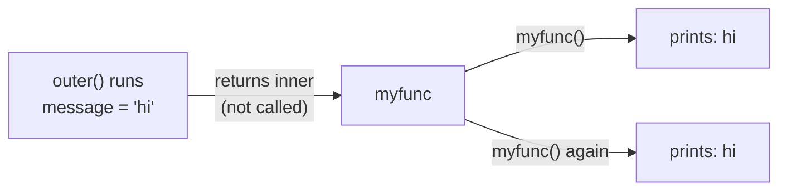
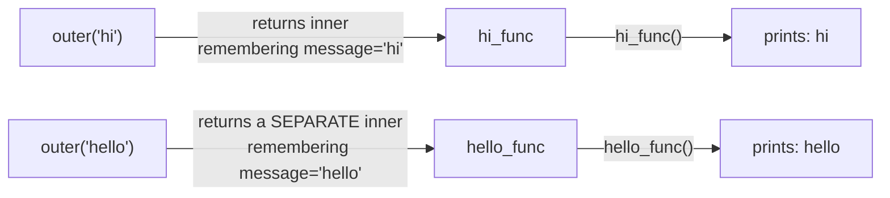
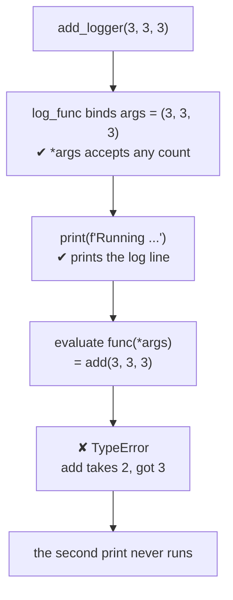

#python #decorators #closures #python-utils


A returned function is only interesting if it can still do something once it's out in the world on its own. This is the piece that makes that possible.

## The simplest case

```python
def outer():
    message = "hi"

    def inner():
        print(message)

    return inner()
```

`inner` doesn't take any parameters, and it doesn't define `message` either — it just reaches out and uses a variable that belongs to `outer`. That's called a **free variable**: not local to the function using it, not global, just borrowed from whatever function it's sitting inside.

Run `outer()` and it prints `hi`, which isn't surprising yet — `inner` is called **while `outer` is still running**, so `message` is right there.

## Returning without calling

Drop the parentheses so `outer` hands back the function instead of running it:

```python
def outer():
    message = "hi"

    def inner():
        print(message)

    return inner          # no parentheses — hand back the function itself
```

```python
myfunc = outer()
print(myfunc)             # <function outer.<locals>.inner at 0x...>
print(myfunc.__name__)    # 'inner'

myfunc()                  # hi
myfunc()                  # hi
```

By the time `myfunc()` runs, `outer` has already returned. Its local scope should be gone — `message` should not exist anywhere anymore. And yet `myfunc()` still prints `hi`, every time it's called.

> [!important] That's a closure. `inner` didn't just use `message` while `outer` was running — it **kept a reference to it**, and that reference survives `outer` finishing. In simple terms: 
> Closure is an inner function that remembers the variables from the scope it was created in, even after that outer scope is gone.



## Each call captures its own copy

Give `outer` a parameter instead of a hardcoded string, and every call creates a separate closure with its own remembered value:

```python
def outer(message):
    def inner():
        print(message)
    return inner

hi_func    = outer("hi")
hello_func = outer("hello")

hi_func()      # hi
hello_func()   # hello
```

`inner` still takes no arguments — the value isn't passed in when you call it, it was baked in when the closure was created.



`hi_func` and `hello_func` are two different function objects, each closing over its own `message`. Nothing is shared between them.

## Where this earns its keep

A closure that only prints a fixed string is a demo. Here's a version that does something worth wanting: wrap **any** function so every call to it gets logged.

```python
def logger(func):
    def log_func(*args):
        print(f"Running {func.__name__} with {args}")
        print(func(*args))
    return log_func

def add(x, y):
    return x + y

def sub(x, y):
    return x - y
```

```python
add_logger = logger(add)
sub_logger = logger(sub)

add_logger(3, 3)
# Running add with (3, 3)
# 6

sub_logger(10, 5)
# Running sub with (10, 5)
# 5
```

`log_func` closes over `func` — the specific function `logger` was called with — the same way `inner` closed over `message`. `add_logger` and `sub_logger` are two separate closures, each permanently wired to a different function, and each can be called any number of times afterward as if it **were** that function, just with logging attached.

### What `*args` actually promised

`add` takes exactly two numbers. So what happens if you hand its wrapper three?

```python
add_logger(3, 3, 3)
```

```
Running add with (3, 3, 3)
Traceback (most recent call last):
  ...
TypeError: add() takes 2 positional
arguments but 3 were given
```

Read the order of those two outputs — the log line printed, **then** it crashed. Walk the wrapper line by line and you can see why:

1. `log_func(*args)` accepts the call without complaint. `*args` means **collect however many positional arguments arrive into a tuple**, so there is no count to violate. `args` becomes `(3, 3, 3)`.
2. The first `print` runs on that tuple. Nothing has touched `add` yet, so nothing can go wrong.
3. The second line is `print(func(*args))`. Python has to evaluate the argument before it can call `print`, so it attempts `add(3, 3, 3)` — and **that** is what raises. The `print` around it never runs.



> [!warning] **The wrapper is more permissive than the thing it wraps.**
> `log_func(*args)` accepts any number of positional arguments and relays them onward. It validates nothing — `add` is what decides whether the call was legal. So the wrapper doesn't **make** bad calls work; it just delays the complaint until the inner call happens.

And note this wrapper only used `*args`, so it covers positional arguments alone — `add_logger(x=3, y=3)` still fails at the wrapper itself with `got an unexpected keyword argument 'x'`. Adding `**kwargs` alongside it is what makes a wrapper able to catch genuinely any call.

That delay has a cost worth naming now, because it comes back later. After `add_logger = logger(add)`, the name `add_logger` no longer advertises `(x, y)` to anyone inspecting it — your editor's autocomplete, `help()`, and a type checker all see `(*args)` instead. The arity check moved from **before you run it** to **at runtime, halfway through**. Two tools later in this folder exist to claw that back: `functools.wraps` restores what `help()` and other runtime introspection see, and `ParamSpec` restores what the type checker sees.

> [!tip] This is exactly the shape a decorator wraps in nicer syntax. `logger(add)` — take a function, return a new function that does something extra around a call to the original — is the entire mechanism; `@logger` above `def add` is just a shorter way to write `add = logger(add)`.
