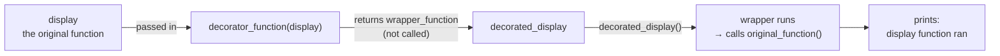
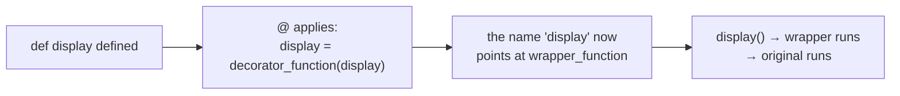
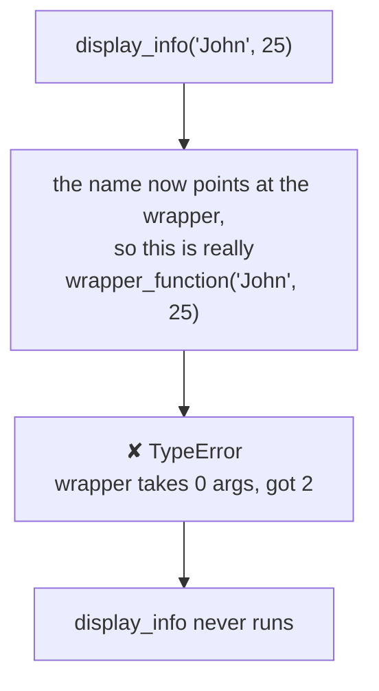
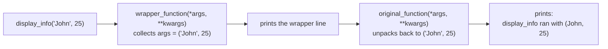

#python #decorators #python-utils


A closure remembers a **value**. Swap that value for a **function** and you have a decorator — that single substitution is the whole idea.

> [!info] A **decorator** is a function that takes another function as an argument, adds some functionality, and returns another function — **without changing the source code of the function it was given**.

That last clause is the point. The original function is never edited, never touched. Something is wrapped **around** it.

## From closure to decorator

Here is the closure shape again, with nothing renamed yet:

```python
def outer(message):
    def inner():
        print(message)
    return inner
```

Rename the two functions to what they're about to become, and change one thing — instead of remembering a message to print, remember a **function to run**

```python
def decorator_function(original_function):
    def wrapper_function():
        return original_function()
    return wrapper_function
```

Compare them line by line. The structure is identical. `wrapper_function` closes over `original_function` exactly the way `inner` closed over `message` The only difference is what gets done with the remembered thing: `print(message)` became `original_function()`.

That is already a decorator. It doesn't do anything useful yet, but it is structurally complete.

## Running it by hand

Before any special syntax, do it the long way — the way that makes clear nothing magic is happening:

```python
def display():
    print("display function ran")

decorated_display = decorator_function(display)
```

Nothing has printed yet. `decorator_function(display)` ran, built `wrapper_function`, and handed it back unrun. `decorated_display` is now that wrapper, waiting.

```python
decorated_display()
# display function ran
```

Calling it runs the wrapper, which runs `display`.



## Now make it earn its place

So far the wrapper adds nothing — it just forwards. The reason to have it at all is that you can put anything you like **around** that forwarded call:

```python
def decorator_function(original_function):
    def wrapper_function():
        print(f"wrapper ran before {original_function.__name__}")
        return original_function()
    return wrapper_function

decorated_display = decorator_function(display)
decorated_display()
```

```
wrapper ran before display
display function ran
```

Two lines of output from one call. The first came from the wrapper, the second from the original — and `display` itself was never modified to make that happen. That is the whole value proposition: **behaviour added from the outside.**

## The `@` symbol is just shorthand

Everything above used a plain assignment. What you actually see in real code is this:

```python
@decorator_function
def display():
    print("display function ran")

display()
```

```
wrapper ran before display
display function ran
```

There is no new mechanism here. `@decorator_function` sitting above `def display` means **exactly** this:

```python
display = decorator_function(display)
```

Take the function you just defined, pass it through the decorator, and rebind the **same name** to whatever comes back. From that line onward, the name `display` refers to the wrapper, not to the function you wrote.

> [!important] `@decorator` above `def f` is nothing but `f = decorator(f)`, run immediately after the `def`. Write it out longhand once and the syntax stops being magic — it's an assignment with a nicer face.



The two forms are interchangeable, but `@` reads better — and it becomes clearly better once several decorators stack on one function.

## Where it breaks: functions that take arguments

The decorator above works on `display` because `display` takes no arguments. Try it on something that does:

```python
@decorator_function
def display_info(name, age):
    print(f"display_info ran with ({name}, {age})")

display_info("John", 25)
```

```
TypeError: decorator_function.<locals>.wrapper_function()
takes 0 positional arguments but 2 were given
```

Read whose name is in that error: **`wrapper_function`**, not `display_info`. That's the tell. After decoration, the name `display_info` points at the wrapper — so `display_info("John", 25)` is really `wrapper_function("John", 25)`, and `wrapper_function` was defined to take nothing at all. The call dies at the door; the original function is never reached.

The `<locals>` in the middle of that path is worth recognising too — it means the failing function was defined **inside** another function, which is a strong hint you are looking at a decorator's wrapper rather than anything you called directly.



### The fix

The wrapper has to accept whatever anyone throws at it and hand it onward untouched. That is exactly what `*args, **kwargs` is for:

```python
def decorator_function(original_function):
    def wrapper_function(*args, **kwargs):
        print(f"wrapper ran before {original_function.__name__}")
        return original_function(*args, **kwargs)
    return wrapper_function
```

Two changes, both required, and they do opposite jobs:

- `*args, **kwargs` in the **definition** **collects** — any positional arguments become the tuple `args`, any keyword arguments become the dict `kwargs`.
- `*args, **kwargs` in the **call** **unpacks** — the tuple and dict are spread back out into individual arguments for the original function.

Collect on the way in, unpack on the way out. Now one decorator serves both functions:

```python
@decorator_function
def display():
    print("display function ran")

@decorator_function
def display_info(name, age):
    print(f"display_info ran with ({name}, {age})")

display()
display_info("John", 25)
```

```
wrapper ran before display
display function ran
wrapper ran before display_info
display_info ran with (John, 25)
```



> [!warning] This pass-through is non-negotiable for any general-purpose decorator. A wrapper without `*args, **kwargs` silently restricts what the decorated function can accept — and the failure surfaces as a `TypeError` naming a function the caller has never heard of.

The names `args` and `kwargs` carry no meaning to Python — only the `*` and `**` do. They are pure convention, and breaking it will confuse every reader.

## The same thing built from a class

A decorator has to be **callable** — that's the only real requirement. Functions are callable, but so is any object whose class defines `__call__`. So a class works just as well:

```python
class DecoratorClass:
    def __init__(self, original_function):
        self.original_function = original_function

    def __call__(self, *args, **kwargs):
        print(f"call method ran before "
              f"{self.original_function.__name__}")
        return self.original_function(*args, **kwargs)
```

The two halves map directly onto the function version:

| Function version | Class version | Job |
|---|---|---|
| `decorator_function(func)` | `__init__(self, func)` | receives the original function |
| closure variable `original_function` | `self.original_function` | stores it |
| `wrapper_function(*args, **kwargs)` | `__call__(self, *args, **kwargs)` | runs on every call |

Where the function version **closed over** `original_function`, the class version **attaches it to the instance** as `self.original_function`. Different storage, same idea: hold onto the function so it can be called later.

Usage is identical:

```python
@DecoratorClass
def display_info(name, age):
    print(f"display_info ran with ({name}, {age})")

display_info("John", 25)
```

```
call method ran before display_info
display_info ran with (John, 25)
```

`@DecoratorClass` still means `display_info = DecoratorClass(display_info)` — that call now builds an **instance** rather than returning a nested function, and calling that instance triggers `__call__`.

Function decorators are far more common in practice, and the rest of this folder uses them. Classes become the better shape when the decorator needs to **hold state across calls** — a counter, a cache, a circuit breaker's failure tally — where an instance attribute is more natural than a closure variable.

## One thing that just quietly broke

Check what the decorated function calls itself now:

```python
print(display.__name__)   # wrapper_function
```

Not `display`. The name `display` points at the wrapper, so every piece of metadata that comes with it — `__name__`, `__doc__`, `__module__` — belongs to the wrapper too. The original function's identity has been papered over.

That sounds cosmetic and isn't. Anything that reads metadata off a function to decide what to do — debuggers, tracebacks, `help()`, and framework machinery that inspects your handlers — now sees the wrapper instead. `functools.wraps` is the one-line fix, and it's next.
