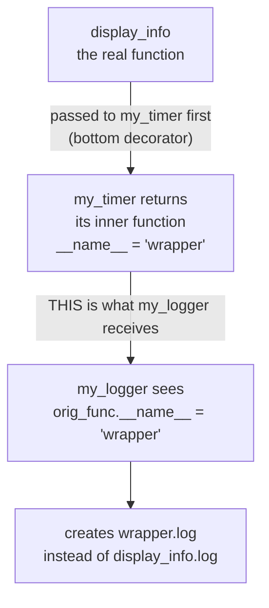
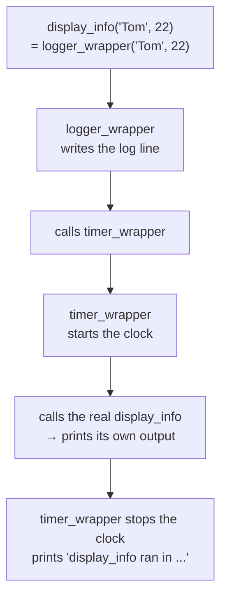
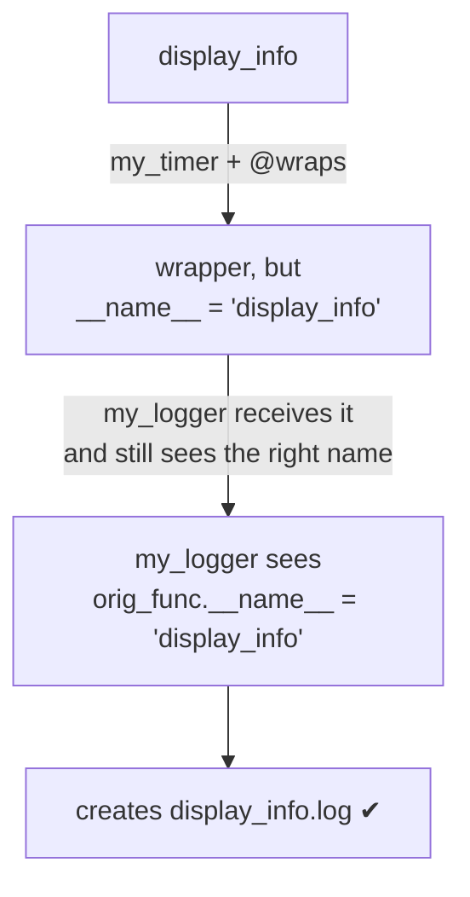

#python #decorators #functools #python-utils


The mechanism is settled. What trips people up next is **why you'd reach for one** — so here are two decorators worth actually having, and then the bug that appears the moment you use both at once.

## Logging every call

Say you want to record how often a function runs and what it was called with. Written by hand, that means adding a logging line inside every function you care about — and remembering to keep them all consistent forever.

As a decorator it's written once:

```python
import logging

def my_logger(orig_func):
    logger = logging.getLogger(orig_func.__name__)
    logger.setLevel(logging.INFO)
    
    handler = logging.FileHandler(f'{orig_func.__name__}.log')
    handler.setFormatter(
        logging.Formatter('%(asctime)s %(message)s'))
    
    logger.addHandler(handler)

    def wrapper(*args, **kwargs):
        logger.info(f'Ran with args: {args}, kwargs: {kwargs}')
        return orig_func(*args, **kwargs)

    return wrapper
```

```python
@my_logger
def display_info(name, age):
    print(f'display_info ran with ({name}, {age})')

display_info('Tom', 22)
```

The console shows only the function's own output, but a file `display_info.log` now exists containing:

```
2026-08-05 14:06:44,324 Ran with args: ('Tom', 22), kwargs: {}
```

> [!important] **Where a line sits decides how often it runs.**
> The logger set-up sits in the **decorator body**, so it executes **once**, at decoration time — when Python reads the `@my_logger` line. The `logger.info(...)` call sits in the **wrapper**, so it executes **on every call**. That split is the shape of most real decorators: set-up cost paid once, per-call work paid every time.

## Timing every call

Same shape, different payload — how long did the function take?

```python
import time

def my_timer(orig_func):
    def wrapper(*args, **kwargs):
        t1 = time.perf_counter()
        result = orig_func(*args, **kwargs)
        elapsed = time.perf_counter() - t1
        print(f'{orig_func.__name__} ran in: {elapsed:.2f} sec')
        return result
    return wrapper
```

The one detail worth pausing on is why the result is stored instead of returned immediately. The wrapper still has work to do **after** the original function finishes — stop the clock, print the duration — so it holds the value in `result` and returns it at the very end. Return early and the timing code never runs.

```python
@my_timer
def display_info(name, age):
    time.sleep(1)
    print(f'display_info ran with ({name}, {age})')

display_info('Tom', 22)
```

```
display_info ran with (Tom, 22)
display_info ran in: 1.00 sec
```

> [!info] `time.perf_counter()` rather than `time.time()` is deliberate. `time.time()` reports wall-clock time and can jump backwards if the system clock is adjusted mid-measurement, producing a negative duration. `perf_counter` only ever moves forward and has higher resolution — it exists specifically for measuring elapsed time. `time.time()` answers **what time is it**; `perf_counter` answers **how long did that take**.

## Stacking them — and where it goes wrong

Both decorators are useful, so apply both. You stack them:

```python
@my_logger
@my_timer
def display_info(name, age):
    time.sleep(1)
    print(f'display_info ran with ({name}, {age})')

display_info('Tom', 22)
```

The console looks right:

```
display_info ran with (Tom, 22)
display_info ran in: 1.01 sec
```

But check the directory. There is no `display_info.log` — instead there's a file named **`wrapper.log`**, holding the entry that should have gone to it:

```
LOG FILES: ['wrapper.log']
  wrapper.log:
  2026-08-05 14:25:35,510 Ran with args: ('Tom', 22), kwargs: {}
```

Flip the order and the damage moves rather than disappearing:

```python
@my_timer
@my_logger
def display_info(name, age):
    ...
```

```
display_info ran with (Tom, 22)
wrapper ran in: 1.01 sec
```

This time the log file is the one you wanted:

```
LOG FILES: ['display_info.log']
  display_info.log:
  2026-08-05 14:25:50,398 Ran with args: ('Tom', 22), kwargs: {}
```

So the log file is named correctly now, but the **console** has gone wrong instead — the timer reports on a function called `wrapper`. Compare the two runs: whichever decorator ends up on top is the one that reports the wrong name. Something is losing the original function's identity, and swapping the order only moves which of the two notices.

## Unrolling the stack

Recall that `@decorator` above `def f` is just `f = decorator(f)`. So a single decorator is:

```python
display_info = my_timer(display_info)
```

Stacked decorators are the same rule applied twice, and they apply **bottom-up** — the one nearest the `def` goes first:

```python
display_info = my_logger(my_timer(display_info))
```

Read that inside-out and the bug becomes obvious:

1. `my_timer(display_info)` runs first. It receives the real `display_info`, and returns its own inner function — which is named **`wrapper`**.

2. `my_logger(...)` runs second, and what it receives is **that returned object**. Its `orig_func` parameter is not `display_info` at all; it is the timer's `wrapper`.

3. So `orig_func.__name__` inside `my_logger` evaluates to `'wrapper'`, and the log filename becomes `wrapper.log`.

You can watch it happen by printing at decoration time:

```
[decoration] my_timer got: display_info
[decoration] my_logger got: wrapper
```



The decorators are working correctly. Each one faithfully reports the name of whatever it was handed — the problem is that the thing handed to the outer decorator has lost its original identity. Every decorator returns a function called `wrapper`, so identity is destroyed at every layer.

### Following one call all the way through

Part of what makes this hard to read is that **both** inner functions are called `wrapper`. Give them distinct names for a moment — `timer_wrapper` and `logger_wrapper` — and trace a single call end to end:

```
[decorate] my_timer received: display_info
[decorate] my_logger received: wrapper

name 'display_info' now points at: wrapper

--- calling display_info('Tom', 22) ---
   -> logger_wrapper RUNS, writes log line
   -> timer_wrapper RUNS, starts clock
   -> REAL display_info runs: (Tom, 22)
   -> timer prints: display_info ran in 1.01 sec

log files: ['wrapper.log']
  wrapper.log contains: Ran with args: ('Tom', 22), kwargs: {}
```

Two separate things are happening here, and it's worth keeping them apart:

**Decoration ran bottom-up.** `my_timer` got the real function; `my_logger` got `timer_wrapper` back and only ever saw something named `wrapper`. After both, the name `display_info` refers to `logger_wrapper`.

**Calling runs top-down.** `display_info('Tom', 22)` is really `logger_wrapper('Tom', 22)`, which logs and then calls `timer_wrapper`, which starts the clock and then calls the genuine `display_info`. Each layer does its own work and passes the call inward.



> [!important] **Nothing failed here — that's the point.** The `logger.info(...)` line executed exactly as written. The timer measured correctly and even printed the right name, because **its** `orig_func` is the genuine function. The only thing wrong is which **file** the log line landed in, and that was decided much earlier: `my_logger` computed the filename from `orig_func.__name__` at **decoration time**, when `orig_func` was `timer_wrapper`. A name frozen at decoration cannot correct itself on later calls, so every future call keeps writing to `wrapper.log`.

> [!important] Stacking applies bottom-up: the decorator closest to `def` wraps first, and each one above it wraps the **result** of the one below. Anything a decorator learns from `__name__` is therefore about the previous wrapper, not about your function.

## The fix: `functools.wraps`

The problem is that the wrapper doesn't carry the original function's metadata. `functools.wraps` copies it across — `__name__`, `__doc__`, `__module__`, and more — so the wrapper stops pretending to be an anonymous `wrapper`.

It is itself a decorator, applied to each wrapper:

```python
from functools import wraps

def my_logger(orig_func):
    logger = logging.getLogger(orig_func.__name__)
    logger.setLevel(logging.INFO)
    handler = logging.FileHandler(f'{orig_func.__name__}.log')
    handler.setFormatter(
        logging.Formatter('%(asctime)s %(message)s'))
    logger.addHandler(handler)

    @wraps(orig_func)
    def wrapper(*args, **kwargs):
        logger.info(
            f'Ran with args: {args}, kwargs: {kwargs}')
        return orig_func(*args, **kwargs)

    return wrapper


def my_timer(orig_func):
    @wraps(orig_func)
    def wrapper(*args, **kwargs):
        t1 = time.perf_counter()
        result = orig_func(*args, **kwargs)
        elapsed = time.perf_counter() - t1
        print(f'{orig_func.__name__} ran in: {elapsed:.2f} sec')
        return result
    return wrapper
```

A decorator inside a decorator looks alarming and isn't: `@wraps(orig_func)` takes the function whose identity should be preserved, and applies it to the wrapper directly below.

With both wrappers decorated, the stack behaves:

```python
@my_logger
@my_timer
def display_info(name, age):
    time.sleep(1)
    print(f'display_info ran with ({name}, {age})')

display_info('Tom', 22)
print(display_info.__name__)
```

```
display_info ran with (Tom, 22)
display_info ran in: 1.01 sec
display_info
```

and the log file is `display_info.log`, as intended.



> [!tip] Use `@wraps` on every decorator you write, not only the ones you plan to stack. It costs one line, and without it you have quietly broken `help()`, tracebacks, debuggers, and any framework that inspects your functions — including the ones that decide what to do based on a handler's name.

> [!warning] `functools.wraps` fixes **runtime** introspection only. A type checker still sees the wrapper's `(*args, **kwargs)` signature rather than your function's real parameters, so a wrong-arity call goes uncaught until it runs. `ParamSpec` is the tool for that half, and it comes later.

The two failures in this note came from the same root cause — a wrapper that doesn't know what it wrapped — and both were invisible until two decorators met. Which is the honest argument for `@wraps` as a reflex rather than a fix: the cost of forgetting it doesn't show up until later, in someone else's stack.
