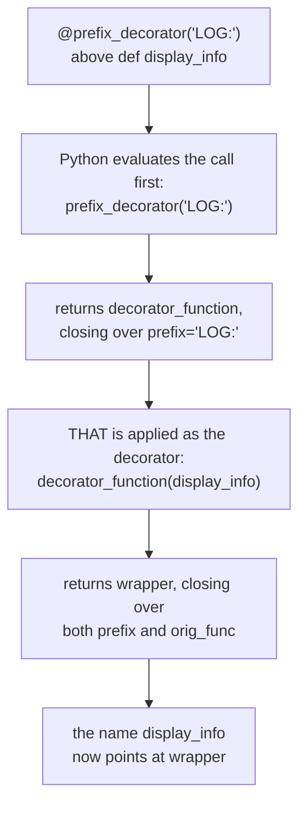

#python #decorators #python-utils


Every decorator so far took exactly one thing: the function below it. `@my_logger`, `@my_timer` — no configuration, no options. Sometimes you want to configure the decorator itself at the point where it's applied, which is what `@app.route('/about')` in a web framework is doing. That extra pair of parentheses changes the shape underneath more than it looks like it should.

Start from a plain decorator with the usual structure:

```python
from functools import wraps

def decorator_function(orig_func):
    @wraps(orig_func)
    def wrapper(*args, **kwargs):
        print('Executed before', orig_func.__name__)
        result = orig_func(*args, **kwargs)
        print('Executed after', orig_func.__name__)
        return result
    return wrapper
```

```python
@decorator_function
def display_info(name, age):
    print(f'display_info ran with ({name}, {age})')

display_info('John', 25)
```

```
Executed before display_info
display_info ran with (John, 25)
Executed after display_info
```

## Why the simple version runs out

Say those messages should carry a prefix, so log output can be filtered later. Hardcoding one is trivial:

```python
        print('LOG:', 'Executed before', orig_func.__name__)
```

That holds right up until a second function needs a **different** prefix — `TEST:` while debugging, `AUDIT:` somewhere else. The only way out with the tools so far is a copy of the whole decorator per prefix, each differing by one string. Same duplication problem inheritance solved for classes, in a smaller space.

What's needed is a way to pass the prefix in **at the decoration site**:

```python
@prefix_decorator('LOG:')
def display_info(name, age):
    ...
```

## Why one more layer is required

The obstacle is that `@` already spends its one argument. Recall the rule from the earlier note: `@deco` above `def f` means exactly `f = deco(f)` — Python hands the decorated function to whatever name follows the `@`, and there is no second slot to put a prefix in.

But `@prefix_decorator('LOG:')` is not a name. It's a **call**, and Python evaluates it first. So the rule still applies, with whatever that call returned playing the part of `deco`:

```python
display_info = prefix_decorator('LOG:')(display_info)
```

Read the two calls separately and the requirement falls out. `prefix_decorator('LOG:')` must return **a decorator** — a function that accepts `display_info`. So `prefix_decorator` is not itself a decorator; it's a function that **builds** one, which is why the whole thing needs one more layer of nesting than before:

```python
def prefix_decorator(prefix):
    def decorator_function(orig_func):
        @wraps(orig_func)
        def wrapper(*args, **kwargs):
            print(prefix, 'Executed before',
                  orig_func.__name__)
            result = orig_func(*args, **kwargs)
            print(prefix, 'Executed after',
                  orig_func.__name__)
            return result
        return wrapper
    return decorator_function
```

```python
@prefix_decorator('LOG:')
def display_info(name, age):
    print(f'display_info ran with ({name}, {age})')

display_info('John', 25)
display_info('Travis', 30)
```

```
LOG: Executed before display_info
display_info ran with (John, 25)
LOG: Executed after display_info
LOG: Executed before display_info
display_info ran with (Travis, 30)
LOG: Executed after display_info
```

Nothing about the innermost two layers changed. The only new thing is an outer function whose entire job is to take the prefix and hand back the decorator you already knew how to write — and `prefix` is available inside `wrapper` for the same reason `orig_func` always was: it's a closure over an enclosing scope's variable.

## Watching the layers fire

Printing at each level makes the sequence concrete:

```
--- decoration time ---
  [1] prefix_decorator called, prefix='LOG:'
  [2] decorator_function called, orig_func=display_info
  [3] wrapper built and returned
--- call time ---
LOG: before
   display_info ran with (John, 25)
LOG: after
LOG: before
   display_info ran with (Travis, 30)
LOG: after
```

Steps 1-3 happen **once**, the moment Python reads the `@` line — the same decoration-time/call-time split from the practical-decorators note, now with two set-up steps instead of one. Only `wrapper` runs per call.

Written longhand, the two steps are visible as two separate statements:

```python
step1 = prefix_decorator('LOG:')
print(step1.__name__)     # decorator_function

display_info = step1(display_info)
```



Each decoration builds its own independent chain, so two prefixes coexist without interfering:

```python
@prefix_decorator('LOG:')
def a(): print('a')

@prefix_decorator('TEST:')
def b(): print('b')
```

```
LOG: before
a
LOG: after
TEST: before
b
TEST: after
```

`a` and `b` are wrapped by two separate `wrapper` objects, each closing over a different `prefix` — exactly the **each call captures its own copy** behaviour from the closures note, one layer further out.

## The mistake this shape invites

> [!warning] **Forgetting the parentheses does not fail at the `@` line.** It fails later, somewhere that doesn't mention the decorator at all:
> ```python
> @prefix_decorator          # no ('LOG:')
> def display_info(name, age):
>     print(f'display_info ran with ({name}, {age})')
>
> display_info('John', 25)
> ```
> ```
> TypeError: prefix_decorator.<locals>.decorator_function()
> takes 1 positional argument but 2 were given
> ```
> Decoration itself succeeded. `@prefix_decorator` means `display_info = prefix_decorator(display_info)`, so the **function** got bound to the `prefix` parameter, and the name `display_info` now refers to `decorator_function` — which quite reasonably accepts one argument and got two.
>
> The `<locals>` in that message is the tell, exactly as it was for a broken wrapper: the failing function was defined inside another function, so you're looking at decorator machinery rather than your own code.

The reverse mistake reads more clearly, at least:

```python
@decorator_function('LOG:')   # a plain decorator, called
def f(x):
    return x
```

```
TypeError: 'str' object is not callable
```

`decorator_function('LOG:')` bound the string to `orig_func` and returned `wrapper`; the `@` then tried to call `wrapper` on `f`, which reached `orig_func(...)` — a string.

> [!important] **The parentheses are part of the decorator's identity, not optional syntax.** A decorator taking arguments must **always** be called, even with no arguments to pass — `@prefix_decorator()` if every parameter has a default. A plain decorator must **never** be called. The two are different kinds of object that happen to be spelled similarly, and neither degrades gracefully into the other.

## What each layer is for

| Layer | Receives | Returns | Runs |
|---|---|---|---|
| `prefix_decorator` | the decorator's own arguments | a decorator | once, at the `@` line |
| `decorator_function` | the function being decorated | the wrapper | once, at the `@` line |
| `wrapper` | the arguments of each actual call | the original's result | every call |

Reading an unfamiliar decorator is mostly a matter of counting layers: three means it takes arguments, two means it doesn't.

> [!tip] `@wraps(orig_func)` still belongs on the innermost `wrapper` and nowhere else. The extra outer layer changes nothing about the identity problem it solves — `wrapper` is still what the decorated name ends up pointing at, so it's still what needs to carry the original's `__name__` and `__doc__`.

Once the shape is recognisable it turns up constantly: route paths in web frameworks, retry counts and backoff settings, cache expiry times, test parameters. All of them are the same three-layer structure, with the outer layer's arguments closed over and used somewhere in the innermost function.
