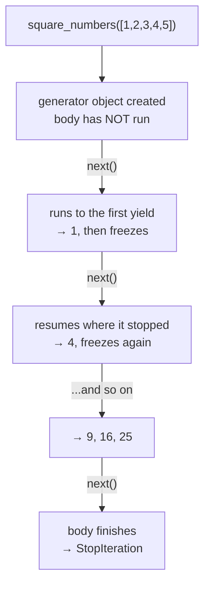
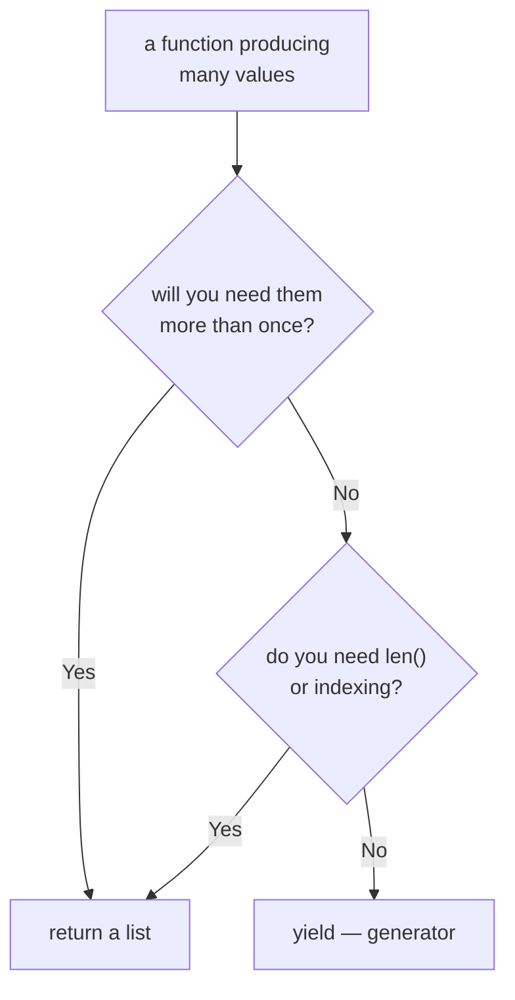

#python #generators #yield #python-utils


A function that produces many values normally builds a list and hands it back. That means every value exists in memory at once, and nothing is available until the last one is finished. A generator changes both of those, and the change costs one keyword.

## The ordinary version

```python
def square_numbers(nums):
    result = []
    for i in nums:
        result.append(i * i)
    return result

print(square_numbers([1, 2, 3, 4, 5]))
# [1, 4, 9, 16, 25]
```

Three things happen here that are worth naming, because a generator undoes all three: an empty list is created, every result is appended to it, and nothing is returned until the loop is completely finished.

## The same thing as a generator

Delete the list, delete the `append`, delete the `return`, and `yield` each value instead:

```python
def square_numbers(nums):
    for i in nums:
        yield i * i
```

The `yield` keyword is the entire difference — its presence anywhere in the body makes the function a generator function. And the result of calling it is no longer a list:

```python
my_nums = square_numbers([1, 2, 3, 4, 5])
print(my_nums)
# <generator object square_numbers at 0x1027c2a80>
```

No squares have been computed. The loop hasn't started. What came back is an object that *knows how to* produce those values, waiting to be asked.

## Asking for values

`next()` asks for one:

```python
print(next(my_nums))   # 1
print(next(my_nums))   # 4
print(next(my_nums))   # 9
print(next(my_nums))   # 16
print(next(my_nums))   # 25
```

Each call runs the function body **until it hits a `yield`**, hands that value back, and freezes everything — the loop variable, the position in the loop, all of it — until asked again. This is the mental shift the whole topic rests on: the function doesn't run to completion and return, it suspends partway through and resumes later.

Ask once more and there's nothing left:

```python
print(next(my_nums))
```

```
StopIteration
```

That exception isn't a failure. It's the agreed signal for "this is exhausted", and it's how every consumer knows when to stop.



You can watch the suspension directly:

```python
def noisy():
    print('body started')
    yield 1
    print('resumed')
    yield 2
```

```python
n = noisy()
print('created')
print(next(n))
print(next(n))
```

```
created
body started
1
resumed
2
```

`'body started'` prints *after* `'created'` — the body genuinely had not begun when the generator object was made.

## Looping

Nobody calls `next()` by hand in normal code. A `for` loop does it for you, and catches `StopIteration` so you never see it:

```python
for num in square_numbers([1, 2, 3, 4, 5]):
    print(num)
# 1 4 9 16 25
```

And `list()` drains it into an actual list, when you really do want them all:

```python
print(list(square_numbers([1, 2, 3, 4, 5])))
# [1, 4, 9, 16, 25]
```

## Generator expressions

A list comprehension does the same job as the original function in one line:

```python
my_nums = [x * x for x in [1, 2, 3, 4, 5]]
```

Swap the square brackets for parentheses and you get a generator instead:

```python
my_nums = (x * x for x in [1, 2, 3, 4, 5])
print(my_nums)
# <generator object <genexpr> at 0x...>
```

Same laziness, same `for`-loop usage, one character of difference. When it's the only argument to a function, even the parentheses can be dropped:

```python
print(sum(x * x for x in range(5)))   # 30
```

## What laziness is actually worth

On five numbers none of this matters. The argument only becomes real at scale, so here it is measured — building a million records as a list, then as a generator:

```python
def people_list(num_people):
    result = []
    for i in range(num_people):
        result.append({
            'id': i,
            'name': random.choice(names),
            'major': random.choice(majors),
        })
    return result

def people_generator(num_people):
    for i in range(num_people):
        yield {
            'id': i,
            'name': random.choice(names),
            'major': random.choice(majors),
        }
```

```
LIST       time 1.40 s     memory 214.0 MB
GENERATOR  time 0.00001 s  memory 0.22 KB
```

Roughly a million times less memory and effectively no time — because the generator hasn't done anything yet. A single generator object is 224 bytes regardless of how many values it will eventually produce.

The time doesn't vanish, of course; it moves. Consuming all million values still costs the work:

```
GEN consumed fully:  time 2.14 s   memory 0.07 KB
```

**That last line is the actual point.** Doing the same total work, the peak memory stayed near zero rather than 214 MB, because only one record exists at a time. That's what makes generators the right shape for reading a file larger than RAM, paging through an API, or streaming a response token by token — the input size stops determining the memory footprint.

> [!warning] **`list(...)` around a generator throws all of it away.** It's the honest way to check what a generator produces, and it's also how the benefit is most commonly lost by accident:
> ```
> GEN -> list   time 1.40 s   memory 214.0 MB
> ```
> Identical to having built the list in the first place. If a generator's output is being wrapped in `list()` at the call site, either the laziness isn't needed or the wrapping is a mistake.

## What you give up

A generator is not a sequence, and three things stop working. Two of them fail loudly:

```python
len(my_nums)
# TypeError: object of type 'generator' has no len()

my_nums[0]
# TypeError: 'generator' object is not subscriptable
```

Both make sense — it can't know how many values it will produce without producing them, and it has no stored positions to index into.

The third one is the problem.

> [!warning] **A generator can only be consumed once, and the second attempt returns nothing instead of raising.** Once exhausted it stays exhausted:
> ```python
> g = square_numbers([1, 2, 3])
>
> print([n for n in g])   # [1, 4, 9]
> print([n for n in g])   # []   ← no error
> ```
> A list would give the same values both times. This is the single most common source of "why is my generator empty the second time?", and it gets genuinely dangerous when consumers are separated in the code:
> ```python
> g = square_numbers([1, 2, 3, 4, 5])
>
> print(max(g))   # 25
> print(sum(g))   # 0    ← silently wrong
> ```
> `max` drained it, so `sum` had nothing left and returned its starting value. No exception, no warning — just a `0` that looks like a real answer. **Any time two things need to read the same data, either call the generator function twice to get two fresh generators, or materialise it into a list once and share that.**

## Choosing between them



The default worth adopting is the generator, and the reasons compound: it reads better than accumulating into a list, it costs constant memory whatever the input size, and it starts producing results immediately rather than after the last one is computed. Reach for a list when the values are genuinely needed more than once, when something needs to know how many there are, or when the collection is small enough that none of it matters.
