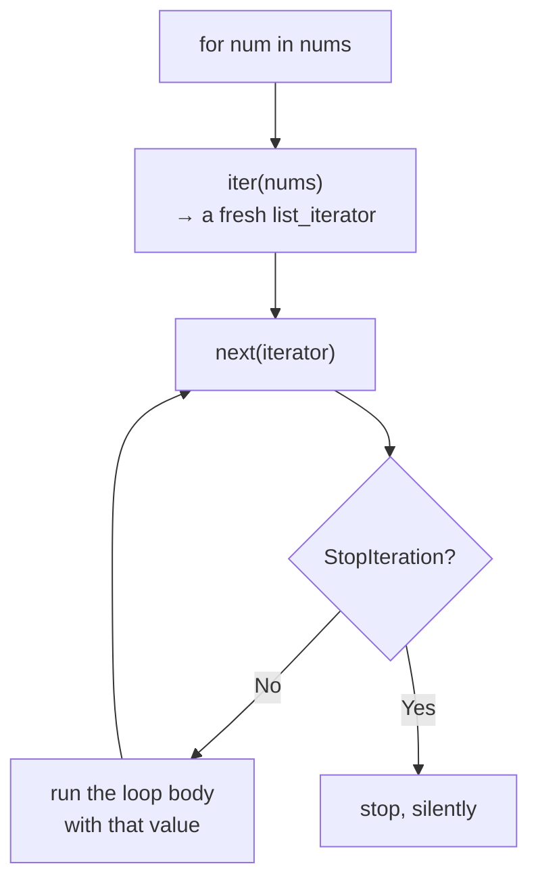

#python #generators #iterators #python-utils


The generators note used `next()`, `StopIteration`, and `for` loops without ever saying what makes those work — or why a generator is single-use while a list isn't. Both answers live in one small protocol, and it's worth knowing because it's the same protocol behind `for` loops over files, dicts, database cursors, and streamed responses.

The confusing part up front: **a list is iterable, but a list is not an iterator.** Those are two different things, and the difference is the whole note.

## Iterable — something you can loop over

Broadly, an iterable is anything a `for` loop accepts:

```python
nums = [1, 2, 3]
for num in nums:
    print(num)
```

Precisely, it's an object with an `__iter__` method. `dir()` lists what an object has:

```python
print('__iter__' in dir(nums))   # True
print('__next__' in dir(nums))   # False
```

The list has `__iter__`. It does **not** have `__next__` — and that second line is why a list isn't an iterator.

## Iterator — something that produces values and remembers where it is

An iterator has two properties: a `__next__` method that hands back the next value, and **state**, so it knows where it left off. A list has neither, so asking one for a next value fails:

```python
next(nums)
```

```
TypeError: 'list' object is not an iterator
```

`next(x)` is just a readable spelling of `x.__next__()`, and the list has no such method. But its `__iter__` will produce something that does — and `iter(x)` is the matching spelling of `x.__iter__()`:

```python
i_nums = iter(nums)
print(i_nums)
# <list_iterator object at 0x104b65de0>
```

A different type entirely. This one has both methods:

```python
print('__iter__' in dir(i_nums))   # True
print('__next__' in dir(i_nums))   # True
```

And it walks the list one value at a time, remembering its position between calls:

```python
print(next(i_nums))   # 1
print(next(i_nums))   # 2
print(next(i_nums))   # 3
print(next(i_nums))   # StopIteration
```

> [!info] An iterator having `__iter__` looks redundant, since `__iter__` is what produced it. It's required because **every iterator is also an iterable** — otherwise you couldn't use one directly in a `for` loop. Its `__iter__` simply returns itself:
> ```python
> print(iter(i_nums) is i_nums)   # True
> ```

## What a `for` loop actually does

Put those pieces together and the loop stops being magic. It calls `iter()` on whatever you gave it, then calls `next()` repeatedly until `StopIteration` shows up, which it catches and treats as **done**:

```python
i_nums = iter(nums)

while True:
    try:
        item = next(i_nums)
    except StopIteration:
        break
    print(item)
```

```
1
2
3
```

Identical output to `for num in nums`. That's all a `for` loop is.



## Why the two roles are separate

This is the part that pays off. Because `iter()` builds a **fresh** iterator each time, a list can be looped over as often as you like, and two loops over it don't interfere:

```python
a = iter(nums)
b = iter(nums)
print(next(a), next(a), next(b))   # 1 2 1
```

`b` started from the beginning while `a` was halfway through, because they're separate objects with separate state. The list holds the data; each iterator holds one **position** in it.

A generator collapses the two roles into one object — it **is** its own iterator — which is exactly why the last note's warning applies:

```python
g = my_range(1, 5)
print(iter(g) is g)   # True
```

There's no separate data structure to re-iterate. One object, one position, one pass.

## Writing your own

A class becomes iterable by defining `__iter__`, and an iterator by also defining `__next__`. Here's a class that counts from a start value to an end value:

```python
class MyRange:
    def __init__(self, start, end):
        self.value = start
        self.end = end

    def __iter__(self):
        return self

    def __next__(self):
        if self.value >= self.end:
            raise StopIteration
        current = self.value
        self.value += 1
        return current
```

```python
nums = MyRange(1, 5)
print([n for n in nums])   # [1, 2, 3, 4]
```

`__iter__` returns `self`, which is legal precisely because this class also defines `__next__`. Each `__next__` call grabs the current value, advances the state, and hands the old value back — raising `StopIteration` once it reaches the end.

It works. But it is **not** a replacement for `range`, and the reason is the point of this whole section.

> [!warning] **Returning `self` from `__iter__` makes the object single-use.** Loop it twice and the second pass is empty, because `self.value` is already at the end and nothing reset it:
> ```python
> nums = MyRange(1, 5)
> print([n for n in nums])   # [1, 2, 3, 4]
> print([n for n in nums])   # []
> ```
> The real `range` doesn't behave that way:
> ```python
> r = range(1, 5)
> print([n for n in r], [n for n in r])
> # [1, 2, 3, 4] [1, 2, 3, 4]
> ```
> A nested loop makes the damage obvious, since both loops share the one position:
> ```python
> nums = MyRange(1, 4)
> print([(a, b) for a in nums for b in nums])
> # [(1, 2), (1, 3)]
> ```
> ```python
> r = range(1, 4)
> print([(a, b) for a in r for b in r])
> # [(1, 1), (1, 2), (1, 3), (2, 1), (2, 2),
> #  (2, 3), (3, 1), (3, 2), (3, 3)]
> ```
> Two values instead of nine, with no error raised.

The fix is to stop conflating the two roles — let `__iter__` return a **new** iterator each time, exactly as a list does:

```python
class MyRange:
    def __init__(self, start, end):
        self.start = start
        self.end = end

    def __iter__(self):
        return MyRangeIterator(self.start, self.end)


class MyRangeIterator:
    def __init__(self, value, end):
        self.value = value
        self.end = end

    def __iter__(self):
        return self

    def __next__(self):
        if self.value >= self.end:
            raise StopIteration
        current = self.value
        self.value += 1
        return current
```

```python
nums = MyRange(1, 5)
print([n for n in nums])   # [1, 2, 3, 4]
print([n for n in nums])   # [1, 2, 3, 4]
print([(a, b) for a in nums for b in nums])
# all nine pairs
```

`MyRange` is now iterable and **not** an iterator; `MyRangeIterator` is both. That's the same split lists use, and it's what re-iterability actually requires.

> [!important] **The decision is a design choice, not an oversight — but it has to be deliberate.** Return `self` when the thing genuinely represents a one-time stream: a network response, a cursor over rows, a file being consumed. Return a fresh iterator when it represents a **collection** that happens to be loopable. Getting this wrong produces silently short results rather than errors, as the nested loop above shows.

## The generator version

All of that machinery, written as a generator:

```python
def my_range(start, end):
    current = start
    while current < end:
        yield current
        current += 1
```

```python
print(list(my_range(1, 5)))   # [1, 2, 3, 4]
```

Ten lines become four, and `__iter__`, `__next__`, the state, and the `StopIteration` are all generated for you. **A generator is an iterator** — you simply never write the protocol by hand.

It has the same single-use property as the first `MyRange`, for the same reason:

```python
g = my_range(1, 5)
print([n for n in g])   # [1, 2, 3, 4]
print([n for n in g])   # []
```

The practical difference is that calling `my_range(1, 5)` again is trivially cheap and gives a fresh one — which is why **call the generator function twice** was the advice in the last note.

## Iterators don't have to end

Nothing in the protocol requires `StopIteration` to ever arrive. Drop the end condition and the sequence is infinite:

```python
def count_from(start):
    current = start
    while True:
        yield current
        current += 1
```

```python
c = count_from(1)
print(next(c), next(c), next(c))   # 1 2 3
```

This is safe **only** because values are produced on demand. The consumer decides when to stop — with `break`:

```python
for n in count_from(100):
    if n > 105:
        break
    print(n, end=' ')
# 100 101 102 103 104 105
```

or by taking a fixed number of items:

```python
from itertools import islice
print(list(islice(count_from(1), 10)))
# [1, 2, 3, 4, 5, 6, 7, 8, 9, 10]
```

> [!warning] Anything that consumes an iterator **fully** will hang forever on an infinite one — `list()`, `sum()`, `max()`, `sorted()`, `len(list(...))`. There is no error and no timeout; the process simply grows until it is killed. An infinite iterator and an eager consumer are never compatible.

This is where laziness stops being an optimisation and becomes the only option. A sequence with no end can't be a list at any price, and neither can one that merely exceeds available memory — but either can be looped over one value at a time, indefinitely, in constant space.

## The definitions, side by side

| | Has `__iter__` | Has `__next__` | Re-loopable |
|---|---|---|---|
| list, tuple, dict, str | yes | no | yes — fresh iterator each time |
| `list_iterator` | yes, returns `self` | yes | no |
| generator | yes, returns `self` | yes | no |
| file object | yes, returns `self` | yes | no |

**Iterable**: has `__iter__`, which returns an iterator.
**Iterator**: has `__next__` and its own position, raises `StopIteration` when exhausted, and returns itself from `__iter__`.

Every iterator is iterable; most iterables are not iterators. The column that matters in practice is the last one — whether a second loop over the same object gets the values again or gets nothing.
