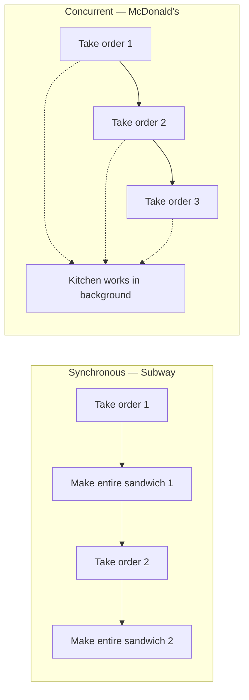
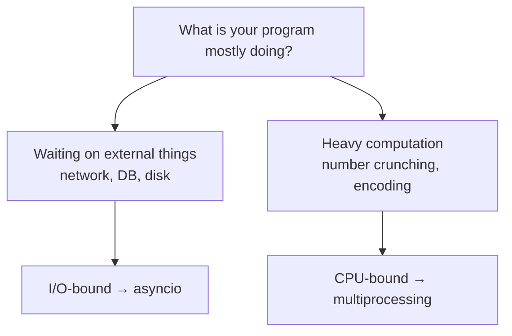
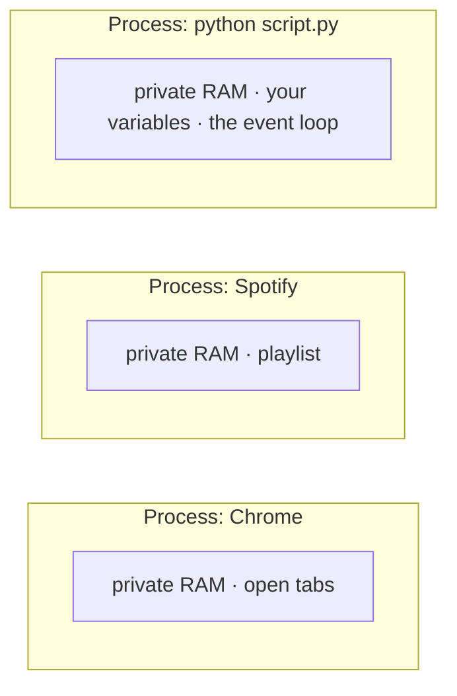
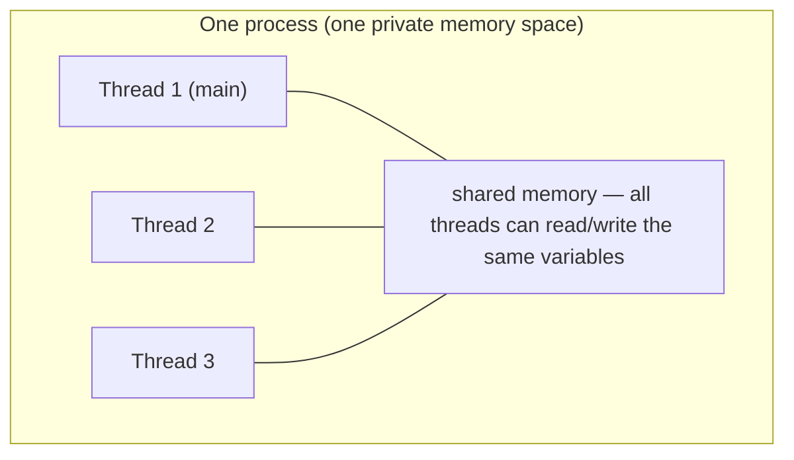

AsyncIO is Python's built-in library for writing **concurrent** code using the `async` / `await` syntax. It has a reputation for being intimidating — lots of terminology, lots of moving parts — but the core idea fits in one sentence: **stop sitting idle while you wait for slow things.**

Everything else is machinery for making that one idea work.

---

## Synchronous vs concurrent — the sandwich shops

The code we normally write is **synchronous**: one thing happens after another, each step running to completion before the next begins.

Think of a Subway restaurant. You place your order, and the person behind the counter makes your **entire sandwich from start to finish** — bread, fillings, toasting, wrapping — before they even look at the next customer. The queue moves exactly as fast as one complete sandwich at a time.

**Concurrent** code is a McDonald's. Someone takes your order and immediately **moves on to the next customer** while your food is being made in the background by someone (or something) else. Orders overlap. Nobody stands around watching a burger cook.



The confusion starts when people map this onto code, because of one persistent myth:

> [!danger] **Asynchronous does not automatically mean faster.** Async doesn't speed anything up by itself — it just means that while you're **waiting** on something slow (a network request, a database query, a file read), your program can do **other useful work** instead of sitting idle. If there's nothing to wait on, async buys you nothing.

The proof shows up immediately in real numbers: a script that fetches two things taking 1 second and 2 seconds runs in **3 seconds synchronously** (1 + 2, one after the other) and **2 seconds concurrently** (both waits overlap, total time = the longest single wait). The waiting is the only thing that shrank. The work didn't get faster — the **idle time** got reused. That worked example is the whole of the next-but-one note.

---

## I/O-bound vs CPU-bound — where async wins and where it loses

Because async's entire value is **reusing waiting time**, it only helps when your program actually waits. That gives us the dividing line:

- **I/O-bound tasks** — the program is waiting for something **external**: a network response, a database query, a file on disk. The CPU is idle during that wait. **This is asyncio's home turf.**
- **CPU-bound tasks** — the program is doing heavy computation. There is no waiting to reuse; the CPU is the bottleneck. For these you want **processes** (multiprocessing), not asyncio.

Why can't asyncio help with CPU-bound work? Because of **how** it achieves concurrency — and that **how** packs three separate claims into one sentence:

> [!info] AsyncIO is **single-threaded** and runs in a **single process**. It uses **cooperative multitasking** — tasks **voluntarily** give up control when they hit a wait, and the event loop hands the thread to whoever is ready to run. Nothing runs in parallel; things take turns **during each other's waits**.

That sentence hides three ideas that each deserve their own space: **single process** and **single thread** (**where** async code runs) and **cooperative multitasking** (**how** the one thread gets shared). The next two sections unpack them — and together they're the whole reason CPU-bound work is a dead end for asyncio.



---

## Single process, single thread — what that actually means

The callout leans on two words that sound technical but are simple once you have the picture: **process** and **thread**. Get these and **single-threaded, single process** stops being jargon.

### A process is a running program

Forget async for a moment and look at your laptop right now. Chrome is open, maybe Spotify, maybe VS Code. Each of those is a **running program** — and a running program is exactly what a **process** is.

The key word is **running**. Chrome sitting as an icon on disk is just a file — dead bytes. The moment you launch it, the operating system loads it into memory (RAM), gives it its **own private chunk of that memory** that no other program may touch, and starts executing its instructions. That live thing — code plus its own isolated memory plus its own resources — is a process.



The defining property is **isolation**: Spotify cannot reach into Chrome's memory and read your tabs. Each process is walled off, which is a deliberate safety feature — if Spotify crashes, Chrome keeps running, because they share no memory.

So when you run `python my_script.py`, the OS creates **one** process for it. Every variable, every task, and the event loop itself all live inside that single walled-off memory space.

> [!info] **AsyncIO runs in a single process** means it never spins up extra **copies** of your program to get more done — there's one process, one private memory space, and all the async machinery happens inside it. (Contrast `multiprocessing`, which **does** launch several processes to spread work across multiple CPU cores. Asyncio deliberately does not — that's the line the sentence is drawing.)

### A thread is a worker inside the process

A process is **where** the code lives; a **thread** is **what actually executes it**. Picture a thread as a single worker walking through your program line by line, running one instruction after another.

Every process starts with exactly one thread — the **main thread**. But a process can spawn more, and here's the crucial contrast with processes: threads inside the same process **share** that process's memory. Multiple threads means multiple workers moving through the code at once, potentially on different CPU cores at genuinely the same instant.



**Single-threaded** simply means asyncio uses just **one** of these workers. All your tasks — even thousands of them — run on that one thread, and only one task is ever executing at any given instant. Nothing runs truly in parallel; tasks take turns.

### So is Python single-threaded, or is asyncIO?

This is the question the myth gets backwards. The answer: **asyncIO is single-threaded; Python is not.**

- **Python is not single-threaded.** CPython can spawn many OS threads with the `threading` module and many processes with `multiprocessing`. Nothing about the language forces one thread.
- **AsyncIO chooses to be single-threaded.** Its event loop runs **all** your tasks on one thread in one process. This is a design **decision**, not a limitation handed down by Python — asyncio picks one thread on purpose, to sidestep the locks and race conditions that come with juggling many threads over shared memory.

> [!important] **Single-threaded** describes **asyncIO's design**, not a hard limit of Python. Python the language happily does multi-threading and multi-processing. AsyncIO opts into a single thread deliberately: one worker, many tasks, taking turns during each other's waits — which is why there are no data races **between** awaits (only one task ever runs at a time).

There's one more piece that explains **why** giving up extra threads costs asyncio so little:

> [!danger] The GIL twist. Even when you **do** use multiple threads, CPython's **Global Interpreter Lock (GIL)** allows only **one thread to execute Python bytecode at a time**. So Python threads never run your actual Python **code** in parallel anyway — they only help while a thread is **waiting** on I/O (a waiting thread releases the lock so another can run). That's the quiet reason asyncio's single-thread design gives up almost nothing: multithreading wouldn't have parallelized your computation either. For true CPU parallelism you need multiple **processes** — each gets its own GIL — which is exactly why CPU-bound work goes to `multiprocessing`, not threads and not asyncio.

---

## Cooperative multitasking — how the one thread gets shared

If everything runs on a single thread, something has to decide **which** task gets that thread at any moment. There are two ways to share one thread between many tasks, and asyncio uses the one whose name is load-bearing.

The way your operating system shares a CPU between threads is **preemptive**: a scheduler forcibly interrupts a running thread mid-instruction — the thread gets no say — and hands the CPU to another. Interruptions can happen anywhere, at any time.

AsyncIO does the **opposite** — **cooperative** multitasking. There is no scheduler forcibly interrupting anyone. A task keeps the single thread and runs uninterrupted until it **voluntarily** gives it up, which it does by hitting an `await` on something slow — **I'm waiting on the network now, someone else can run.** Only then does the event loop take the thread and hand it to whoever's ready.

```
Task A runs ──▶ hits `await` (waiting on network) ──▶ voluntarily yields the thread
                                                             │
                                        event loop takes over ▼
                                        hands thread to Task B
Task B runs ──▶ hits `await` ──▶ yields ──▶ (A's data arrives) ──▶ A resumes
```

That word **cooperative** is the whole game: the system works **only if every task cooperates** by yielding when it waits. And that hands you the answer to **why can't asyncio do CPU-bound work?** A task that's crunching numbers instead of waiting **never hits an `await`**, so it never yields — it hogs the single thread, and every other task is frozen behind it.

> [!danger] One greedy task freezes the whole event loop. Because scheduling is cooperative, a task that computes without ever awaiting keeps the one thread to itself, and all other tasks stall until it finishes. One greedy cook in the McDonald's kitchen and the entire restaurant stops. This is **the** failure mode of asyncio — blocking the event loop — and it has its own note later in this series.

---

## What this buys you — and what it doesn't

**What async gives you:**

- Overlapped waiting — total time collapses toward the **longest single wait** instead of the **sum of all waits**
- Massive connection counts on one thread — no per-thread memory cost, no thread-switching overhead
- No race conditions **between** awaits — only one task runs at any instant

**What it doesn't give you:**

- Faster computation — a single thread crunches numbers exactly as fast as before
- Parallelism — two things are never executing at the same moment; they **take turns during waits**
- Free speedups for synchronous code — libraries must be written for asyncio to participate (why is the subject of the next note)

> [!tip] Interview framing: **AsyncIO is single-threaded cooperative multitasking: tasks voluntarily yield control while waiting on I/O, and the event loop runs whoever's ready. So it shines for I/O-bound work — overlapping thousands of network waits on one thread — and does nothing for CPU-bound work, where I'd reach for multiprocessing instead. And async isn't automatically faster: it only wins when there's idle waiting to reclaim.**

Before any of that machinery makes sense in code, there's a vocabulary to learn — event loops, awaitables, coroutines, tasks, futures. That's next.
