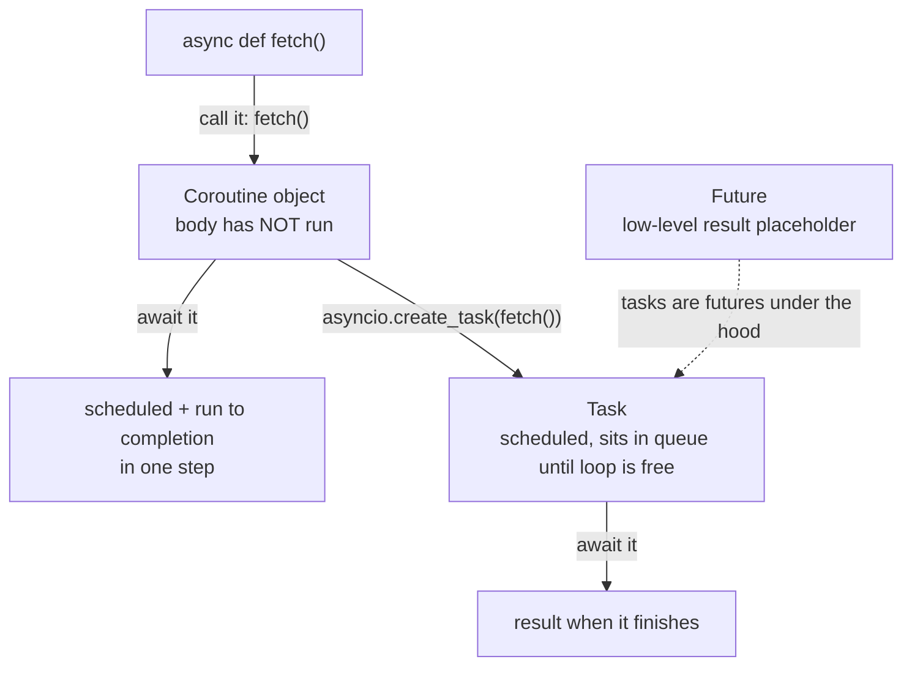

The terminology is what trips most people up when they start asyncio — **event loop, awaitable, coroutine, task, future** — five words for what feels like one idea. This note walks through all of them the way they appear in real code, using one small file with a synchronous function and an asynchronous one side by side:

```python
import asyncio
import time


def sync_function(test_param: str) -> str:
    print("This is a synchronous function.")
    time.sleep(0.1)
    return f"Sync Result: {test_param}"


# ALSO KNOWN AS A COROUTINE FUNCTION
async def async_function(test_param: str) -> str:
    print("This is an asynchronous coroutine function.")
    await asyncio.sleep(0.1)
    return f"Async Result: {test_param}"


async def main():
    ...


if __name__ == "__main__":
    asyncio.run(main())
```

---

## The event loop — the engine everything runs on

Notice that `main()` is defined with `async def`, and at the bottom we don't just call it — we hand it to `asyncio.run()`. That's not optional. An asynchronous function can't run by itself; something has to **drive** it. That something is the **event loop**.

> [!info] The event loop is the engine that runs and manages asynchronous functions. Think of it as a **scheduler**: it keeps track of all your tasks, and when a task suspends because it's waiting on something, control returns to the loop, which finds another task to start or resume.

`asyncio.run(main())` does three jobs: 
* It starts the event loop.
* Runs tasks until they're complete.
* Shuts the loop down at the end. 

No event loop running → no asynchronous code runs. Everything in asyncio lives inside this loop.

---

## `await` and awaitables — the yield points

Inside async code you'll see `await` everywhere. What it does:

> [!info] When you `await` something, you're telling the event loop: **pause this function right here and take control back — go run someone else.** The function stays suspended until the thing it's awaiting completes.

These pause points are exactly the **voluntarily give up control** moments of cooperative multitasking. And they're the entire mechanism of concurrency: every `await` is an opening for another task to run.

Two rules govern the keyword:

**Rule 1 — you can only await an awaitable.** An awaitable is an object that implements a special `__await__` method under the hood. This is why you **cannot** `await time.sleep(1)`: synchronous libraries have no mechanism to work with the event loop — no way to yield control and resume later. That pause-and-resume behaviour has to be **coded in**. That's the entire reason `asyncio.sleep` exists as a separate function from `time.sleep`: same wait, but built to suspend cooperatively instead of blocking the thread.

**Rule 2 — you can only use `await` inside an `async def` function.** Remove the `async` from a function that contains an `await` and the linter flags it immediately: **await should be used within an async function.** The two keywords come as a pair.

> [!important] This is why **just sprinkle async on it** doesn't work on an existing codebase. Every blocking call in the chain — every `time.sleep`, every synchronous HTTP client, every sync DB driver — is a place where the event loop **cannot** take control back. Async needs async-compatible libraries all the way down.

Python has exactly **three kinds of awaitable**: 
* coroutines
* tasks
* futures

---

## Coroutines — pausable functions

A **coroutine function** is any function defined with `async def`. But there's a distinction hiding here that causes real bugs, so it gets its own callout:

> [!important] **Coroutine function ≠ coroutine object.** The **function** is what you define with `async def`. The **object** is the awaitable you get back when you **call** that function. Calling a coroutine function does **not** run its body — it only creates the object.

Watch what actually happens:

```python
coroutine_obj = async_function("Test")
print(coroutine_obj)
# <coroutine object async_function at 0x105c70e80>
#   ← no print statement ran! The body never executed.

coroutine_result = await coroutine_obj
# This is an asynchronous coroutine function.   ← NOW the body runs
print(coroutine_result)
# Async Result: Test
```

Calling `async_function("Test")` printed nothing — the body didn't execute. We just got a coroutine object back. Only when we `await` that object does the body actually run.

Coroutines are a bit like generators — functions that can suspend execution and resume later — but designed to work with an event loop: they carry the extra machinery asyncio needs to schedule them and coordinate multiple tasks.

One more behaviour, stated innocently here but responsible for the most common asyncio performance bug (the next note is built around it):

> [!danger] When you await a coroutine object directly, it is **scheduled on the event loop and run to completion at the same time**. Schedule-and-immediately-finish — there is no window where it sits scheduled **waiting** while your code continues. Remember this line.

---

## Tasks — how coroutines actually run concurrently

A **task** is a wrapped coroutine that can be executed independently. You create one with `asyncio.create_task()`:

```python
task = asyncio.create_task(async_function("Test"))
print(task)
# <Task pending name='Task-2' coro=<async_function() running at .../terms.py:14>>

task_result = await task
# This is an asynchronous coroutine function.
print(task_result)
# Async Result: Test
```

Printing the task shows its state (`pending`), its name, and the coroutine it wraps. The task tracks whether its coroutine finished successfully, raised an error, or got cancelled.

The crucial difference from a bare coroutine object:

> [!important] A task can be **scheduled on the event loop and just sit there**, not yet running, until the loop gets control. That is the key to asyncio: you can **queue up multiple tasks first**, and then the event loop runs them whenever it's ready, letting them take turns during each other's I/O waits. Bare coroutine objects can't wait in the queue — tasks can.

---

## Futures — the low-level promise you'll almost never touch

A **future** is a low-level object representing an **eventual result**. If you're coming from JavaScript, futures are Python's promises — a placeholder for a value that will exist later.

A future's job is to hold a state and a result. The state is one of:

- **pending** — no result or exception yet
- **cancelled** — someone called `future.cancel()`
- **finished** — a result was set with `future.set_result(...)` (or an exception with `future.set_exception(...)`)

```python
loop = asyncio.get_running_loop()
future = loop.create_future()
print(f"Empty Future: {future}")
# Empty Future: <Future pending>

future.set_result("Future Result: Test")
future_result = await future
print(future_result)
# Future Result: Test
```

But here's the thing — unlike JavaScript, in Python you almost **never work with futures directly**. You write coroutines; you schedule them as tasks; asyncio uses futures **under the hood** to track results. In fact **tasks are futures under the hood**, with extra logic bolted on to actually run the wrapped coroutine. You'd only touch raw futures writing low-level asyncio code — say, building an asyncio-compatible framework.

---

## The three awaitables, side by side



| Awaitable | What it is | How you use it |
|---|---|---|
| **Coroutine** | pausable function body, created by calling an `async def` | write these constantly; await = schedule + run in one step |
| **Task** | wrapped coroutine, schedulable independently | `create_task` to queue work — **this is how you get concurrency** |
| **Future** | eventual-result placeholder | almost never directly; the machinery under tasks |

> [!tip] Interview framing: **There are three awaitables. Coroutines are what `async def` gives you — calling one just builds an object; awaiting it schedules and runs it in one step. Tasks wrap coroutines with `create_task`, and their superpower is sitting scheduled on the loop before running — that's what makes concurrency possible. Futures are the promise-like primitive underneath; tasks are literally futures with run-logic added, so you almost never touch futures directly in application code.**

That difference between **await a coroutine: schedule + run in one step** and **create a task: schedule now, run later** sounds like a footnote. It is actually the difference between async code that gets **zero concurrency** and async code that works — proven with timings and animations next.
