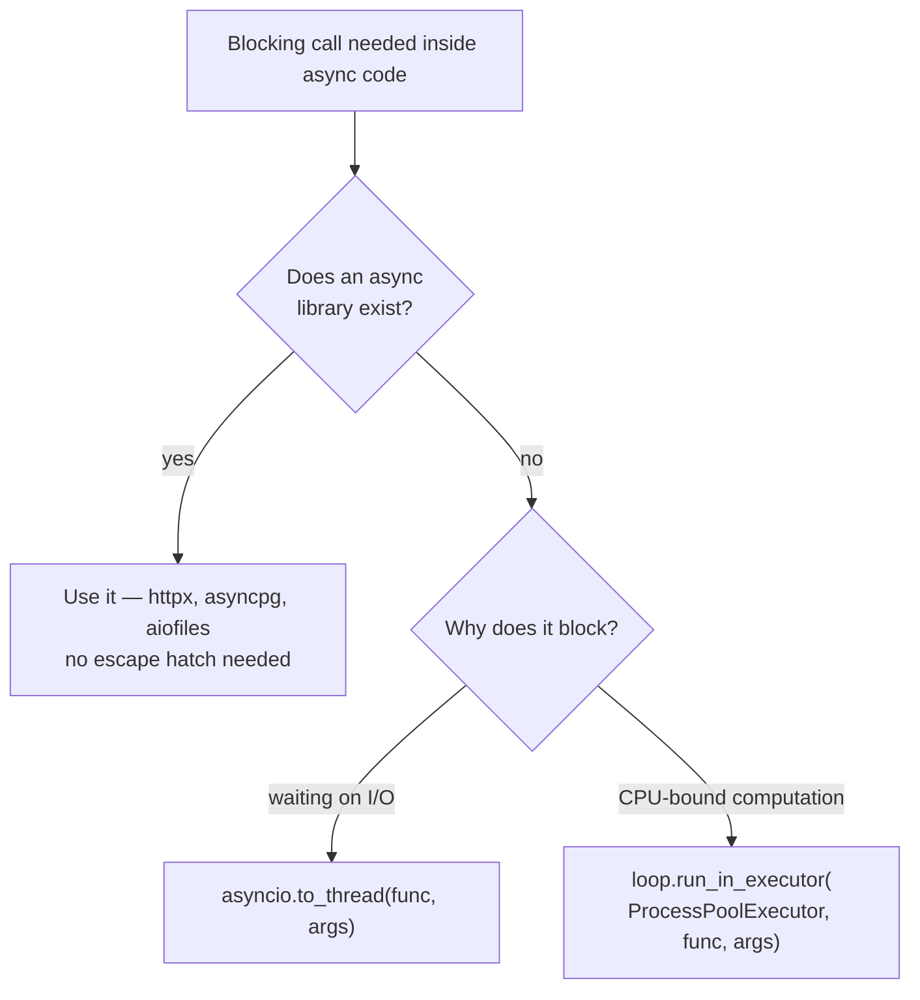

The blocking-the-loop note ended on an uncomfortable case: your code *must* call something blocking, and there is no async alternative. A legacy SDK, a sync-only database driver, a C library that computes for seconds. You can't await it, and calling it directly freezes the loop. The escape hatch: **hand the blocking call to a thread or a process, and let the event loop await *that*.** The loop stays free; the blocking work happens elsewhere; asyncio manages the handoff.

---

## The setup — deliberately synchronous again

`fetch_data` goes back to being a plain function — no `async`, blocking `time.sleep` and all. That's the honest shape of the problem: it's someone else's blocking code and we're not allowed to rewrite it.

```python
import asyncio
import time
from concurrent.futures import ProcessPoolExecutor


def fetch_data(param):                # regular synchronous function
    print(f"Do something with {param}...", flush=True)
    time.sleep(param)                 # blocking — and staying that way
    print(f"Done with {param}", flush=True)
    return f"Result of {param}"
```

Two housekeeping details in this example, both easy to trip on later:

- **`flush=True` on the prints** — output from other threads/processes can get buffered and appear in a weird order; flushing keeps the story readable. Tutorial hygiene, but a real gotcha when debugging.
- **`if __name__ == "__main__":` around the entry point** — required for the multiprocessing half. When Python spawns a new process it re-imports your script *in that process*; without the guard, the child would re-execute `asyncio.run(main())` and you'd have an infinite process-spawning loop.

---

## Threads — `asyncio.to_thread`

```python
async def main():
    task1 = asyncio.create_task(asyncio.to_thread(fetch_data, 1))
    task2 = asyncio.create_task(asyncio.to_thread(fetch_data, 2))
    result1 = await task1
    print("Thread 1 fully completed")
    result2 = await task2
    print("Thread 2 fully completed")
```

`asyncio.to_thread` wraps the synchronous function in a future and makes it **awaitable** — the missing `__await__` machinery, bolted on from outside. From there it's the familiar pattern: wrap in `create_task`, await the tasks.

> [!danger] Look at the call shape: `to_thread(fetch_data, 1)` — the **function itself and its arguments, separately**. Not `to_thread(fetch_data(1))`! Writing parentheses would execute `fetch_data(1)` right there, blocking the loop before `to_thread` ever saw it. You hand over the *recipe*, not the cooked result, so the thread can execute it later.

The animation shows where the work went. The Event Loop column holds two lightweight `to_thread` wrapper tasks — suspended, showing just "Running in thread pool..." — while Background I/O shows the real story: **both `fetch_data` calls executing in their own threads simultaneously**, blocking sleeps and all:

![[AI-Engineering/00-Python-Utils/08-Async/Images/10-To-Thread-Both-Threads-Running.png]]

The animation deliberately doesn't show the function's code inside those wrapper tasks — because that code *isn't running in our thread anymore*. When a thread finishes, it notifies its wrapper task, the task completes, and the await chain wakes up exactly as with any other task. The blocking code never touched the event loop's thread.

---

## Processes — `run_in_executor` + `ProcessPoolExecutor`

Threads solve *blocking I/O*. But if the blocking code is **CPU-bound** — real computation — a thread doesn't help. For that you push the work into another **process**, and the ceremony is a bit heavier:

```python
    loop = asyncio.get_running_loop()

    with ProcessPoolExecutor() as executor:
        task1 = loop.run_in_executor(executor, fetch_data, 1)
        task2 = loop.run_in_executor(executor, fetch_data, 2)

        result1 = await task1
        print("Process 1 fully completed")
        result2 = await task2
        print("Process 2 fully completed")
```

Three moving parts instead of one function call: grab the running loop with `asyncio.get_running_loop()`, create a `ProcessPoolExecutor` (imported from `concurrent.futures`), and schedule with `loop.run_in_executor(executor, func, *args)`. Same golden rule — function and arguments passed separately — and same result: a future you can await while the work runs in a whole separate Python process:

![[AI-Engineering/00-Python-Utils/08-Async/Images/11-Run-In-Executor-Both-Processes-Running.png]]

---

## The timing tells the story

```
Do something with 1...
Do something with 2...
Done with 1
Thread 1 fully completed
Done with 2
Thread 2 fully completed
Do something with 1...
Do something with 2...
Done with 1
Done with 2
Process 1 fully completed
Process 2 fully completed
['Result of 1', 'Result of 2']
Finished in 4.16 seconds
```

Why ~4 seconds? Because the example runs **two concurrent groups back-to-back**: the thread pair ran concurrently (2s = the longer sleep), *then* the process pair ran concurrently (another 2s). `2 + 2 = 4` — plus a fraction of overhead, because **threads and processes cost real time to spin up and tear down**. That overhead is the price of the escape hatch: don't pay it for calls that have a native async alternative.



**What the escape hatches guarantee:** the event loop stays responsive — blocking work runs elsewhere while the loop keeps serving every other task, and you await the result like any task.

**What they don't guarantee:** free lunch. Spin-up/tear-down overhead, memory per thread/process, and for threads specifically — a thread does not speed up CPU-bound Python (that's what the process pool is for). This is glue for the boundary between sync and async worlds, not a performance feature.

> [!tip] Interview framing: "If blocking code has no async alternative, I don't run it on the loop — I push it off with `asyncio.to_thread` for blocking I/O, or `run_in_executor` with a `ProcessPoolExecutor` for CPU-bound work. Both wrap the call in an awaitable future, so the event loop stays free and I await it like any task. Key details: pass the function and args separately — calling it inline would block before the handoff — and guard the entry point with `if __name__ == '__main__'` when processes are involved, since multiprocessing re-imports the module."

With the escape hatches covered, the remaining gap is ergonomics: so far every task was created and awaited **one at a time, by hand**. Real code fires off dozens at once — which is what `gather` and `TaskGroup` are for.
