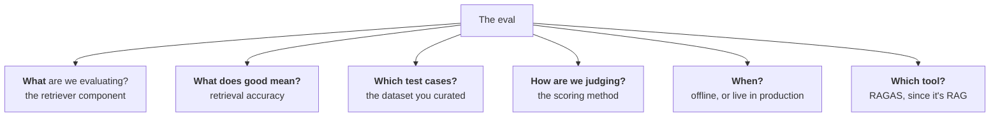

Vibe testing doesn't survive contact with real users, and LLM applications are harder to test than ordinary software because they're probabilistic and because "good" has several dimensions instead of one.

**There are two completely different activities hiding under the phrase "LLM evals"**, and only one of them is our job.

---

## What an eval actually is

Here's the definition to hold on to:

> **LLM evals are systematic, repeatable tests used to judge an LLM or LLM-powered system against a clear criteria.**

![[AI-Engineering/01-Agent-Evals/Images/v2-01-Definition-Systematic-Repeatable.png]]

Three words in that sentence are load-bearing — **systematic**, **repeatable**, **clear criteria** — and each one is there to rule out a specific bad habit.

### Systematic — not random prompting

Systematic means you are *not* doing what you did with your last project: five questions off the top of your head, replies look fine, ship it.

Instead you build a **proper dataset**, and you deliberately try to cover the edge cases. The example worth copying: if you were building a course assistant for CampusX, you wouldn't invent test questions. You'd pull **100 real student doubts** out of actual chat logs and make *that* your dataset.

That distinction is the whole point. Invented test cases measure how the system handles questions *you* thought of. Real logged questions measure how it handles the questions users actually ask — which are messier, and which is the only behaviour that matters.

### Repeatable — the same test, run again

Repeatable means: tomorrow you change the prompt. Or swap the model. Or replace the retriever. Or change the chunking strategy. Or rewrite the system instruction. **After any of those, you can still run the exact same test and get a comparable number.**

This is not a nice-to-have. It is the *only* mechanism by which you can answer "is v2 better than v1?" You hold the dataset fixed, score v1 on it, score v2 on it, and compare. Without a fixed dataset you have two feelings and no way to choose between them.

> [!important] Repeatability is what turns evaluation from a one-time check into an instrument. A test you cannot re-run tells you about a moment; a test you can re-run tells you about a *direction*.

### Clear criteria — you have to define what "good" means

![[AI-Engineering/01-Agent-Evals/Images/v2-02-Clear-Criteria.png]]

You cannot grade an answer until you've said what a good answer *is*. For a CampusX course assistant, "good" might decompose into four things:

- **correct**
- carries a **simple explanation**
- **grounded in the course content** — not in whatever the model happens to know
- **safe and policy-compliant** — no abuse, nothing threatening in tone

Notice these are choices, not discoveries. Someone sat down and decided that a good answer for *this* product means those four things. A bank's support agent would list different ones.

And this gives the cleanest possible test for whether you're actually evaluating:

> [!tip] **Without criteria, you are only judging by vibes. With criteria, you are doing evaluation.** That's the entire difference between the two — not the tooling, not the metrics. Just whether you wrote down what good means before you looked at the output.

---

## The misconception worth killing immediately: an eval is not a metric

In ML, "evaluation" *means* metric. How do you evaluate a model? Accuracy. Precision. Recall. Those are numbers, and evaluation is the act of computing them. So the natural assumption is that LLM evals are just a different set of numbers.

**That assumption is wrong, and it's worth unlearning early.**

![[AI-Engineering/01-Agent-Evals/Images/v2-03-Not-Just-A-Metric.png]]

An eval is **the complete testing setup**. Six questions, and the eval is all six answers together:

- What are we evaluating?
- What does good mean?
- What test cases are we using?
- How are we judging the output?
- When are we running it?
- Which tool are we using?

Make it concrete. Say you have a RAG chatbot and you want to evaluate its **retriever**:

Every one of those six is *part of the eval*. The metric — retrieval accuracy — is a single box in that diagram, not the diagram.

> [!note] So when someone asks you what an LLM eval is, the answer isn't a metric name. It's: *the entire testing setup — what we test, against what definition of good, on which cases, judged how, run when, with which tool.*

### And the goal isn't a score

A score is an intermediate artefact. The reason you build an eval is to answer questions a human has to act on:

- Can the model be used for this particular task or application?
- **Is this system good enough to ship?**
- Did prompt v2 improve over prompt v1?
- Is the RAG answer grounded in the retrieved context?
- Is the agent completing the task correctly?
- Is the chatbot safe for real users?
- Is the latency under control?

Every one of those is a decision. If your evaluation produces a number that doesn't help you make one of these calls, it isn't doing its job.

---

## The split: model evals vs application evals

Now the distinction that makes everything downstream easier. Go back and read the definition once more — *"...used to judge **an LLM or LLM-powered system**."*

Two different objects. So two different kinds of evaluation:

![[AI-Engineering/01-Agent-Evals/Images/v2-06-Model-Vs-Application-Evals.png]]

- **Model evals** evaluate **the LLM itself.**
- **Application evals** evaluate **the whole application built on top of an LLM.**

> [!warning] **Disclaimer, given explicitly in the lecture:** "model evals" and "application evals" are *not* official industry terms. They're coined here to make the distinction learnable. In the industry both are just called **LLM evals**, and people infer from context which one is meant. So use the split as a mental model — don't cite it as standard vocabulary.

---

## Model evals — what the frontier labs do

Model evals exist to answer one question: **when a new LLM ships, what is it capable of?** The lab tests it, benchmarks it, documents the results, and publishes them.

You've seen the output of this process without necessarily noticing. Every model launch announcement quotes a benchmark score or a leaderboard position — *"tops X benchmark", "scores Y%"*. Behind that number is a pre-built eval that the new model was run through to establish its capability level.

### The eight capability categories

Today's models are tested along roughly eight axes:

![[AI-Engineering/01-Agent-Evals/Images/v2-04-Eight-Model-Capabilities.png]]

1. **Reasoning** — can it think through a problem step by step?
2. **Knowledge** — does it have general world knowledge? (Everything up to its cutoff date should be in there.)
3. **Maths** — can it solve maths problems?
4. **Coding** — can it write code?
5. **Instruction following** — give it ten instructions; does it actually follow all ten, in order?
6. **Long context** — can it find the right answer inside a very large context?
7. **Multimodal understanding** — can it understand images, text, audio — and produce them?
8. **Tool use** — can it use tools properly?

### And the benchmarks that test them

![[AI-Engineering/01-Agent-Evals/Images/v2-05-Benchmark-Table.png]]

| Capability area               | Benchmark                    | What it checks                                                             |
| ----------------------------- | ---------------------------- | -------------------------------------------------------------------------- |
| General knowledge + reasoning | **MMLU**                     | Broad subject knowledge across science, history, law, medicine, and more   |
| Maths                         | **GSM8K**                    | Grade-school word problems and step-by-step numerical reasoning            |
| Coding                        | **HumanEval**, **SWE-bench** | Code generation, and real-world software-engineering issue solving         |
| Instruction following         | **IFEval**                   | Whether the model follows explicit constraints and formatting instructions |
| Long context                  | **Needle-in-a-Haystack**     | Whether it can find specific information hidden inside a very long context |
| Multimodal                    | **MMMU**                     | Reasoning over images, diagrams, charts, and visual academic problems      |
|                               |                              |                                                                            |

### The honest career note

Here's the part worth being clear-eyed about: **as an AI engineer you will probably never run a model eval.**

Think about who does this work. Benchmarking a newly released LLM, documenting its capabilities, publishing the results — that's the frontier labs' job. They build the model, they test it, they tell you how it did.

So why learn it at all? Because you need to be **literate**, not practised. Specifically:

> [!important] When you start a new project, one of your first real decisions is *which model goes in it* — OpenAI, Anthropic, or an open-source model. **That decision comes directly out of reading benchmarks.** Knowing what MMLU measures versus what SWE-bench measures is what lets you make that call on evidence instead of vibes.

---

## Application evals — the thing you'll actually do

This is the category to care about, because building LLM applications is your job — which makes evaluating them your job too.

### Why they have to exist: the LLM is one component

Beginners assume the LLM *is* the application. It's the brain, so surely everything is about the brain.

As you build bigger systems, that assumption falls apart:

![[AI-Engineering/01-Agent-Evals/Images/v2-07-LLM-Is-One-Component.png]]

Look at everything that sits around the model in a real application — the user interface, the input handler, the prompt layer, tools and APIs, context and memory, the orchestrator or workflow (the LangGraph code deciding where control flows, where it branches, where it runs in parallel), guardrails and safety, output parsers, the retrieval system, the embedding model, the vector database, monitoring and logging, the feedback loop.

**The LLM is one box in that picture.** Every other box can be the thing that's broken.

### The smartphone analogy

Snapdragon and MediaTek publish chip benchmarks. A new generation ships, they announce a benchmark score, and you learn how strong the processor is.

Now: **does a strong processor guarantee a good phone?** Obviously not. The camera system, the operating system, the sound, the GPU, the screen, the battery — all of it matters, and every one of those gets tested separately. A flagship chip in a phone with a bad screen and two hours of battery is a bad phone.

> [!important] The frontier labs hand you the chip benchmark. **Evaluating everything you built around the chip is your responsibility as an AI engineer.** That's the entire reason application evals exist as a discipline.

### What application evals actually cover

> **Application evals assess the behaviour and performance of an LLM-powered application, whether at the level of the entire system or a specific component within it.**

Note the *both* in there — application evals operate at two levels:

- **System level** — the final response quality, end-to-end latency, cost per token.
- **Component level** — is my retriever returning the right chunks? Is my embedding model good enough? Is my reranker actually improving the ordering?

And the question being asked changes completely:

![[AI-Engineering/01-Agent-Evals/Images/v2-08-Application-Eval-Questions.png]]

In an application eval you **don't** ask *"can the model do this?"* — that's the model eval's question. You ask **"does my product work?"**

For a CampusX course assistant, that unpacks into:

- Did it answer the student's question correctly?
- Did it use the course material properly?
- Was the answer faithful to the retrieved context?
- Was it clear enough for a beginner?
- Did it avoid hallucinating policies?
- Did it respond quickly enough?
- Did it stay safe?

Every one of those is about *your* system, and none of them can be answered by a benchmark score on a leaderboard.

> [!tip] A useful heuristic: if you come across a video or article titled "LLM evaluation", assume roughly 99% of the time it means **application** evaluation, not model evaluation. That's also the one you need.

