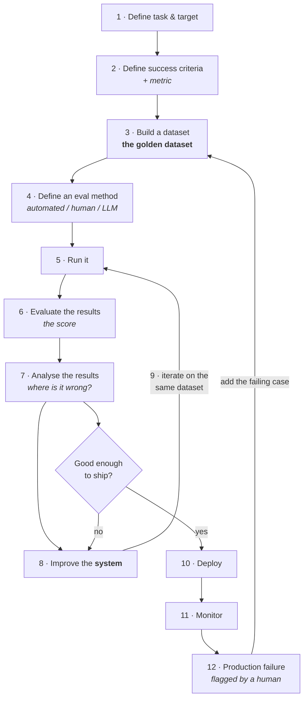

A food-delivery company — say Zomato — receives an enormous volume of customer email every day. Answering it manually doesn't scale, so they want the triage automated.

What they actually want is narrow: read each email, and **classify it** into one of three buckets.

![[AI-Engineering/01-Agent-Evals/Images/v3-01-Routing-Taxonomy.png]]

- **billing** → route to the billing team
- **technical** → route to the technical team
- **general** → route to customer support

Nobody needs to sit there reading mail and tagging teams. That's the whole product.

And the system to do it is about as small as an LLM application gets: **one LLM, one prompt.** The prompt says something like *you are a customer agent who reads an email and decides where it should be routed.* Email goes in, a label comes out.

![[AI-Engineering/01-Agent-Evals/Images/v3-02-The-System-Under-Test.png]]

You could build this in ten minutes. Which brings up the only interesting question: **do you deploy it?**

No. First you evaluate it. Here's how.

---

## Step 1 — Define the task and target

![[AI-Engineering/01-Agent-Evals/Images/v3-03-Workflow-Top.png]]

Two things, and it's worth keeping them separate:

- **Target** — *what* are you evaluating? Here: the whole system, the entire workflow. (It could equally have been one component inside a bigger system.)
- **Task** — what is the evaluation actually checking? Here: it's a **classification task**. Does the system put each email in the right bucket?

## Step 2 — Define a success criteria

Now: how would you *know* the system works?

For a classification task the answer is straightforward — the success criterion is correct classification, and the metric is **accuracy**. Send it 100 queries; if 90 land in the right bucket, the system is 90% accurate.

This is where "clear criteria" from the previous note stops being abstract. You have now written down what good means, in a form a machine can check.

## Step 3 — Build a dataset

![[AI-Engineering/01-Agent-Evals/Images/v3-04-Golden-Dataset.png]]

Two columns: the input message, and the label you have decided is correct.

| Input message | Expected label |
|---|---|
| "My card was charged twice" | billing |
| "The app crashes on login" | technical |
| "What are your hours?" | general |

Three rows is a slide. In reality you build **50 to 500 rows**.

And where those rows come from matters more than how many there are. **The best source is your actual data** — pull real past customer conversations and label them by hand. Sit someone down and have them assign the labels.

This is the thing everyone means by a **golden dataset**: real inputs, human-assigned correct answers, held fixed.

## Step 4 — Define an evaluation method

![[AI-Engineering/01-Agent-Evals/Images/v3-05-Eval-Methods.png]]

Now: **who does the grading?** Three options — 
* ***automated** (code), 
* a **human**, or
* ***another LLM**.

First, be clear on what "running the evaluation" mechanically is. You push the golden dataset through your system. For every row, the system emits a label. Now you have two columns side by side — what you said was correct, and what the system actually produced — and you compute how often they agree.

For *this* system, the answer is obvious: **automated.** Why would you pay a human to check whether `billing == billing`? Why bring in an LLM? A few lines of Python compare two strings and print an accuracy score.

### Now break it

Change one thing about the example. Suppose it isn't a one-word label. Suppose it's a chatbot, and the expected answer is a long paragraph, and the system's answer is a different long paragraph.

**Can code tell you whether those two paragraphs mean the same thing?**

No. And the reason is precise: the semantic meaning can be identical while almost no words match. String comparison will call a perfectly good answer wrong. Code has run out of road.

A human can obviously do it — but a human is **expensive**, and evaluation is something you want to run over and over, on hundreds of rows, every time you change a prompt.

Which is exactly where the third option earns its place:

> [!important] **LLM-as-judge is the middle option, and it exists because the cheap option broke.** Automated grading is better whenever it's possible — it's free, instant, and perfectly consistent. You reach for an LLM judge only when the thing being graded is open-ended enough that code can't grade it and volume is too high for humans. Knowing *why* you're using a judge is what stops you using one where a string comparison would do.

### Where we are

Worth restating the whole configuration in one line, because this *is* the eval:

**Target** = the system · **Task** = classify correctly · **Criteria** = classification · **Metric** = accuracy · **Dataset** = 50-100 labelled real emails · **Method** = automated.

---

## Step 5 — Run the model

Push the dataset through the system. Collect an answer for every row. Nothing clever here.

## Step 6 — Evaluate the results

Your Python code computes the score. Say it comes back **80%** — 80 of 100 correct, 20 wrong.

## Step 7 — Analyse the results

A score alone changes nothing. The question is *where* it's going wrong, and what you can actually change about it.

In a system this small there are only two levers:

- **The system prompt.** Perhaps it's worded such that the model keeps conflating *billing* and *technical* — the boundary between them was never made explicit.
- **The model.** Perhaps you picked a small open-weights model with too few parameters and it simply can't do the task reliably.

That's genuinely it. A one-LLM-one-prompt system doesn't have much surface to fix — which is itself informative, because a real system has far more, and knowing which knob to reach for is the skill.

## Step 8 — Improve the system

![[AI-Engineering/01-Agent-Evals/Images/v3-06-Workflow-Bottom.png]]

Look closely at the "Improve the model" box in that flowchart: **"model" is struck out and replaced with "system."** That correction is made live in the lecture, and it's the same point the previous note made about the smartphone — the model is one component. What you improve is the *system*: the prompt, the retriever, the chunking, the orchestration, the guardrails, and sometimes the model.

## Step 9 — Iterate

Re-trigger the evaluation. And here is where **repeatability** stops being a nice property and starts paying rent:

- Tweak the prompt → re-run on the **same** golden dataset → **90%**
- Manager wants more → swap in a bigger LLM → re-run on the **same** dataset → **95%**.
- Manager is satisfied → stop.

> [!important] You can only make the claim *"90 → 95, so this change helped"* because the dataset did not move. Change the system and the test set at the same time and the comparison is meaningless — you've measured two things at once and learned neither. This is the single most common way eval work gets wasted.

## Step 10 — Deploy

When the number is good enough that the system is worth shipping, ship it.

## Step 11 — Monitor

Deployment is not the end of evaluation. A live system can fail quietly, and without monitoring you find out from a customer.

The specific failure to expect: your system scored 95% **on your test set**. Then real traffic arrives carrying emails unlike anything in that set, and accuracy drops. Your test set described the past.

## Step 12 — Feed production failures back into the dataset

This is the step that turns the whole thing into a flywheel.

A mail comes in that should have been *billing*, and the system labels it *technical*. You take **that specific instance** — the actual email content — and add it to your golden dataset. Then you restart the loop.

Do that continuously and the golden dataset gets **richer over time**. Every real-world failure becomes a permanent test. The system is now being improved against a set that keeps getting harder in exactly the ways reality is hard.

### But who decides an output was wrong?

Worth answering properly, because "monitor for failures" sounds automatic and isn't. The mechanism is a **process with a human in it**:

A customer emails a billing problem. It gets misrouted to the technical team. The technical team follows up, and the customer says *I don't need you, I need billing.* At that point the technical team **flags the case** as misrouted — and that flag is what puts the example into the dataset.

> [!note] "Monitoring" is not only dashboards and metrics. It includes a deliberate path for whoever is downstream of a bad output to mark it as bad. If nobody can flag it, you will not learn about it.

---

## The whole loop, in one picture

The flowchart in the lecture is taller than the screen, so here it is redrawn whole:

Two loops, not one. The **inner loop** (5 → 6 → 7 → 8 → 5) is you improving the system against a fixed dataset before launch. The **outer loop** (12 → 3) is production teaching the dataset something new. The outer loop never stops running for as long as the system is live.

---

## One application, several evals

One more point, and it's easy to miss because the example above deliberately showed only a single eval:

![[AI-Engineering/01-Agent-Evals/Images/v3-07-Several-Evals-Per-App.png]]

Take a RAG application. In practice you'd be running several evals against it at once:

- one eval for **retriever** performance
- a separate one for the **embedding model**
- a separate one for the **whole RAG workflow** end to end
- a separate one for **system latency**

> [!important] Don't think *"my application has an eval."* Think *"my application has an **eval suite** — one eval per thing I care about."* Each has its own target, its own criteria, its own dataset, and possibly its own grading method. This is why the next note is about needing multiple eval pipelines rather than one.

---

## Where the TDD analogy holds — and where it breaks

If you come from software, this loop should feel familiar, and the resemblance is useful up to a point.

**It holds here:** you write the test before you trust the code. The test *is* the specification — the golden dataset is a written statement of what correct behaviour means. Red-green-refactor becomes measure-improve-re-measure. And the suite is your regression net: it's what stops a prompt change from silently breaking something that used to work.

**It breaks here, and the difference matters:**

- A unit test is **binary**. An eval produces a **score over a distribution**. You never get "green" — you get 95%, and then a judgement call about whether 95% is shippable for this product. That judgement is yours, not the test's.
- Unit tests are usually written once. The **golden dataset is a living artefact** that grows every time production finds a new failure. Step 12 has no equivalent in ordinary TDD.
- A failing unit test tells you exactly which line broke. A dropped eval score tells you only that *something* got worse — locating it is the separate skill covered later under error analysis.
