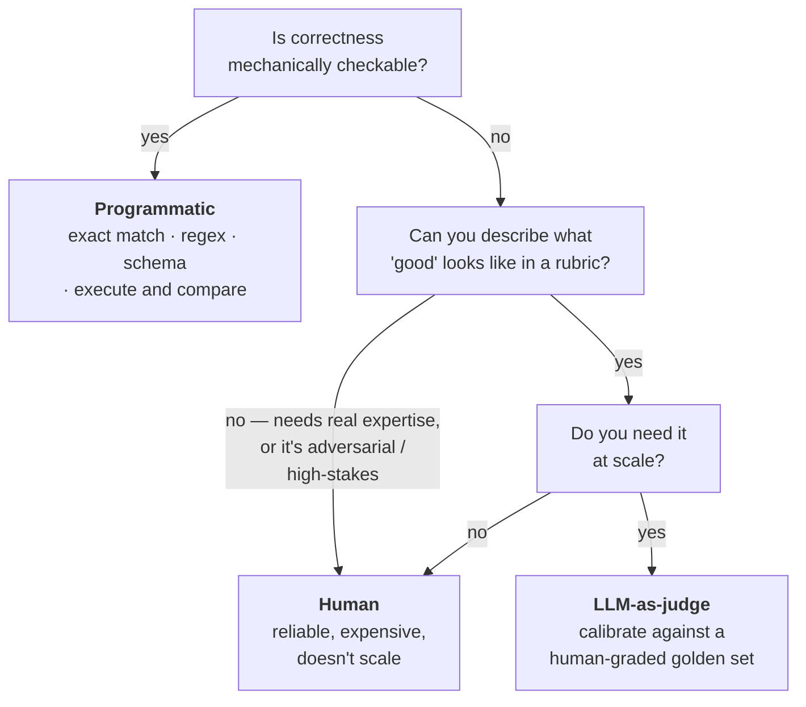

> **An LLM eval method is the mechanism you use to decide whether an LLM's output is good or not — the actual procedure that takes an output and produces a judgment about it.**

![[AI-Engineering/01-Agent-Evals/Images/v5-01-Three-Methods.png]]

The eval **pipeline** exists to tell you whether a component, workflow, or application is working. The **method** is what actually carries that pipeline out. Put most plainly: **who executes the eval?**

There are exactly three answers.

**1 · Programmatic / deterministic** — **code produces the verdict.**
The output is checked against a rule or a known correct answer by a program: exact match, regex, JSON schema validation, or running the output (execute the code, run the SQL) and comparing results. **Fast, cheap, reproducible — but only works where correctness is mechanically checkable.**

**2 · Human** — **a person produces the verdict.**
People rate, rank, or compare outputs directly. **The most expensive and slowest, but the gold standard for nuanced, subjective, or high-stakes judgments.**

**3 · Model-graded (LLM-as-judge)** — **a model produces the verdict.**
A strong LLM scores or ranks the output against a rubric. **Used where there's no single right answer but you can describe what good looks like** — helpfulness, tone, groundedness.

> [!note] The Zomato email classifier was **programmatic** — a few lines of Python compared predicted label to expected label and computed accuracy. That was never a preference; it was the only sensible choice, because `billing == billing` is mechanically checkable.

---

# Example 1 — Programmatic: evaluating a retriever

CampusX builds a RAG chatbot so users get help without emailing. We decide to evaluate it properly, and we start at the **component level** with the retriever.

**Target:** a single component — the retriever. 
**Task:** is it fetching the right documents?

## Success criteria — Recall@k

![[AI-Engineering/01-Agent-Evals/Images/v5-02-RecallAtK.png]]

> **Recall@k** — **Out of all the correct/relevant items that exist, how many did the system retrieve in its top-k results?**
>
> `Recall@k = (relevant items retrieved in top k) / (total number of relevant items)`

Work one row by hand. Question: **What are the prerequisites for the ML course and how long is it?**

- Documents that actually contain the answer: **1001** and **1003** — two of them.
- Retriever with `k=5` returns: `1001, 1002, 1004, 1005, 1006`.

Of the two correct documents, it found one. **Recall = 1/2 = 0.5.** Bounded between 0 and 1; ideally 1.

> [!info] Relevance has more than one aspect, and Recall@k only covers the first: 
> (a) of all the correct documents, how many did you fetch — **recall**; 
> 
> (b) of the documents you fetched, how many were useless — **precision**; 
> 
> (c) were they in a sensible **order** — ranking metrics. We're deliberately measuring one aspect here.

## Build the dataset

50-100 questions users might plausibly ask once the chatbot is live — deliberately sampled to cover easy questions, difficult questions, edge cases, and random ones.

Then a **human expert** goes into the vector database and, for each question, records which document IDs actually contain the answer. That's the golden dataset: question → gold document IDs.

## Define the method, run it, read the result

Every question goes to the **retriever only** — not the whole chatbot — with `k=5`. Each returns five document IDs. Now you have gold IDs and retrieved IDs side by side, so you compute recall per row and average across the set.

![[AI-Engineering/01-Agent-Evals/Images/v5-03-Retriever-Improvements.png]]

`(1.0 + 0.5 + 1.0 + 1.0 + 0.0 + 0.5) / 6 = 4.0/6 ≈ 0.67`

**Recall@5 = 67%.** No human was involved in the grading, and none was needed — humans are expensive, and a program can do this exactly.

## Analyse and improve

Study the rows with the worst recall, then reach for one of four levers:

- **Better embedding model** — perhaps it isn't capturing semantic meaning well enough
- **Query expansion** — pass the user's question through an LLM to expand it **before** it reaches the retriever
- **Increase k** — try `k=10` instead of `5`
- **Reranking** — if the right document was at position 8, a reranker can lift it to position 3

> [!important] Whether an eval is programmatic, human, or model-graded depends on **who executes it and extracts the scores** — nothing else. **Creating the golden dataset is a separate activity, and it is essentially always done by a human.** This retriever eval is **programmatic** even though a human labelled the gold document IDs.

---

# Example 2 — Human: evaluating helpfulness

Same company, different question. The chatbot is live-ish and we want to know whether its answers are actually **helpful**.

**Target:** the **entire application** — not one component, not one workflow. **Task:** evaluate helpfulness.

Helpfulness here means three things at once: the answer is **accurate**, in the **right tone**, and **complete** in itself.

## Success criteria — and why there isn't a metric

Here defining a success criterion is genuinely hard. **There is no correct metric for helpfulness.** It varies business to business.

So instead of a metric, you write a **rubric**:

![[AI-Engineering/01-Agent-Evals/Images/v5-04-Helpfulness-Rubric.png]]

| Score | Meaning |
|---|---|
| **5** | Fully answers the question, accurate and complete, appropriate tone |
| **3** | Partially helpful — missing something, or slightly off |
| **1** | Unhelpful, wrong, or irrelevant |

## The dataset has only one column

50-100 questions, again sampled for coverage — normal, difficult, edge cases, random:

```
1  How long is the ML course?
2  Is the ML course right for me if I already know Python?
3  What's the fee for the DL course?
4  Do I get a refund if I drop out midway?
5  Can I pay the fee in installments?
```

**Notice what's missing: there is no expected-answer column.** Hold that thought — it becomes the whole point of the next note.

## Why the method has to be human

Could you write a program that reads a chatbot answer and tells you it's 70% helpful? No. The judgment is too nuanced — it needs a reading of tone, completeness, and whether the answer actually lands for a beginner. So the method is **human**: a person sees the question, sees the answer, and assigns a grade against the rubric.

## Why you often use two graders

![[AI-Engineering/01-Agent-Evals/Images/v5-05-Two-Graders.png]]

Grader A and Grader B score the same answers. Row 1: 5 and 5. Row 3: 5 and 5. Row 2: **2 and 3.**

One grader you trust. Why add a second? Because **disagreement between graders is a measurement of your rubric, not of your chatbot.**

> [!important] If two graders keep diverging on the same answers, the conclusion is **there is ambiguity in the rubric.** One says 2, the other says 4, repeatedly — the instruction is unclear and both are guessing differently. High agreement means the rubric is well-specified. So a second grader is often added **purely to refine the rubric.**

Average the grades and you have your helpfulness score — produced by a human.

## Humans do five different jobs in evals

The flow above is only the simplest one. Humans show up in five distinct roles:

![[AI-Engineering/01-Agent-Evals/Images/v5-06-Five-Human-Eval-Types.png]]

| Role | What it is |
|---|---|
| **Direct grading / rating** | A person reads outputs and scores them against a rubric — the pipeline you just built. The most basic role: human as the grader. |
| **Red teaming** | Actively **attacking** the system to find failures: crafting jailbreaks, prompt injections, adversarial and edge-case inputs, trying to make it produce harmful or wrong output. Creative adversarial work automated evals **can't originate**. |
| **A/B testing** | Real users as graders **in production**; their behaviour (thumbs-up, task completion, re-asking, escalation) is the verdict on which version is better. |
| **Gold-answer / dataset creator** | Writing or verifying the correct answers (gold SQL, gold doc IDs, concept rubrics) and curating the test set to cover the real distribution. |
| **HITL (human-in-the-loop)** | A human placed **inside the production flow** as a checkpoint — reviewing, approving, editing, or rejecting live outputs before they reach the user, triggered on the risky slice (low-confidence, high-stakes, flagged). |

Two of these are worth pausing on. **Red teaming** is the one an automated eval structurally cannot replace — a program can re-run known attacks but cannot **invent** the next one. And **A/B testing** is the only entry where the grading happens after deployment, by people who don't know they're grading.

## The trade

**Advantage: reliability.** If you hire a competent person, you trust their judgment. A human brain handles nuance a program can't come near, so trust in the number is high.

**Disadvantage: cost.** You have to pay people. Which means at real scale — lakhs or crores of users — **you most likely cannot use humans for evaluation at all.**

---

# Example 3 — LLM-as-a-judge: grading UPSC Mains answers

Now the interesting case: **what if programmatic is impossible and human is unaffordable?**

## The setup

CampusX runs a UPSC preparation website and YouTube channel. UPSC has three stages — **Prelims**, **Mains**, **Interview**. Prelims is MCQ, so automating a mock test is trivial. **Mains is subjective**, which means grading needs subject-matter experts.

Here's the business problem. Lakhs of students could take the mock test. Even at 10,000 students, you need a lot of SMEs, paid per paper evaluated — and your profitability collapses.

Then a company offers a platform: send any number of students, and an LLM-based system grades them against **your** rubrics for a fraction of the cost. Does that make business sense? Obviously.

**We are that platform.** And now we have to evaluate it.

**Target:** the whole application. **Task:** does it grade papers the way a human expert does?

## Success criteria

> **If the platform evaluates UPSC answers exactly the way human experts do, the platform is successful.**

Not the only possible criterion, but a good one — and note what it implies: **the human's grade becomes the definition of correct.**

## Step 1 of the dataset — define the rubric (this is not the dataset)

Take a three-question paper. Bring in an expert who grades well and ask only one thing: **what dimensions should I check in an answer?**

![[AI-Engineering/01-Agent-Evals/Images/v5-07-UPSC-Rubric.png]]

| Q | Question (Mains) | Expected dimensions | Max |
|---|---|---|---|
| q1 | **Ethical governance is impossible without administrative accountability.** Discuss. | ① defines ethical governance & accountability ② explains the link between them ③ gives mechanisms (RTI, social audit, CVC) ④ cites examples/cases ⑤ balanced conclusion | 15 |
| q2 | Examine the role of the Governor in Centre-State relations. | ① constitutional role (Art. 153-163) ② discretionary powers ③ points of friction/misuse ④ Sarkaria/Punchhi recommendations ⑤ balanced view | 10 |
| q3 | **Federalism in India is more cooperative than competitive.** Critically analyse. | ① defines cooperative vs competitive federalism ② arguments for cooperative (GST Council, ISC) ③ arguments for competitive (Ease of Business rankings) ④ recent tensions ⑤ reasoned stance | 15 |

> [!warning] **This is the rubric, not the dataset.** A rubric is a reusable standard for judging **any** answer to that question. Confusing the two is a common slip.

## Step 2 — the golden dataset

![[AI-Engineering/01-Agent-Evals/Images/v5-08-Golden-Dataset.png]]

Now conduct the paper, take real student answers, and have **one** human SME grade them against that rubric — dimension by dimension.

| Ans | Q | Answer summary | Dimensions covered | Human marks |
|---|---|---|---|---|
| a1 | q1 | Defines both terms, links them, discusses RTI & social audit, cites 2G/CVC example, balanced conclusion | ①✓ ②✓ ③✓ ④✓ ⑤✓ | **13/15** |
| a2 | q1 | Long, fluent essay on **good governance** generally; never links to accountability, no mechanisms, no examples | ①partial ②✗ ③✗ ④✗ ⑤✗ | **4/15** |
| a3 | q1 | Covers link and mechanisms well but no example and abrupt ending | ①✓ ②✓ ③✓ ④✗ ⑤✗ | **8/15** |
| a4 | q2 | Constitutional role + discretionary powers + Sarkaria; misses friction points and conclusion | ①✓ ②✓ ③✗ ④✓ ⑤✗ | **6/10** |
| a5 | q2 | Vague, mostly restates the question with heavy jargon, no constitutional articles | ①✗ ②✗ ③✗ ④✗ ⑤partial | **1/10** |
| a6 | q3 | Defines both, strong two-sided argument with GST Council & rankings, reasoned stance | ①✓ ②✓ ③✓ ④✓ ⑤✓ | **12/15** |
| a7 | q3 | Only argues the cooperative side, ignores competitive angle, no recent tensions | ①✓ ②✓ ③✗ ④✗ ⑤partial | **6/15** |

**50-100 rows is enough** — and note how small the human cost actually is. You are not grading lakhs of papers. You grade **50-100 answers, once,** with one expert. That's the entire human investment.

## Step 3 — the method has to be an LLM

Programmatic? You can't compare a subjective essay to a human's mark with Python. Human at scale? Unaffordable — that was the whole business problem. So: **LLM.**

## Running it — the judge prompt

![[AI-Engineering/01-Agent-Evals/Images/v5-09-Judge-Prompt.png]]

```text
You are grading a UPSC Mains answer against an evaluation rubric.

QUESTION (max marks: {max_marks}): {question}

RUBRIC — expected dimensions and their marks:
{rubric_dimensions_for_this_question}

ASPIRANT ANSWER: {answer}

For each dimension, decide whether the answer genuinely addresses it
(and how well), then allocate marks. Do NOT reward verbosity,
keyword-stuffing, or confident assertions that lack substantiation.
Reward structure, relevant examples, and balanced argumentation.

Respond in JSON only:
{
  "dimensions": [{"dimension": "...", "addressed": true|false, "marks": <number>}],
  "total_marks": <number>,
  "reasoning": "two-sentence justification"
}
```

Three things in that prompt are doing real work, and they're the transferable part:

- **The rubric is injected per question**, pulled from the rubric table — the judge is not asked to invent standards.
- **Explicit negative instructions.** **Do not reward verbosity, keyword-stuffing, or confident assertions that lack substantiation.** These name the exact failure modes an LLM judge falls into: fluent-and-long reads as good.
- **Structured output plus a reasoning field.** JSON makes it parseable; the two-sentence justification makes a disagreement auditable.

## Reading the result — MAE

![[AI-Engineering/01-Agent-Evals/Images/v5-10-Human-Vs-Judge-MAE.png]]

Human and judge, same rubric, side by side:

| Ans | Q | Human | Judge |
|---|---|---|---|
| a1 | q1 | 13 | 12 |
| a2 | q1 | 4 | **8** |
| a3 | q1 | 8 | 8 |
| a4 | q2 | 6 | 6 |
| a5 | q2 | 1 | 2 |
| a6 | q3 | 12 | 12 |
| a7 | q3 | 6 | 5 |

The success criterion said **grades like a human**, so the metric is the **gap** between the two columns — **Mean Absolute Error**:

`MAE = ( |13-12| + |4-8| + |8-8| + … ) / 50 = 2.3`

**What 2.3 means:** on average the judge deviates ±2.3 marks from the human. And now the goal is completely concrete — **drive that number toward zero**, because zero means the LLM grades exactly as a human does.

Levers: a stronger LLM, a rewritten system prompt, or a sharper rubric. Then re-run on the same 50 answers, exactly as the loop in note 03 prescribes.

> [!tip] Look at row a2 — human 4, judge 8. That's a **long, fluent essay that never actually answers.** The judge fell for exactly the failure the prompt tried to forbid. A single row like that is worth more than the aggregate, and finding it is what error analysis means.

---

## Choosing a method



> [!important] Reach for the cheapest method the problem allows, not the most powerful. Programmatic where correctness is checkable. Human where judgment is irreducible or the stakes are high. **LLM-as-judge is the middle option, and it earns its place only when programmatic can't grade the thing and humans can't grade the volume.** Most production eval pipelines end up model-graded — which is why LLM-as-judge is the technique you'll meet most in this field, and why Block 3 spends a whole block on its biases and calibration.
