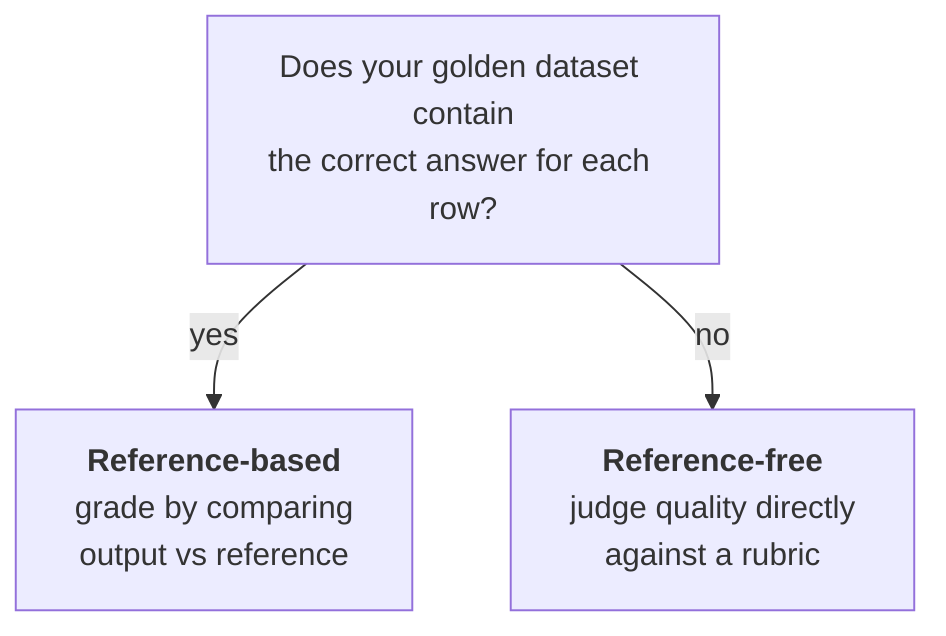

Two terms that get asked about, and that you have already met three times without them being named. They describe **what your golden dataset contains** — and the distinction turns out to be a single yes/no question.

---

## The two definitions

![[AI-Engineering/01-Agent-Evals/Images/v5-11-Reference-Based-Vs-Free.png]]

> **Reference-based evaluation**
> You have a reference — a **known-correct answer** (or the key things a correct answer must contain) **written down in advance for each test case.** You grade by comparing the output against that reference.

> **Reference-free evaluation**
> You have **no predefined correct answer.** You judge the output's quality directly, on its own terms, against a criterion or rubric — but a rubric here is a **scale/standard** (**what does a good answer look like**), not a per-item correct answer.

The load-bearing phrase is **per test case**. Reference-free evaluation still has **standards** — the helpfulness rubric was a standard. What it doesn't have is a row-by-row statement of what the right answer was.

---

## Classifying the three examples

The three worked examples from the previous note sort cleanly — and one of them was chosen specifically so the contrast would show up.

![[AI-Engineering/01-Agent-Evals/Images/v5-12-Reference-Classified.png]]

### Retriever eval → reference-based

For each question we recorded the gold document IDs **in advance**: **the answer to this question is in document 1001**, **the answer to this one is in 1001 and 1003.**

That's a known-correct answer per test case. Recall@k is literally a comparison of retrieved-vs-reference. **Reference-based.**

### UPSC judge eval → reference-based

Less obvious, and worth being precise about. The golden dataset had a **Human marks** column: a1 → 13/15, a2 → 4/15, a5 → 1/10.

Ask what **correct** means for that system. The success criterion was **grades the way a human expert does** — so **the human's mark is the correct answer** for each row. We were telling the judge, in effect: **the human gave this answer 13; try to give it 13 too.** One reference per test case. **Reference-based.**

### Chatbot helpfulness eval → reference-free

Look at that dataset again: it had **one column**, a list of questions. No expected answer anywhere.

The flow was: take a question → send it to the chatbot → chatbot produces an answer → human reads the rubric and assigns 1-5 based on judgment. Nothing in the dataset says what the right answer was. The human is relying on the **rubric as a standard**, not on a stored answer. **Reference-free.**

> [!note] That human example was deliberately built without a reference. Human-graded evals are **often** reference-free — but not always, and the two axes are independent. Which is the next point, and the one worth carrying.

---

## The test

That's the whole distinction. If someone shows you an eval pipeline, you don't need to inspect the method or the metric — **just ask whether the dataset carries a per-item correct answer.**

---

## The two axes are independent

This is the part most people conflate, so it's worth laying out explicitly. **Who grades** and **whether a reference exists** are two separate questions, and every combination occurs:

| | **Reference-based** | **Reference-free** |
|---|---|---|
| **Programmatic** | Retriever Recall@k · exact match · running the SQL and diffing results | Rare — code with no reference can only check **form** (valid JSON, length, no banned words), not quality |
| **Human** | Grading against a published answer key | Chatbot helpfulness rubric — the example above |
| **LLM-as-judge** | UPSC grader calibrated to human marks | **Rate this answer's tone 1-5** · faithfulness checked against retrieved context |

Two things fall out of that table that are easy to miss:

**Programmatic + reference-free is nearly empty**, and for a good reason. Without a reference, code can only check properties it can compute — schema validity, length, presence of a citation, absence of a banned word. It cannot assess quality. That's precisely the gap LLM-as-judge fills.

**Reference-free doesn't mean unmeasurable.** Groundedness is reference-free — you're not comparing the answer to a gold answer, you're checking whether every claim is supported by the retrieved context. The context is the standard, and it changes per request. Some of the most useful metrics in RAG evaluation live in this box.

---

## Why the distinction earns its keep

Beyond being an interview question, it tells you something operational:

**Reference-based evals are cheap to run and expensive to build.** Someone has to write down the correct answer for every row. But once built, grading is mechanical and the score is trustworthy.

**Reference-free evals are cheap to build and harder to trust.** No answer key needed — but the score now depends entirely on the rubric's quality and the grader's consistency. Which is exactly why the previous note's two-grader trick exists: with no reference to anchor against, **inter-grader disagreement is your only signal that the rubric is ambiguous.**

> [!important] So the sequence is: prefer reference-based where you can afford to build the answer key, because the number means more. Go reference-free where a correct answer genuinely doesn't exist — and then invest the saved effort into the rubric, because the rubric has become the entire definition of correct.

