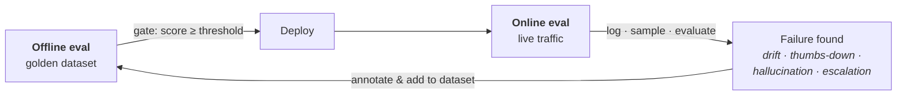

Everything covered so far — the loop, the three grading methods, both reference types — has been **offline evaluation**: run before the system reaches a user. You already know it; it just hasn't been named.

This note names it, gives it three concrete jobs, then shows the three things that go wrong **after** deployment that offline evaluation is **structurally incapable** of catching. That gap is what online evaluation fills.

The one line to carry out of here: **offline eval tells you whether your application works correctly; online eval tells you whether it's running normally.** Those are different questions, and the second one is answerable without an answer key — which is the whole trick.

---

## Offline evals — and their three jobs

Any eval pipeline you run on your application **before deploying it** is an offline eval. The UPSC grader from note 04 was one: built, evaluated against a golden dataset, **then** shipped.

![[AI-Engineering/01-Agent-Evals/Images/v6-01-Why-Offline-Evals.png]]

### 1 · Pre-release testing — and gating

The obvious job: don't ship untested. But there's a stronger version, and the green annotation on that board is the point — **`gate → CI/CD`**.

Once the eval is a script, it becomes a **release gate**:

```
push code → CI triggers (e.g. GitHub Actions) → eval script runs → score
    score ≥ 95%  →  deployment pipeline triggers automatically
    score <  95%  →  notification: "evals failed" · rollback to previous version
```

Not just testing before release — an **automated** decision about whether release happens at all.

### 2 · Version comparison

You have a choice to make: build on Claude or on OpenAI? Everything else in the code is identical; only the model differs.

Build two versions and run **the same eval** on both. Because the eval is the same and the golden dataset is the same, **the field is level** — so the score difference is attributable to the model and nothing else.

This generalises to any fork in the road: different prompts, different models, different rerankers, different vector databases, even different whole architectures. Whenever you're stuck between options, the eval decides.

### 3 · Regression testing

**Test of change.** And the example is worth remembering because it's so ordinary.

You notice in production that the chatbot answers **coldly** about refunds. Reasonable fix: edit the system prompt — **be very kind and polite.**

Now its personality is **too** soft. A student asks the cost of the Insider plan. The real answer is **₹19,500**. To sound agreeable, the bot says **it's around ₹19,000.**

> [!warning] You improved one thing and broke another. That's **regression** — and it is the characteristic failure mode of complex LLM systems. You go to raise performance in one place and it drops somewhere else.

Offline evals catch it because your golden dataset deliberately contains **all case types** — refund questions, pricing questions, curriculum questions — so you get results **per category**. Refund handling was 90% before the prompt change; afterwards it should still be ~90%. If it's 80%, there's regression, and that change should not ship.

---

## But what about post-deployment?

Offline evals pass. You deploy. Three things now happen that your offline setup never saw.

![[AI-Engineering/01-Agent-Evals/Images/v6-02-Post-Deployment-Risks.png]]

**1 · Unanticipated inputs.** Offline you tested the 200-500 questions you **thought** users would ask. Production is open to the real world: questions mixing Hindi and English, ambiguous half-questions, **angry rants with a real question buried inside**, adversarial prompt-injection attempts, and edge-case scenarios you never considered. Production is an enormous superset of your test set.

**2 · Emergent / systemic failures** — problems that only exist **at scale, under load, over time**:

- a retrieval index silently lagging its source document
- cost per conversation quietly tripling after a prompt change
- the latency tail (p99) frustrating a slice of users
- **a subtle bias that only becomes visible across thousands of conversations** — e.g. the bot handles technical-background users well and subtly worse with non-technical ones. You cannot see that in one conversation; the pattern only emerges in aggregate.
- degradation that only appears under real concurrent load

You launch a new course, a thousand concurrent users arrive, latency spikes. **You could never have tested that offline — you can't bring a thousand real users into a test harness.**

**3 · Drift** — and the annotation says it exactly: **`offline eval → obsolete`.**

You built the golden dataset against today's documents: today's prices, curriculum, policies, transcripts. Over a year, the business changes all of them. A year later your corpus is very different — but the golden dataset still describes the old world.

The result is the dangerous one: **your offline eval still reports good scores while users are giving negative feedback.** You kept changing the system and never changed the eval, so the eval quietly stopped measuring reality.

### Why offline evals can't reach any of this

One structural reason. Offline evals work by having a **golden dataset with correct answers**.

In production there is no golden dataset. The user can ask anything, and **you do not have the correct answer** — you don't know what a future student will ask, let alone what the right response is.

---

## Online evals

> **Online eval is evaluating your system on live production traffic, after deployment, as real users interact with it.**
>
> **Biggest challenge — in production, there is no answer key.**

That constraint is also the defining feature: online evaluation is the kind that **works without a golden dataset.**

![[AI-Engineering/01-Agent-Evals/Images/v6-03-Offline-Vs-Online-Table.png]]

| | **Offline eval** **(before deployment)** | **Online eval** **(after deployment)** |
|---|---|---|
| **Data** | Fixed, pre-collected dataset | Live production traffic |
| **Answer key** | Known in advance | None — must estimate quality |
| **Timing** | Runs before shipping | Runs continuously, live |
| **Inputs seen** | Only what you anticipated | The real, messy distribution |
| **Catches** | Known regressions | Drift, surprises, emergent bugs |
| **Best for** | Gating, version comparison, CI | Real-world quality, drift detection |
| **Cost & speed** | Fast, cheap, repeatable | Ongoing, needs sampling to afford |

> [!important] **Not rivals — two halves of one loop: offline gates what ships, online watches what shipped.** These are complementary, never substitutes. You do not pick one.

---

## Correctness vs normality

The cleanest way to feel the difference. Take the UPSC grader again.

**Offline, we measured correctness.** Correctness had a precise definition: do the system's marks land close to the human's marks? Measured with MAE, and we drove it toward zero.

**Online, can we measure correctness?** No. For the answer being graded **right now**, we don't have a human's marks. There's no golden dataset for this particular answer — nobody graded it before the system did. **The human perspective does not exist in production.**

So what **can** we check? Whether the system is behaving **normally**.

![[AI-Engineering/01-Agent-Evals/Images/v6-04-Distribution-Shift.png]]

Store every total score, then plot the **distribution over a one-week window**. Last week: most students around 500, a good number around 700, few around 200. Do that for several weeks and the shape stabilises — that's your **baseline**.

Then one week the distribution shifts: suddenly most scores cluster around **800**. You cannot say **the system is wrong** — but you can say **something changed**, and that's a trigger to go investigate.

> [!note] A student raised the right objection: the shift might be legitimate — maybe unusually strong candidates showed up that week. True. Online evals don't **prove** incorrectness. They tell you something moved, and you go look. That is a much weaker claim than offline correctness, and it's still the difference between finding out today and finding out from a customer.

### Two other ways to grade without an answer key

**User feedback as a proxy for correctness.** Put thumbs-up / thumbs-down in the UI. If the last hour is suddenly full of thumbs-down, something is producing wrong answers. You've substituted user judgment for the missing answer key.

**Metrics that never needed a reference.** **Faithfulness** is the clean example: you have the retrieved context, and you have the generated answer. Ask an LLM whether the answer is supported by that context. No gold answer required, so it works identically online and offline.

> [!tip] So the online toolkit is: metrics that are inherently reference-free (faithfulness, toxicity, PII leakage) · user-behaviour signals standing in for correctness · and baseline comparison for everything else.

---

## The online eval pipeline

### Step 1 — Logging

Nothing can be evaluated that wasn't recorded. If the conversation is lost, there is nothing to evaluate.

> **Capture a structured, replayable record of every conversation turn.**

![[AI-Engineering/01-Agent-Evals/Images/v6-05-Logging-Spec.png]]

What goes in each record:

| Group | Fields |
|---|---|
| **Identity / threading** | `conversation_id`, `turn_id`, `user_id` / `session_id`, `timestamp` |
| **Input** | raw user message, plus any preprocessing (normalised text, detected language/intent) |
| **Retrieved context** | the chunks that were fetched |
| **Output** | response text, `model_name` / `prompt_version` (needed for A/B testing and answering **which version regressed?**), tool calls, finish reason |
| **Operational telemetry** | `latency_ms` — ideally split into retrieval vs generation — `prompt_tokens`, `completion_tokens`, derived cost, error/status codes |
| **Downstream user signals** | thumbs up/down, escalation to support, drop-off, rephrase, conversion |

And **four engineering properties** that make the difference between logging that works and logging that hurts:

- **Non-blocking** — logging must **never** add latency to the response. Fire to a queue, write in the background. Logging is itself an operation; done naively it becomes part of the user's wait.
- **Durable + queryable** — a warehouse or observability tool you can run analytical queries against, **not scattered text logs**. You will need to fetch this later; that's the whole point.
- **Late-signal attachment** — signals arrive at **different times**: thumbs-down in seconds, escalation in an hour, conversion the next day. Someone may email support the day after the conversation. So records are **keyed on `conversation_id` and updated as signals arrive**.
- **PII handling** — scrub or tokenise emails, phone numbers, payment details. Apply retention limits and access control, so a teammate can't later extract personal data out of your observability tool. (**PII** = personally identifiable information — phone, card, date of birth, Aadhaar.)

### Step 2 — Two kinds of signal

![[AI-Engineering/01-Agent-Evals/Images/v6-06-Computed-Vs-Captured.png]]

| **Captured** **(read directly from the trace)** | **Computed** **(produced by an evaluator)** |
|---|---|
| Thumbs up/down · escalation rate · abandonment / drop-off · rephrase rate · conversion · latency (p50/p95/p99) · cost per conversation · token usage · error rate | Faithfulness · answer relevance · correctness · hallucination · toxicity · bias & fairness · PII leakage / prompt injection · conciseness · task completion, satisfaction |

**Captured** signals already exist — the user pressed thumbs-down, the request took 2.03s. You store them as-is; nothing to calculate.

**Computed** signals don't exist until you produce them. Nobody hands you a faithfulness score — you have to build an evaluator that generates it.

That distinction determines the pipeline shape.

### The flow for a captured quantity

```
log  →  dashboard  →  alerting
```

Dashboards **aggregate over time windows** — last hour, 24 hours, week, six months. And that aggregation is the substance:

> [!important] A single conversation in isolation doesn't matter. Latency on one request can spike for any reason. But if **average latency over the last hour** is climbing, that's a system-level problem. Online evaluation is about aggregates over windows, not individual events.

Then alerting, because nobody watches a graph all day — the on-call engineer is asleep or on holiday. Set a threshold, wire the alert to Slack, email, or PagerDuty. Latency crosses 4s → someone gets paged → they allocate more instances, adjust the load balancer, and latency comes back down.

### The flow for a computed quantity

```
log  →  sampling  →  evaluator (LLM-as-judge)  →  metric  →  dashboard  →  alerting
```

![[AI-Engineering/01-Agent-Evals/Images/v6-07-Online-Pipeline.png]]

Two additions, and both matter.

**The evaluator is reference-free.** Take hallucination. Is there a golden dataset for the answer that was just produced? No. Is there an answer key? No. So this is a **reference-free evaluation** — exactly the category from the previous note — and the method is **LLM-as-judge**: show a stronger model the retrieved context, the question, and the output, plus a rubric describing how to detect hallucination, and let it score.

**Sampling, because the evaluator costs money.** If you run 50,000 conversations a day and your evaluator is itself an LLM call, evaluating everything **more than doubles your bill** — you're already paying to serve those conversations. So you sample, say 1,000 of 50,000.

But **not random sampling — stratified sampling:**

> [!tip] Not all conversations are equally informative. Bucket them first, then draw **more heavily from the problematic buckets**: thumbs-down · abruptly-ended conversations · escalations · repeatedly-rephrased questions · money-related topics (refunds, fees, admissions). Deprioritise the thumbs-up ones — the user was already satisfied, so there's probably nothing to find. Same sampling budget, far higher chance of catching a real hallucination.

---

## The same evaluator can be either

One detail from the LangSmith walkthrough that crystallises the whole note:

![[AI-Engineering/01-Agent-Evals/Images/v6-08-Tracing-Or-Dataset.png]]

When you configure an evaluator — name, application, judge model, rubric prompt, output format — you then choose its **Source**: **Tracing** or **Datasets**.

- Point it at **tracing** (your live logs) → it is an **online evaluator**.
- Point it at a **dataset** → datasets live in the offline setup → it is an **offline evaluator**.

**Same evaluator. Same rubric. The only difference is what you point it at.** Which is the cleanest possible statement of the distinction: offline and online evaluation are not different techniques, they are the same techniques aimed at different data.

The template catalogue is worth knowing too, and note that **every entry is LLM-as-judge**: security (PII leakage, prompt injection, code injection), safety (toxicity, bias & fairness), quality (hallucination, correctness, assertions, conciseness, answer relevance), conversation quality, trajectory (for agents), plus image- and voice-specific ones.

---

## The self-improving loop

The last piece closes the circle from note 03.

When your team spots a bad conversation in the logs, you **add it to the offline dataset** — one click in a tool like LangSmith, or via an annotation queue where you mark what went right and wrong. The next offline eval then runs against the enriched dataset.



> [!important] Offline gates what ships. Online watches what shipped. **Online failures become offline test cases**, so the golden dataset gets harder in exactly the ways reality is hard — and drift stops being able to quietly obsolete your eval, because production keeps refreshing it.

---

## Reading a dashboard number

A question worth having an answer to: **faithfulness is 0.87, toxicity is 0, latency is 3s — is the bot good?**

**On its own, 0.87 means nothing.** Every quantity needs a **baseline**, and the baseline generally comes from your offline eval. If your offline baseline was 0.85, then 0.87 in production is good news. If it drops to 0.75 against that same 0.85 baseline, that's concerning — and that's what the alert threshold should have been set against.

> [!tip] The same logic answers **my offline score went 92% → 99%, is that good?** — only if nothing else moved. In LLM systems, improving one quantity routinely drags another down. **A single improved number is not evidence of improvement; the whole eval suite holding or rising is.** That's regression testing again, and it's why you run a suite rather than a metric.
