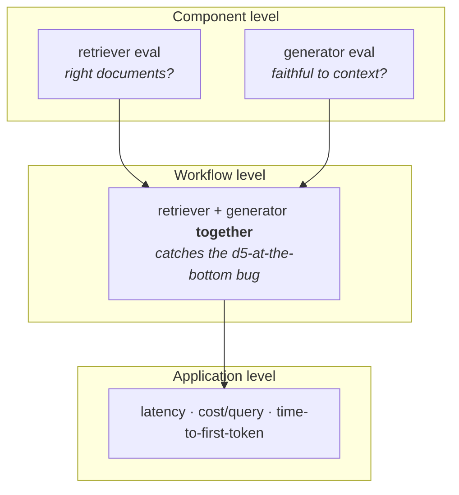

> **One LLM-based application has several LLM evals.**

That's the claim this note proves. Not **here are more evals you could write** — but **why a single eval pipeline is structurally incapable of telling you your application works.** There are two independent reasons, and the first one is demonstrated with a counterexample worth sitting with, because it's genuinely surprising the first time.

By the end you'll have two taxonomies: **where** a system can fail (three levels), and **what kind** of failure it is (three risk categories). Together they tell you how many evals you need and where to put them.

---

## The system: a RAG chatbot

![[AI-Engineering/01-Agent-Evals/Images/v4-01-RAG-Architecture.png]]

Standard shape, and you know it already. A query arrives at the **retriever**. The retriever uses it to fetch relevant documents from a **vector database**. Then the query **and** the retrieved documents both go to the **generator** — an LLM — which produces an answer grounded in that context.

## Reason 1 — a system has multiple failure points

Look at that diagram and ask where it can break. Two answers are immediate:

![[AI-Engineering/01-Agent-Evals/Images/v4-02-Two-Failure-Points.png]]

1. **The retriever fetches the wrong documents.** The generator then does its best work on bad material and produces a wrong answer.
2. **The retriever works, but the generator ignores the context** and hallucinates something else.

Both have to work for the application to work. So you write one eval pipeline per failure point:

- **Retriever eval** — given a query, are you getting the right relevant documents back?
- **Generator eval** — given a context, is the answer generated correctly from it? The quality being checked here has a name: **faithfulness**, also called **groundedness**.

### What faithfulness actually means

Concretely. The question is **What is the duration of the machine learning course?** and the retrieved document says **3 weeks**.

A faithful answer is: **The machine learning course duration is three weeks.** Nothing else.

An unfaithful answer adds things that were never in the context — **It is a great course**, or **you can also purchase the Python course, whose duration is four weeks.** Those may even be true. They are still failures, because the answer must be **grounded in the context** and nothing but the context.

---

## The counterexample: both components pass, the application still fails

Now the interesting part. Suppose both evals are green — the retriever is provably fetching the right documents, the generator is provably faithful to whatever context it's given.

**Does that guarantee the application works?**

![[AI-Engineering/01-Agent-Evals/Images/v4-03-The-Counterexample.png]]

Walk through what actually happens.

The user asks: **What is the duration of the machine learning course?** The retriever is configured with **k = 5** — meaning it returns the five most relevant documents from the vector database.

What comes back:

```
d1  →  some random thing
d2  →  ... "the duration of the Python course is 6 weeks" ...
d3  →  some random thing
d4  →  some random thing
d5  →  "the duration of the ML course is 8 weeks"     ← the actual answer
```

**Did the retriever do its job?** Yes. Genuinely yes. You gave it a budget of five documents and told it to bring back the right answer within that budget — and it did. The lecture's analogy is exact: **I'll give you five attempts and you need to crack the exam once in five. It cracked it.** By its own contract, the retriever succeeded. (Assume there's no reranker in the system yet — that's the point.)

Now all five documents plus the question go to the generator. And the generator behaves the way generators behave: **it weights the earlier documents more heavily.** Either because that's the natural bias of position in the context, or because your system prompt explicitly told it to prioritise higher-ranked documents.

So it looks at d1-d4, finds a duration figure in d2 — **6 weeks** — and answers:

> **The duration of the ML course is 6 weeks.**

Which is wrong.

**But did the generator do its job?** Also yes. It was instructed to answer from the higher-priority documents, and it did exactly that. It did **not** hallucinate — the number 6 came from the context it was handed, not from thin air. It followed its instructions diligently. Its only sin was **combining the wrong pieces**.

> [!important] The retriever was independently fine. The generator was independently fine. **And the pipeline still broke.** Component-level evals cannot catch this, because at the component level there is nothing to catch — both components satisfied their contracts. The failure lives in the **interaction**.

### Which means you need a workflow-level eval

![[AI-Engineering/01-Agent-Evals/Images/v4-04-Workflow-Eval-And-Reranker.png]]

A third eval, whose target is the **retriever + generator combination**. That eval flags this error — and better, it points at the fix.

The diagnosis: the best document was **last in priority order**. So you add a **reranker** — a component whose job is to reorder retrieved results by relevance to the query. It lifts `d5` to the top and pushes `d1-d4` down. Now the generator's position bias works **for** you instead of against you, and the pipeline starts answering correctly.

### And then: does that guarantee it works?

Three evals now — retriever, generator, workflow — all green. Is the application shippable?

Still no. Because everything can be correct and the whole pipeline can take **ten seconds** per question. The user types, waits ten seconds, gets a right answer, and leaves. Correctness was never the only requirement.

So you need a fourth eval at the **application level**, checking that latency stays under a threshold.

---

## Taxonomy 1 — three levels where systems fail

![[AI-Engineering/01-Agent-Evals/Images/v4-05-Three-Levels.png]]

That walkthrough generalises into three levels. Any LLM application can fail at any of them, and each needs its own evals.

**Component level** — any single piece can fail on its own terms:
prompt · retriever · reranker · query rewriter · embedding model · vector database · output parser · tool selector · memory · guardrails

**Workflow level** — the components are individually fine but their **interaction** is broken:
RAG workflow · agent workflow · multi-turn conversation workflow · structured-output workflow · document-extraction workflow

**Application level** — everything works and the system is still not shippable:
end-to-end latency · token cost per query · time to first token

Here's the same idea as the stack of evals it produces:



> [!warning] Each level is **blind to the level above it.** Green at the component level says nothing about the workflow. Green at the workflow level says nothing about latency or cost. This is why **we have evals** is not a meaningful statement — the question is always **at which level.**

---

## Reason 2 — multiple risk categories

The second, independent reason you need many evals: **each failure point has more than one aspect worth checking.**

Three quick illustrations, one per level:

- **Application level** — the answer should be correct and helpful. It should **also** be **safe**. It is not acceptable for the chatbot to hand you another user's phone number and email address, however correct the rest of the answer was.
- **Workflow level** — faithfulness is one aspect. **Cost** is another: the retriever-plus-generator flow shouldn't cost more than some threshold per answer.
- **Component level** — the retriever's job is fetching relevant documents. But its **latency** matters too. Fetching perfectly while taking five or ten seconds is still a broken component.

So: not only multiple failure points, but **multiple aspects per failure point.** Those aspects are called **risk categories**.

![[AI-Engineering/01-Agent-Evals/Images/v4-06-Risk-Category-Definitions.png]]

They group into three:

| Category | The question it asks |
|---|---|
| **Application quality** | **Is the answer any good?** — does the app do its actual job well: correct, relevant, complete answers to what the user asked. The core **does it work** question. |
| **Safety** | **Could the answer cause harm?** — does the app avoid hurting anyone or exposing anything it shouldn't. **Not** about whether the answer is good; about whether it's harmful. |
| **Operational** | **Is it fast, cheap, and reliable enough to run?** — is the app practical to operate at scale. **Not** about what the answer says; about the system delivering it. |

> [!tip] The clean way to hold the three apart: **quality is about the content of the answer, safety is about the harm the answer could do, and operational is about the system producing it.**

---

## The risk-category catalogue

![[AI-Engineering/01-Agent-Evals/Images/v4-07-Risk-Table-Style.png]]

Not exhaustive — these are the ones you'll meet repeatedly. Application quality is subdivided by application type, because what matters depends on what you built.

### 1. Application quality

**1a · Core generation quality** — any LLM application (a summariser, a rewriter, a classifier)

| Criterion | Description |
|---|---|
| Correctness / accuracy | Whether the factual claims in the answer are actually true |
| Relevance | Whether the answer addresses what the user actually asked |
| Completeness | Whether the answer covers all parts of a multi-part question |
| Instruction following | Whether the output obeys explicit constraints (format, length, etc.) |

**1b · RAG-specific quality**

| Criterion | Description |
|---|---|
| Context relevance | Whether the retrieved chunks are actually relevant to the query |
| Retrieval recall | Whether all chunks needed to answer were retrieved |
| Groundedness / faithfulness | Whether every claim is supported by the retrieved context |
| Citation accuracy | Whether cited sources genuinely support the claims made |

**1c · Agent / tool-use quality**

| Criterion | Description |
|---|---|
| Tool selection | Whether the agent chose the right tool for the task |
| Parameter correctness | Whether the tool was called with valid, correctly-typed arguments |
| Task completion | Whether the agent actually accomplished the user's goal |
| Error recovery | Whether it handled tool failures gracefully and retried sensibly |

**1d · Multi-turn conversation quality**

| Criterion | Description |
|---|---|
| Context retention / memory | Whether it remembers relevant facts given earlier in the conversation |
| Clarification behaviour | Whether it asks for clarification when the request is ambiguous |

### 2. Safety

| Criterion | Description |
|---|---|
| Toxicity | Whether the output contains offensive, abusive, or hateful language |
| Harmful content | Whether it provides dangerous instructions (self-harm, weapons, illegal acts) |
| Bias / fairness | Whether outputs are free of unfair treatment or stereotyping across groups |
| PII leakage | Whether it exposes personal or private data |
| Prompt injection / jailbreak resistance | Whether it resists attempts to override its rules or bypass guardrails |

### 3. Operational

| Criterion | Description |
|---|---|
| End-to-end latency | Total time from user request to final response |
| Cost per request | Total token/compute spend to produce one response |
| Token efficiency | Whether it achieves its result without wasteful token usage |
| Error / failure rate | Fraction of requests that fail, time out, or return malformed output |
| Latency under load | Whether latency stays acceptable at production concurrency |

---

## Putting it together

Two independent multipliers. **Levels** — component, workflow, application. **Risk categories** — quality, safety, operational. Cross them and you get the eval suite for a real system: one pipeline for the retriever's relevance, another for the retriever's latency, another for generator faithfulness, another for workflow-level correctness, another for PII leakage, another for cost per request.

> [!important] Same application, many pipelines. One for latency, one for safety, one for correctness. This is why **99.99% of the time you will have more than one eval pipeline** — not because someone was thorough, but because a single pipeline is structurally blind to most of the ways the system can fail.

Two things worth carrying forward as interview answers, because both are counterintuitive and both are cheap to state:

- **Component-level green doesn't imply workflow-level green.** The d5-at-the-bottom example is the shortest proof of it, and it names its own fix — a reranker.
- **Quality, safety, and operational are three different questions about the same output.** Most people only evaluate the first.
