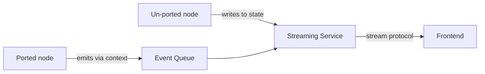

#langgraph #streaming #architecture #coupling #refactoring

---

# Who Should Own Event Emission in a LangGraph Pipeline?

When you build a LangGraph pipeline that streams events back to a frontend (NDJSON, SSE, WebSocket — doesn't matter which), you have to answer one architectural question: **who decides what the user sees?**

Most teams answer this badly the first time, and the bad answer rots into a single point of failure. This note explains the trap and the inversion that fixes it.

---

## The Trap — Streaming Service as Oracle

Imagine a textbook RAG pipeline: a graph with three nodes — one retrieves documents, one runs an LLM over them, one formats the final answer. You want the frontend to show progress as each node completes.

The natural first design has a streaming service wrap `graph.astream(...)` and translate each node's state update into a frontend event. The translation lives in the streaming service:

```python
# pseudo-code, illustrative only
async for chunk in graph.astream(...):
    name, output = unpack(chunk)

    # streaming service has to know every node and every state key
    if name == NODE_A:
        translate output["field_x"] -> event of type "x_ready"
    elif name == NODE_B:
        translate output["field_y"] -> event of type "y_ready"
    elif name == NODE_C:
        translate output["field_z"] -> event of type "z_ready"
    # ... and so on for every node in the graph ...

    yield serialize(event)
```

It works. It looks sensible. But it has three problems that compound badly as the pipeline grows past 3-4 nodes.

---

### Problem 1 — Wrong Layer Owns the Decision

The node is the only thing that actually knows what just happened and what's worth telling the user about. But here, the node is mute — it just returns state — and the streaming service, which has no business understanding profiles, plans, or executions, is making the call on what the frontend sees.

> [!important] The domain expert is silenced; the dumb relay is making domain decisions.

---

### Problem 2 — Coupling by Strings and Field Names

The streaming service hardcodes node names and state field names as string literals.

- Rename a node? Streaming silently breaks. No compile-time signal, no runtime error, just a missing event in the frontend.
- Rename a state field? Same.
- Add a new node? You must remember to also edit a file in a different directory and add another `elif`. Nothing enforces this — your reviewer won't catch it because the new node still works in isolation.

> [!danger] Two files must stay in sync forever, in two different directories, with no compiler help. This is exactly the kind of coupling that produces bugs during a 3am refactor.

---

### Problem 3 — One-Shot Per Node

LangGraph's `astream(stream_mode="updates")` only fires **after a node finishes**. So the streaming service only sees a node's output once, at the end.

If a node makes a 5-second external API call followed by a 3-second LLM call, the frontend gets nothing for 8 seconds, then one event. The user stares at a dead screen.

The node *could* tell the user "fetching..." and then "generating..." mid-execution — but in this architecture, it has no way to speak. The streaming service is the only one with the microphone, and it doesn't know what the node is doing.

---

## The Inversion — Nodes Speak, Streaming Relays

Flip the responsibility. Give every node a way to push events directly into the stream. The streaming service stops interpreting state — it just forwards whatever nodes say.

```python
# pseudo-code
# inside any node — node knows its own domain
ctx.emit(SomeTypedEvent(content=...))
```

```python
# streaming service is now dumb infrastructure
while True:
    event = await event_queue.get()
    yield serialize(event)
```

The node decides **what** the frontend sees and **when**. The event is a typed object — the contract lives in the event schema, not in scattered string lookups across two files.

---

### Why This Fixes All Three Problems

> [!success] Problem 1 fixed
> The node owns its domain decisions. No oracle.

> [!success] Problem 2 fixed
> The streaming service no longer knows or cares that any specific node exists. Renaming a node touches one file. Adding a node means writing a node — that's it.

> [!success] Problem 3 fixed
> Mid-execution emission becomes possible. A node can emit a "working..." status, make the slow call, then emit the result. Progress UX is no longer architecturally blocked.

---

## The Architectural Pattern

This is a specific instance of a general principle:

> [!info] Push, don't pull. The producer who has the information emits it directly. The consumer who needs to forward it is dumb infrastructure.

The opposite — having a consumer interrogate producers' state to figure out what happened — is a code smell anywhere it appears, not just in streaming. It usually means a missing abstraction or a missing event channel.

---

## Migration Strategy

You don't have to rewrite the whole pipeline at once. The two paths can coexist during migration:



Port one node at a time. Each port is two changes: add the emit call inside the node, delete the corresponding branch from the streaming service. The branches you haven't deleted yet keep working.

---

## Mental Model

> The streaming layer should not be omniscient about other people's domains. Every conditional branch on a node name that you write in a streaming service is a small architectural debt that will compound.
