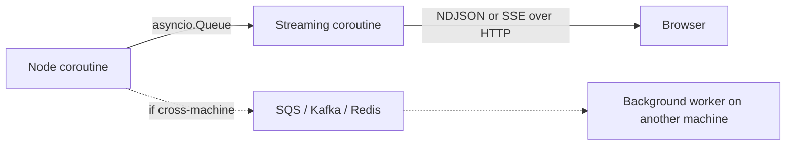

#asyncio #queues #sse #sqs #concurrency #push-vs-pull

---

# Queue vs List vs SSE vs SQS — Picking the Right Mailbox for the Right Distance

When you need to move messages from a producer to a consumer, you reach for some kind of "mailbox." But the word covers wildly different tools at wildly different scales. This note untangles four of them.

The decision rule under all of this: **how far apart are the producer and consumer, and how long do messages need to survive?**

---

## Why Not Just a List?

You've decided a node should push events into something, and a streaming coroutine should drain them. The simplest data structure that comes to mind is a list:

```python
ctx.events: list[Event] = []

# producer
ctx.events.append(event)

# consumer
while True:
    if len(ctx.events) > last_seen:
        send(ctx.events[last_seen])
        last_seen += 1
    await asyncio.sleep(0.05)   # check again in 50ms
```

This is **polling**. The consumer has no way to know an item arrived, so it keeps asking "anything new?" over and over.

> [!danger] Two problems with polling
> 1. **Latency.** Sleep 50ms between checks → every event is delayed up to 50ms for no reason. Drop the sleep → you burn 100% CPU spinning.
> 2. **Wasted work.** Most of the time the list hasn't changed, so most checks are pointless.

A queue inverts this. Instead of the consumer asking, it says **"wake me up when something arrives"** and goes to sleep. It does literally nothing until a producer pushes — then it wakes instantly, processes the item, and goes back to sleep.

```python
event = await ctx.event_queue.get()   # blocks until something is put in
send(event)
```

Zero polling. Zero latency. Zero wasted CPU.

> [!info] Push, not pull. That's the whole reason queues exist instead of "lists with a polling loop."

The mechanism the queue uses internally is a **future / condition variable** — the consumer parks itself on it; the producer's `put_nowait` flips it; the asyncio event loop wakes the consumer. You get all that bookkeeping for free.

---

## `asyncio.Queue` — In-Process, In-RAM

| Property | Value |
|---|---|
| Where it lives | RAM, inside one Python process |
| Who talks to whom | Two coroutines in the same event loop |
| Lifetime | Dies with the process (or sooner, if the request ends) |
| Cost | Zero — just a Python object |
| Persistence | None |

Use this when producer and consumer are **the same process**, **the same request**, **the same event loop tick**.

> [!tip] Real-world fit
> A FastAPI streaming endpoint where one coroutine produces events and another forwards them to the HTTP response.

---

## SQS — Across Machines, Across Time

AWS Simple Queue Service is a managed message queue.

| Property | Value |
|---|---|
| Where it lives | Amazon's servers |
| Who talks to whom | Different processes, different machines, possibly different data centers |
| Lifetime | Messages persist on disk; survive process crashes, deploys, restarts |
| Cost | Network round-trip per message + dollars per million messages |
| Persistence | Strong (configurable retention up to 14 days) |

Use this when **producer and consumer are not in the same process** and you need durability — messages must survive crashes and deploys.

> [!tip] Real-world fit
> "User uploaded a video. Queue a transcoding job for some background worker pool to pick up some time in the next hour."

> [!danger] Common mistake
> Reaching for SQS when an in-process queue would do. SQS for two coroutines in the same process is like mailing a letter to your roommate — it works, but the cost and latency are absurd.

---

## SSE — Server-Sent Events (Different Layer Entirely)

SSE is **not a queue**. It's an HTTP protocol for streaming responses from a server to a browser.

| Property | Value |
|---|---|
| Where it lives | The HTTP layer |
| Who talks to whom | Server → browser |
| Lifetime | One open HTTP connection |
| Cost | One long-lived TCP socket per client |
| Persistence | None |

The browser opens an HTTP request, the server keeps the connection open and writes events line-by-line, the browser's `EventSource` API parses each event as it arrives.

NDJSON streaming over HTTP is essentially the informal cousin of SSE — same idea, just without the strict `text/event-stream` content type and the built-in browser reconnection logic.

> [!important] SSE answers a different question than SQS or asyncio.Queue.
> Queues answer: "how does code A hand a message to code B?"
> SSE answers: "how does the server push messages over HTTP without the browser polling?"
>
> You typically use **both** in the same system: an in-process queue to hand events from a node to a streaming coroutine, and SSE/NDJSON to deliver those events from the coroutine to the browser.

---

## How They Stack in a Real System



- **Node → Streaming coroutine:** in-process handoff → `asyncio.Queue`.
- **Streaming coroutine → Browser:** across the network, single client → NDJSON or SSE.
- **Streaming coroutine → Background worker on another machine:** across the network, durable → SQS / Kafka / Redis.

The queue is the **internal handoff** between two coroutines. The HTTP stream is the **external delivery** to the browser. SQS would be the **cross-machine handoff** if you ever needed it. Three completely separate problems, three different tools.

---

## Decision Rule

> [!info] How far apart are producer and consumer? How long must the message survive?
>
> | Producer ↔ Consumer | Persistence needed? | Tool |
> |---|---|---|
> | Same coroutine | n/a | function call |
> | Same process, different coroutines | None | `asyncio.Queue` |
> | Same process, different threads | None | `queue.Queue` |
> | Different processes, same machine | None | `multiprocessing.Queue`, Unix socket |
> | Different machines, same data center | Some | Redis pub/sub |
> | Different machines, anywhere | Strong (durable) | SQS, Kafka, RabbitMQ |
> | Server → browser | n/a (live HTTP) | SSE, WebSocket, NDJSON streaming |

Reach for the **smallest, cheapest tool** that satisfies the lifetime and distance you actually need. Adding distributed infrastructure for an in-process problem is the same kind of waste as adding a database for an ephemeral cache.

---

## Mental Model

> Match the tool to the **distance and durability** of the message, not to the abstract verb "queue." The same English word covers a Python object, an AWS service, and an HTTP protocol — all at completely different layers.
