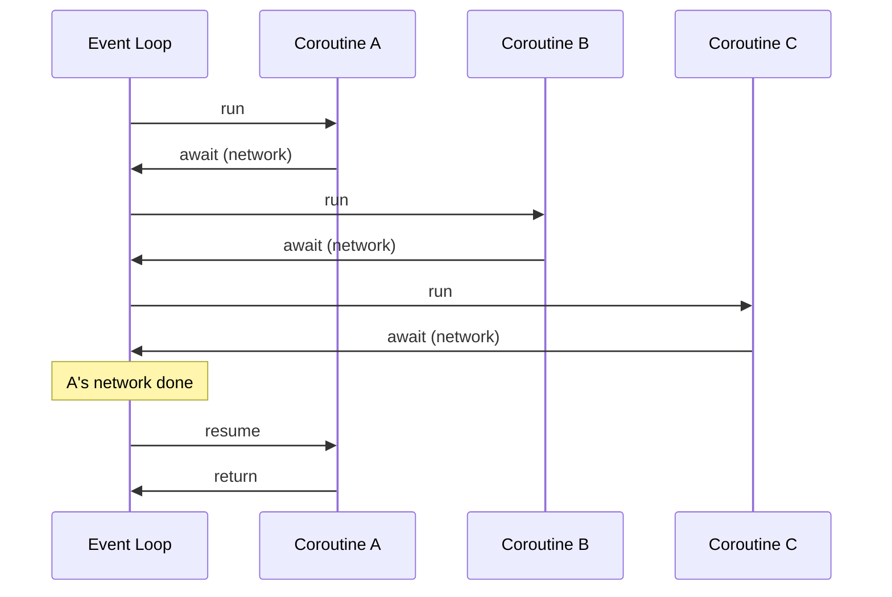

#asyncio #coroutines #event-loop #concurrency #python

---

# What a Coroutine Actually Is

You've seen `async def` and `await` in Python code. This note explains what those keywords *actually do* underneath, by starting from the problem they solve.

---

## The Problem — Wasted CPU on I/O

A regular function that makes a network call:

```python
def fetch_data():
    response = requests.get("https://api.example.com/...")  # takes 200ms
    return response.json()
```

For those 200ms, the CPU does **nothing for your program**. It's just waiting for bytes to come back over the network. It could have done a million other things in those 200ms — but your function is "blocked," frozen on that one line.

Now scale that up. Your server gets 100 simultaneous requests, each making a similar 200ms call. Naively you need 100 threads — one per request — just so they can all wait in parallel.

> [!danger] Threads are expensive
> Each thread costs memory (a stack — typically 1-8 MB), OS scheduling overhead, and forces you to deal with locks for shared state. Spinning up 1000 threads to wait on 1000 idle network calls is a waste of every resource involved.

---

## The Idea — Pausable Functions

What if a function could **voluntarily pause itself** when it knows it's about to wait, let other functions run on the same thread during the wait, and resume when the result is ready?

That's a **coroutine**. A function that can pause and resume.

```python
async def fetch_data():               # async def → this is a coroutine
    response = await client.get(...)  # await → "I'm about to wait, pause me"
    return response.json()
```

- `async def` declares the function as pausable.
- `await` marks the points where it can pause.

While paused, an **event loop** (asyncio's scheduler) picks another paused coroutine that's ready to resume and runs it on the same thread.

So instead of 100 threads waiting on 100 network calls, you have **1 thread** running 100 coroutines — each pausing and resuming as their I/O completes. The expensive resource (threads) is conserved; the cheap resource (in-process pause/resume) is multiplied freely.



---

## Cooperative — Not Preemptive

The event loop is **cooperative**. It can only switch to another coroutine when the current one *voluntarily* yields control — and the only way to yield is to hit an `await`.

This is the opposite of OS threads, which can be paused at any instruction by the OS scheduler (preemptive).

> [!important] If your coroutine has zero `await` statements and just does CPU work — adding numbers in a loop, parsing a huge JSON, processing an image — it **never yields**, and the entire event loop is frozen until it finishes. Every other coroutine on that loop sits stuck.

This is the most common trap with asyncio.

---

## When Async Helps and When It Doesn't

> [!success] Async is great for **I/O-bound** work
> Network calls, disk reads, waiting on queues, waiting on timers. Anything where the program is *waiting on the outside world*.

> [!danger] Async is bad for **CPU-bound** work
> Heavy math, image processing, large parsing. The work doesn't wait — it grinds. There's no `await` point to yield from.

For CPU-bound work in an async program, you reach for one of:

- `asyncio.to_thread(fn, *args)` — run it in a thread pool, leaving the event loop free.
- `loop.run_in_executor(executor, fn, ...)` — same idea, more control.
- `concurrent.futures.ProcessPoolExecutor` — separate processes, sidesteps the GIL too.

The pattern: **keep the event loop's thread free for I/O orchestration; push CPU work elsewhere.**

---

## Concrete Mental Model

```
Regular function   = a single linear story. Runs start to finish, can't pause.
Coroutine          = a story with bookmarks. Can be paused at bookmarks (`await`),
                     other stories can read in between, then resume from the bookmark.
Event loop         = a single librarian who reads bookmarked stories one at a time,
                     switching between them at each bookmark.
Thread             = a separate librarian. Expensive to hire, but reads its own
                     story without coordinating with others.
```

You use coroutines when you have **lots of stories that mostly wait** (I/O). You use threads/processes when you have **a few stories that mostly work** (CPU).

---

## Mental Model To Remember

> [!info] A coroutine is a function that can pause at `await` points.
> The event loop runs many coroutines on a single thread by switching between them at those pause points.
> Async helps when the work is dominated by waiting. Async hurts when the work is dominated by computing.
