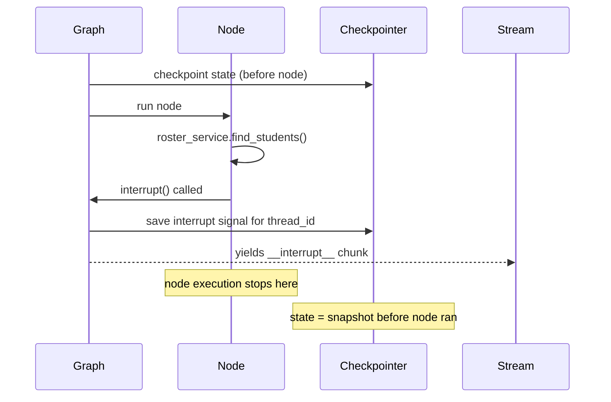

#langgraph #hitl #interrupt #checkpointer #persistence

---

# How Does a Running Graph Pause Mid-Execution for Human Input?

You have a LangGraph pipeline. One of the nodes needs to stop, show the human some options, wait for their choice, and then continue. Simple enough to say. But what does _pause_ actually mean in terms of Python execution — and what has to be saved so the pipeline can resume minutes later from a completely new HTTP request?

---

## The Setup

Imagine a node that does three things in sequence:

```python
async def run(state):
    result = await roster_service.find_students(state["student_name"])  # slow I/O
    selected = interrupt({"options": result.matches})                    # pause here
    marks = await marks_service.fetch(selected)                         # resume here
    return {**state, "marks": marks}
```

The node searches for students by name, then needs the teacher to confirm which one, then fetches that student's marks.

The naive mental model: _pause at line 2, save line number, resume from line 2 when the human responds._

This is wrong. Here's why.

---

## What Breaks With the Save-the-Line-Number Approach

**Problem 1 — Local variables are not in state.**

At the moment `interrupt()` is called, the node has a live `result` object in memory — the list of matching students from the search. That object is not in graph state. It's a local variable inside a running Python function.

If you saved just the line number, you'd come back to line 2 with no `result` in scope. The code would crash immediately.

**Problem 2 — The coroutine stack can't be serialized.**

This one needs unpacking because it's easy to assume: the `result` object is just data — a list of strings — so why can't it be serialized?

You can serialize the data. That's not the problem.

The problem is everything else the coroutine is holding at the moment it's suspended. When Python suspends a coroutine at an `await`, it keeps a **stack frame** alive — a block of memory containing:

- the local variable values (`result`, `state`, any intermediate values)
- a reference to the **event loop** — the scheduler that will wake this coroutine up when its awaited I/O completes
- **suspended futures** — live objects that represent in-progress I/O operations, tied to the current event loop

The event loop reference is the fatal one. It's a pointer to something that exists at a specific memory address in **this specific running process right now**. If you serialize it to DynamoDB, you get back a number — a memory address like `0x7f3a2b1c`. On the resume request, that address points to garbage. The process that owned that memory address is long gone.

> [!danger] An event loop reference is like a seat number in a cinema — it only means something inside that one screening. Walk out and come back the next day: seat 42 is a completely different seat, in a different context, with different people.

The distinction between what is and isn't serializable:

| Thing | Serializable? | Why |
|---|---|---|
| `result` — list of matching students | ✅ Yes | Pure data — strings, numbers |
| Other local variable values | ✅ Yes | Pure data |
| Event loop reference | ❌ No | Live handle, process-specific memory address |
| Suspended futures | ❌ No | Live objects tied to the current event loop |
| Which line to resume from | ❌ No | Encoded inside the frame object, not extractable as plain data |

So even if you extracted and saved all the data values, you still cannot reconstruct the **execution context** — the thing Python needs to actually continue running the coroutine from the suspended point.

---

## What LangGraph Actually Does

LangGraph's unit of persistence is the **node**, not the line.

It checkpoints state **after each node completes**. When `interrupt()` is called inside a node, LangGraph does two things:

1. **Saves the state as it was before this node started** — the last clean checkpoint.
2. **Raises a special signal** that stops graph execution and surfaces as `__interrupt__` in the stream chunk.

The node does **not** complete. Its local variables are discarded. The partial work is lost.

> [!important] LangGraph checkpoints at node boundaries. When a node is interrupted, execution rewinds to the state before that node ran — not to the line inside it.



---

## The Consequence

When the resume comes in, the node **re-runs from the top**. Not from the line after `interrupt()`. From line 1.

This means `roster_service.find_students()` runs again. The I/O call is paid for twice.

> [!warning] Any work a node does before calling `interrupt()` will be repeated on resume. Design nodes with this in mind — operations before `interrupt()` should be reads, not writes.

---

## Edge Cases / When This Matters

**Multiple `interrupt()` calls in one node** — each one causes a full re-run from the top when resumed. If a node has two `interrupt()` calls, the first I/O block runs once on the first request, then again on the first resume (before reaching the second `interrupt()`), then again on the second resume. The earlier work compounds.

**Write operations before `interrupt()`** — a node that sends an email and then calls `interrupt()` will send the email again on resume. This is a real bug. Writes before an interrupt must be idempotent or guarded.

---

## Mental Model To Remember

> [!info] LangGraph checkpoints state at node boundaries, not mid-node. `interrupt()` does not save where you were — it saves what the state was before this node ran and discards the node's in-progress work. On resume, the node starts over from line 1.
