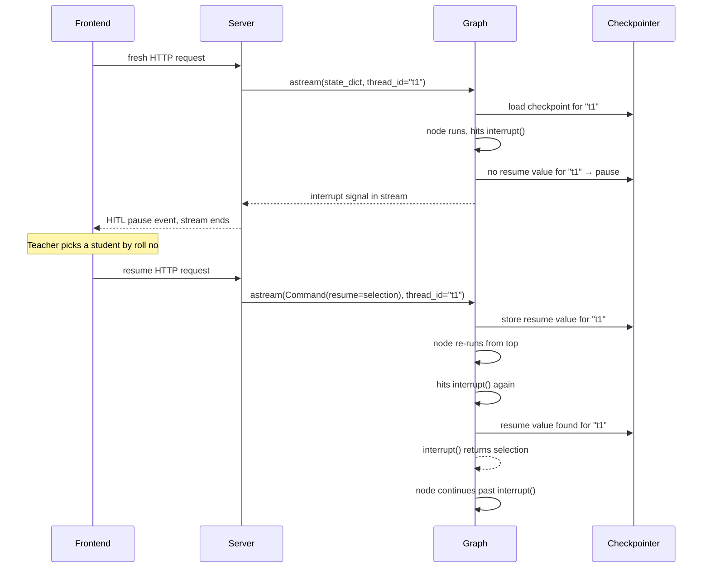

#langgraph #hitl #interrupt #resume #command #thread-id

---

# `interrupt()` Is Called Twice — Why Does It Pause the First Time and Return a Value the Second Time?

The node re-runs from the top on resume (note 10). That means `interrupt()` is called again — the exact same line, with the exact same payload. Yet the first time it freezes the graph for minutes. The second time it returns a string and execution continues. What is LangGraph checking at that line to decide which behavior to use?

---

## The Setup

```python
selected_roll_no = interrupt({"options": matching_students})
```

First request — a fresh HTTP request arrives, graph runs, node executes, this line is reached. Graph freezes. An HITL pause event is sent to the frontend. HTTP response ends.

Minutes later — the human picks an option, the frontend sends a resume request. Graph re-runs the node. Same line is reached again.

The naive expectation: `interrupt()` always pauses. So the second request would also freeze here forever, waiting for another human response that never comes.

That would be broken. What actually prevents it?

---

## What the Resume Request Carries

When the resume HTTP request arrives, the streaming service does not feed the graph a normal state dict. It wraps the human's selection in a `Command` object:

```python
# fresh request
graph.astream({"teacher_query": "...", ...}, config=config)

# resume request
graph.astream(Command(resume=selected_value), config=config)
```

`Command(resume=value)` is LangGraph's signal: **this run is a resume, and here is the value the human provided.**

LangGraph stores this value against the `thread_id` in the checkpointer the moment the graph starts processing it.

---

## What `interrupt()` Checks

When `interrupt()` is called, LangGraph checks one thing: **is there a pending resume value stored for this `thread_id`?**

```
First run:
  interrupt() called → check checkpointer for thread_id → nothing there
  → pause, surface __interrupt__ in stream, stop execution

Resume run:
  interrupt() called → check checkpointer for thread_id → selection value is there
  → pop the value, return it directly, execution continues
```

The `thread_id` is the key. Every conversation has one — it's how LangGraph isolates state between different users and sessions. The resume value is stored against it so the right graph run picks it up.

> [!important] `interrupt()` does not pause based on its arguments. It pauses based on whether a resume value exists for the current `thread_id`. Same call, same payload — completely different behavior depending on what's in the checkpointer.

---

## The Full Sequence



---

## What Happens to the Resume Value After It's Used

Once `interrupt()` pops the resume value and returns it, the value is consumed. If the node hits a **second** `interrupt()` call further down, LangGraph checks the checkpointer again — finds nothing — and pauses again. The cycle repeats for each interrupt in the node.

> [!tip] Each `interrupt()` call consumes exactly one resume value. A node with two `interrupt()` calls requires two separate resume requests to get through. Each one re-runs the node from the top and advances one step further.

---

## Edge Case — Wrong `thread_id`

The resume value is keyed to `thread_id`. If the resume request arrives with a different `thread_id` than the original request — whether by accident or by a bug in session handling — LangGraph will find no resume value, call `interrupt()` again, and the graph will pause for a second time instead of continuing.

> [!danger] A mismatched `thread_id` on a resume request silently re-pauses the graph instead of advancing it. The frontend gets a second HITL pause event for the same interrupt. Always verify that the `thread_id` on the resume request matches the one from the original request.

---

## Mental Model To Remember

> [!info] `interrupt()` is a conditional: do I have a resume value for this `thread_id` in the checkpointer? No → pause and surface the interrupt. Yes → pop the value and return it. The same line of code behaves completely differently depending on what the checkpointer holds.
