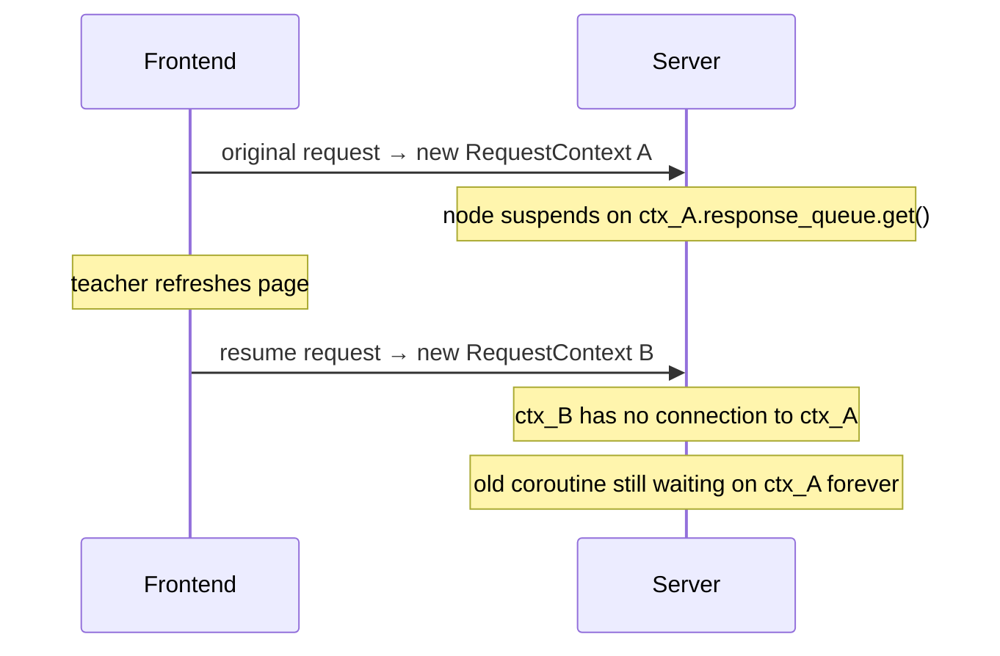
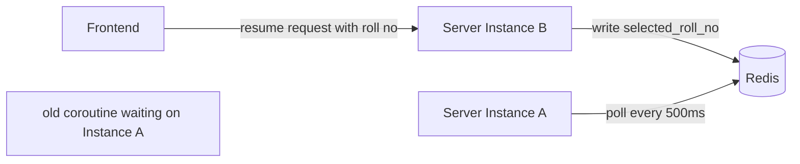
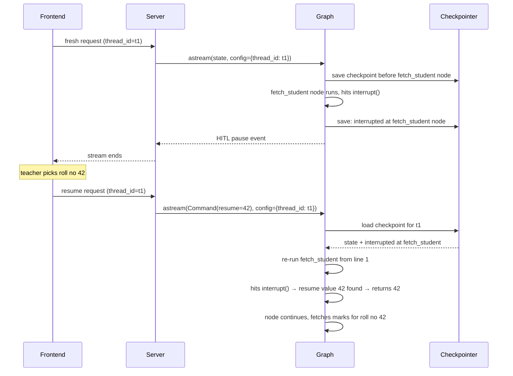

#langgraph #hitl #interrupt #resume #thread-id #checkpointer #redis

---

# Why Not Just `await` the Human's Response Inside the Node?

You know `interrupt()` re-executes the node from the top on resume. That feels wasteful. So the natural question is: can we just push the HITL question onto the event queue, then `await` the teacher's response right there inside the node — no re-execution needed?

This note traces exactly why that falls apart, what you would need to fix it, and how that fix leads you back to reinventing `interrupt()`.

---

## The Idea

```python
async def run(state):
    result = await roster_service.find_students(state["student_name"])

    await ctx.event_queue.put(HITLEvent({"options": result.matches}))
    selected_roll_no = await ctx.response_queue.get()   # wait here for teacher

    marks = await marks_service.fetch(selected_roll_no)
    return {**state, "marks": marks}
```

The node pushes the question, then blocks until the teacher's answer arrives on `response_queue`. Clean, no magic, no re-execution.

---

## Problem 1 — The Connection Dies Before the Teacher Responds

The node is suspended at `await ctx.response_queue.get()`. The original HTTP connection is still open — the streaming response hasn't ended.

> [!danger] Every load balancer, every mobile network, every corporate proxy has a request timeout. AWS ALB default: 60 seconds. Nginx default: 60 seconds. If the teacher takes 2 minutes to decide, the connection is silently killed. The teacher clicks confirm and nothing happens.

Even if the connection survives, the teacher might refresh the page. The browser opens a new connection. The old coroutine is now suspended on a dead connection's `RequestContext`, waiting for a response that can never arrive on it.

---

## Problem 2 — The Resume Request and the Waiting Coroutine Are on Different Contexts

When the teacher eventually responds, the frontend sends a new HTTP request carrying the selected roll number.

That new request gets its own `RequestContext` — a fresh object with fresh queues. The old coroutine is suspended on the **old** `RequestContext`. They have no shared channel.



The resume value lands on `ctx_B`. The waiting coroutine is on `ctx_A`. No bridge.

---

## Problem 3 — What You Would Need to Build to Fix This

To connect the new request to the old coroutine, you need a **shared store outside both requests** — something both server instances can reach, keyed by an interaction ID.

```python
# new request writes the teacher's selection
shared_store["interaction_abc"] = selected_roll_no

# old coroutine polls until the value appears
while True:
    value = shared_store.get("interaction_abc")
    if value:
        break
    await asyncio.sleep(0.5)
```

But a module-level dict doesn't work — if the original request ran on server instance A and the resume request lands on server instance B, the dict on A has no idea.

> [!important] You need a network-accessible store. Redis or DynamoDB — something both instances can read and write.

So now your architecture is:

- An **interaction ID** to correlate question with answer
- A **Redis/DynamoDB store** to hold the response across instances and process restarts
- A **polling loop** inside the node waiting for the value to appear
- A **cleanup mechanism** for when the coroutine times out or the teacher never responds



---

## The Realisation — You Just Rebuilt `interrupt()`

Look at what you've assembled:

| What you built | What `interrupt()` gives you |
|---|---|
| Interaction ID to correlate requests | `thread_id` |
| Redis/DynamoDB to hold the resume value | Checkpointer (DynamoDB / Redis) |
| Polling loop to wait for the value | Fresh graph run triggered by new request |
| Cleanup on timeout | Automatic — old request ended cleanly |
| Long-lived coroutine holding memory | None — coroutine terminated at interrupt |

Your version is strictly worse: you added Redis as a new dependency, you still have long-lived coroutines leaking memory, you wrote and maintain the polling logic, and you have no durability if the server crashes mid-poll.

`interrupt()` accepts one trade-off — **re-execute the node from the top** — and in exchange eliminates every problem above.

---

## How `interrupt()` Actually Routes the Resume

So how does LangGraph know which conversation to resume, and which node within it?

Two pieces of information travel with every resume request:

**1. `thread_id` — identifies the conversation**

Every session has a `thread_id`. It goes into the LangGraph config on every request — fresh or resume. LangGraph uses it to load the right checkpoint from the checkpointer.

```python
config = RunnableConfig(configurable={"thread_id": thread_id})

# fresh run
graph.astream({"teacher_query": "..."}, config=config)

# resume run — same thread_id, different input
graph.astream(Command(resume=selected_roll_no), config=config)
```

**2. Checkpoint record — identifies the node**

When `interrupt()` is called, the checkpointer saves two things:
- The graph state as it was before the interrupted node ran
- A record of **which node was interrupted**

On resume, LangGraph reads this record and re-runs the graph starting from that specific node — not from the beginning of the whole pipeline.



---

## The Two Questions `thread_id` + Checkpoint Answer

> [!info] Two questions, two answers.
>
> **Which conversation?** → `thread_id`. Loaded from the request, used as the checkpointer key.
>
> **Which node within that conversation?** → The checkpoint record. LangGraph saved which node was interrupted and re-enters the graph there.
>
> Together they give LangGraph complete routing information — no polling, no shared queues, no extra infrastructure.
