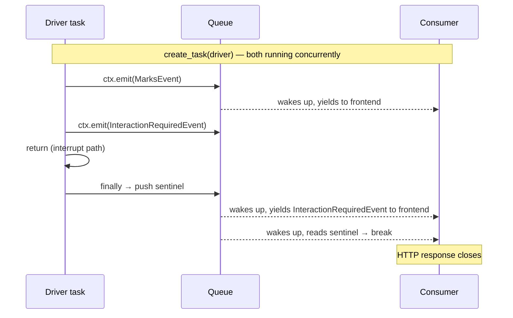

#asyncio #sentinel-pattern #try-finally #streaming #driver-pattern #request-lifecycle

---

# How Does the Consumer Know When to Stop?

The driver iterates the graph stream and pushes events onto the queue. The consumer drains the queue and streams to the frontend. But when the driver finishes — for any reason — the consumer has no idea. It just sits at `await queue.get()` with an empty queue, holding the HTTP response open forever.

---

## The Problem

The consumer loop:

```python
while True:
    event = await ctx.event_queue.get()   # waits forever if queue stays empty
    yield serialize(event)
```

An empty queue does not mean the stream is over. It means nothing has arrived yet. The consumer cannot tell the difference between:

- Driver is still running, just hasn't pushed anything for a moment
- Driver is completely done and will never push anything again

---

## The Sentinel

A **sentinel** is a special value pushed onto the queue that means: _this request's stream is over, stop reading._

```python
_SENTINEL = None
```

Consumer checks for it:

```python
while True:
    event = await ctx.event_queue.get()
    if event is _SENTINEL:
        break
    yield serialize(event)
```

Driver pushes it when done:

```python
async def driver(graph, input_data, config, ctx):
    async for chunk in graph.astream(...):
        if "__interrupt__" in chunk:
            ctx.emit(InteractionRequiredEvent(...))
            return
    
    ctx.event_queue.put_nowait(_SENTINEL)   # only reached on normal END
```

But this only works on one exit path. The driver has three ways to exit:

| Exit path | Sentinel pushed? |
|---|---|
| Graph hits `END` — `async for` exhausts | ✅ Yes — falls through to bottom |
| `__interrupt__` seen — early `return` | ❌ No — skips the bottom |
| Exception thrown | ❌ No — skips the bottom |

On paths 2 and 3, the sentinel never gets pushed. Consumer hangs forever.

---

## The Request-Level Distinction

Before fixing it, understand what the sentinel actually means.

The driver's lifetime = **one HTTP request**. It exits when:
- The graph completed for this request
- An interrupt fired — graph is paused, but this request is done
- Something crashed

In all three cases, **this request's stream is over**. The sentinel does not mean the graph is dead. It means the driver is done for this request and the consumer should close the HTTP response.

> [!important] Sentinel = request over, not graph over. The graph may still be alive, paused at an interrupt, waiting for the teacher to respond on the next request. The sentinel just closes this request's stream cleanly.

---

## `finally` — The Only Safe Place

`finally` runs on **every exit path** — normal return, early return, exception, even cancellation.

```python
async def driver(graph, input_data, config, ctx):
    try:
        async for chunk in graph.astream(...):
            if "__interrupt__" in chunk:
                ctx.emit(InteractionRequiredEvent(...))
                return                                    # early return
    except Exception:
        ctx.emit(ErrorEvent(...))                         # exception path
    finally:
        ctx.event_queue.put_nowait(_SENTINEL)             # always runs
```

Now every exit path pushes the sentinel:

| Exit path | Sentinel pushed? |
|---|---|
| Graph hits `END` | ✅ `finally` runs |
| `__interrupt__` — early `return` | ✅ `finally` runs |
| Exception thrown | ✅ `finally` runs |

---

## The Full Lifecycle of One Request



---

## What Each Block Is For

```python
try:
    # the work
except SomeError:
    # handle known failures — push an error event
finally:
    # cleanup that must happen regardless — push the sentinel
```

> [!info] `try` — this is the work. `except` — handle failures gracefully. `finally` — this runs no matter what. The sentinel belongs in `finally` because closing the consumer is not optional — it must happen on every exit path, success or failure.

Code at the bottom of a function after the `try/except` block is only reached on the happy path. Any early `return` or exception skips it. `finally` does not skip.

---

## Mental Model To Remember

> [!info] The sentinel is a request-level shutdown signal, not a graph-level one. The driver pushes it in `finally` so the consumer always knows when to close the HTTP response — whether the graph completed normally, paused for human input, or crashed. One sentinel, every exit path, always in `finally`.
