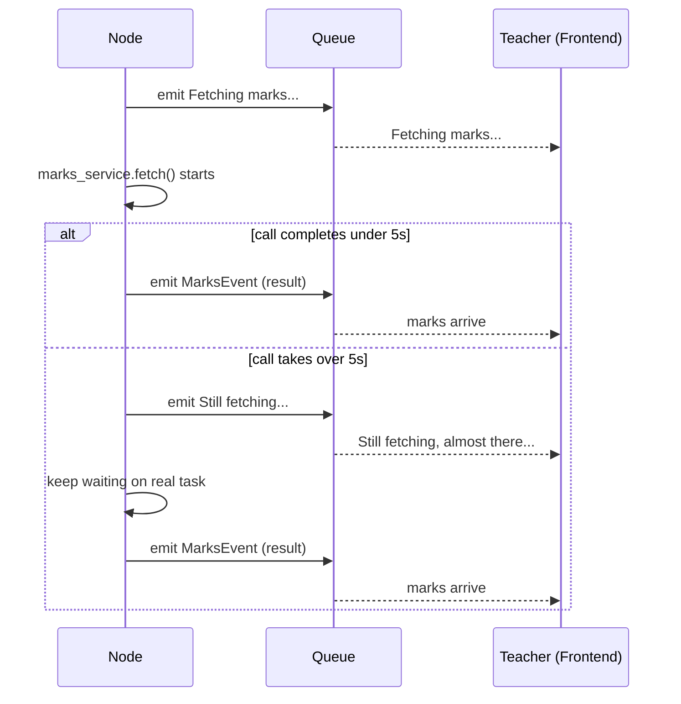

#asyncio #shield #wait-for #timeout #progress #pattern

---

# How Do You Warn the User That a Slow Operation Is Taking Long Without Killing It?

You have a slow I/O call inside a node — an LLM inference, a remote API, a heavy database query. You want to show the user a "Still working..." message if it takes more than 5 seconds. The obvious tool is `asyncio.wait_for`. But `wait_for` alone destroys the operation on timeout. This note explains why, and how `asyncio.shield` fixes it.

---

## The Naive Approach — `wait_for` Alone

```python
# naive — kills the LLM call after 5 seconds
result = await asyncio.wait_for(llm.ainvoke(prompt), timeout=5.0)
```

If the call takes more than 5 seconds, `wait_for` raises `TimeoutError`. But it doesn't just raise and walk away — it **cancels the underlying coroutine first**.

Cancellation injects a `CancelledError` into the coroutine at whatever `await` point it is suspended on. The call is terminated mid-flight. Even if the model sends back a response 2 seconds later, there is no coroutine alive to receive it.

```
t=0s   llm.ainvoke() starts, suspended waiting for model response
t=5s   wait_for timeout fires
        → cancels llm.ainvoke() — CancelledError injected
        → TimeoutError raised to caller
t=7s   model responds — nobody home, result discarded
```

This is not what you want. You want to warn the user, not kill the call.

---

## What `asyncio.shield()` Does

`asyncio.shield(task)` wraps a task in a protective layer. When something tries to cancel the shield, the shield absorbs the cancellation — the real task underneath keeps running untouched.

```
without shield:
wait_for → cancels → real task (call dies)

with shield:
wait_for → cancels → shield wrapper (dies)
                          ↓
                      real task (keeps running)
```

The shield is a sacrificial wrapper. It takes the hit so the real task doesn't have to.

---

## The Slow Warning Pattern

```python
async def run_with_slow_warning(coro, ctx, warning):
    task = asyncio.create_task(coro)       # schedule the real call as independent task
    try:
        return await asyncio.wait_for(asyncio.shield(task), timeout=5.0)
    except asyncio.TimeoutError:
        ctx.emit(ProgressEvent({"message": warning}))   # warn the user
        return await task                               # keep waiting on real task
```

Step by step:

1. `create_task(coro)` — the real call starts running as an independent task
2. `asyncio.shield(task)` — wrap it in a protective layer
3. `asyncio.wait_for(..., timeout=5.0)` — watch the shield for 5 seconds
4. **Fast path** (call completes in under 5s) — result returned, user never sees a warning
5. **Slow path** (call takes over 5s):
   - `wait_for` times out, cancels the shield wrapper
   - Shield absorbs the cancellation — real task keeps running
   - `TimeoutError` raised to the `except` block
   - Warning emitted to the user
   - `return await task` — bare await on the real task, no timeout, no shield

```
t=0s   task starts (LLM call in progress)
       shield watching, wait_for counting to 5s

t=5s   TimeoutError raised
        → shield destroyed
        → real task unaffected, still running
        → "Still working..." emitted to user
        → return await task (bare await — no clock watching)

t=7s   LLM responds → task completes → result returned normally
```

---

## The Shield Is a One-Shot

Once the shield is destroyed at `t=5s`, it is gone. The code moves to `return await task` — a bare `await` with no timeout and no shield.

If the LLM takes another 10 seconds after the warning, the code just waits. There is no second 5-second timer. The warning fires once and then steps aside.

> [!info] The 5 second timeout is a one-shot warning trigger, not a repeating heartbeat. It fires once, emits the warning, then the code waits patiently for however long the operation needs.

If you wanted a repeating warning every 5 seconds you would need a loop. This pattern intentionally warns once and gets out of the way.

---

## Two-Layer Progress

Nodes using this pattern emit two kinds of progress messages:

```python
ctx.emit(ProgressEvent("Fetching marks..."))          # immediate — always shown

result = await run_with_slow_warning(
    marks_service.fetch(roll_no),
    ctx,
    warning="Still fetching, almost there..."         # conditional — only if slow
)
```

The first fires immediately before the call starts — the teacher always sees "Fetching marks..." the moment the node begins.

The second fires only if the call exceeds 5 seconds — the teacher sees "Still fetching..." as a reassurance that the system is not frozen.



---

## Mental Model To Remember

> [!info] `asyncio.shield(task)` makes `wait_for` cancel the wrapper instead of the real task. Use it when you want a timeout to trigger a side effect — a warning, a log, a progress event — without killing the underlying operation. The shield is one-shot: once the timeout fires and the shield is gone, the task is exposed to any outer timeout that may exist.
