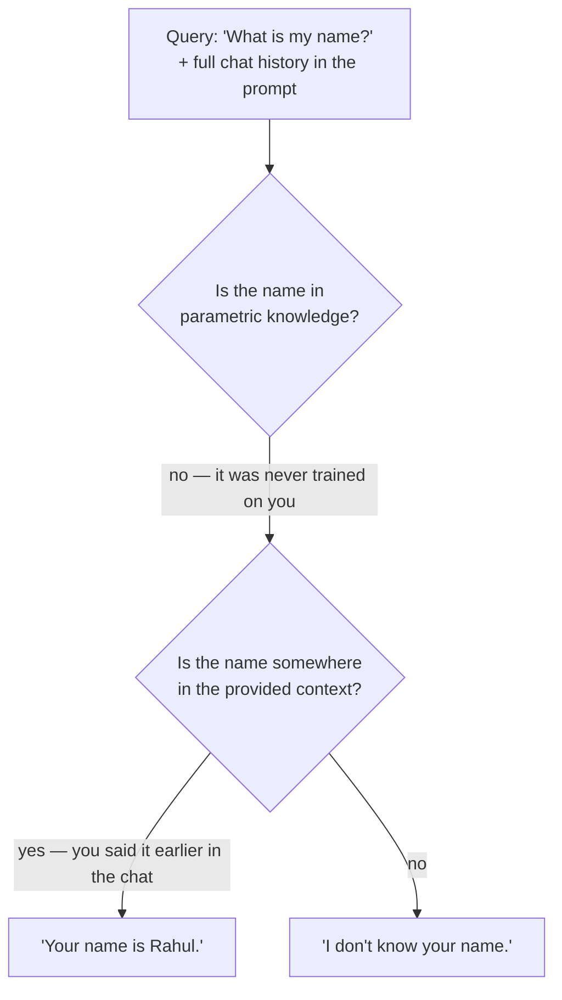

In November 2022, ChatGPT launched — and within weeks the whole world had the same realisation: you could ask this thing *anything*. A tech question, a coding question, a finance question, a healthcare question — whatever the domain, ChatGPT had an answer. It felt less like software and more like talking to someone who had read everything ever written.

Which raises the obvious question: where did that power come from? And — more importantly for this course — where does it *run out*? Because it does run out, in four very specific ways, and those four failures are the entire reason RAG exists. This note builds up those four problems from scratch, tries the obvious fixes, watches them fail, and arrives at the doorstep of the solution.

---

## Where the magic comes from

ChatGPT's intelligence comes from its underlying model — the **GPT model** — which is built on the **transformer architecture**, a deep learning model. The transformer's superpower is its **self-attention mechanism**: for any text, it understands the *relationships between the words* — which words refer to which, which words change each other's meaning. That's what lets it genuinely follow language instead of pattern-matching on keywords.

Then comes the scale part: these models are trained on an *enormous* dataset — effectively the whole public internet. Articles, books, webpages, blogs, reviews — all of it. From that mountain of text, the model picks up language itself: grammar, style, facts, reasoning patterns. And with that comes a powerful capability — it can now *generate* fluent language of its own.

### What the model actually does — next-word prediction

Underneath everything, an LLM performs one deceptively simple task: **predict the next word.** Say the input is:

```
"Hi how are you"      → model predicts:  "how"
"Hi how are you how"  → model predicts:  "can"
"... how can"         → "I"
"... how can I"       → "help"
"... how can I help"  → "you"
```

Each predicted word is appended to the input and fed back in, and the model predicts again — a loop that runs until a full response has been assembled from the concatenated predictions: *"How can I help you?"* You've seen this loop with your own eyes: when ChatGPT types its answer word by word, that's not a loading animation — that's the actual generation process, one next-word prediction at a time.

Training this ability is called **pre-training**, and once it's done, the model is ready for **inference**: user sends a prompt, model generates a response. That's the entire operating cycle.

### The catch — pre-training is colossal

Here's the number that sets up everything that follows: pre-training a large model takes **months** — for the big models, a span on the order of four months of continuous training on massive GPU clusters, burning through enormous compute budgets. And during that entire window, the training dataset is **frozen**. Whatever snapshot of the internet went in at the start is all the model will ever see.

Keep those two facts in hand — *months of training* and *a frozen dataset* — because all four problems grow out of them.

---

## Problem 1 — Knowledge cutoff

A story to make it concrete. Imagine you've built a chatbot on top of an LLM — call the model **M1**. Users send prompts, M1 responds, everyone's happy. Then one day users notice something strange: whenever they ask about an event that happened *after* the model's training — say, something from August 2025 — the model has no idea what they're talking about.

Of course it doesn't. **How could it know about an event that wasn't in its dataset?** The model's knowledge is whatever text existed when the training snapshot was taken. Everything since is invisible to it.

The naive fix: just retrain it with the new data! But you already know the numbers — months of time, mountains of compute, enormous cost. You cannot re-run that for every new day's events. **You have to limit yourself** — train up to some date, ship, and accept that the world will move on without your model.

That date is the model's **knowledge cutoff** — and it's an *intrinsic property* of every LLM on earth. Every model has a cutoff date: full knowledge up to that date, nothing after it. The information on the internet will *always* be ahead of your model's training. A model can never launch already knowing the latest news.

> [!info] Knowledge cutoff: the model knows everything up to its training snapshot date, and nothing after. It's not a bug — it's a direct consequence of training being slow, expensive, and frozen-in-time.

---

## Problem 2 — Hallucination

Try this experiment: ask an LLM about a research paper that **does not exist** — a made-up title, or a paper it was never trained on. Watch what happens. It will generate the paper's abstract. The authors' names. A link. The key results, the tables, the diagrams, the references. All of it delivered fluently, confidently, in perfect academic style — and **all of it fabricated**.

This is **hallucination**: the model generating false facts with full confidence.

Why does it happen? Combine what the model is with what it must do. It has world-class language understanding and generative fluency — it learned from the entire internet what a research paper *sounds like*. And its job is next-word prediction: given your prompt, it **must** produce a plausible continuation. Nothing in that machinery checks whether the continuation is *true* If the model has real knowledge, the fluent output happens to be correct. If it doesn't, the same machinery generates equally fluent fiction — and here's the dangerous part: **the lie is written exactly as convincingly as the truth**, so you cannot tell the difference by reading it.

> [!danger] An LLM never says "I wasn't trained on that" on its own. Where knowledge exists, it answers from knowledge; where it doesn't, it *makes knowledge up* — same confident tone in both cases.

---

## Problem 3 — No source attribution

Ask the model a factual question, get an answer — now ask: *"where did that come from?"* It can't tell you. Not won't — **can't**.

Think back to how it was trained. The dataset was raw text: the words of articles, books, and webpages. What was *never* part of training is the metadata — which website a sentence came from, who wrote it, when. The model absorbed the text's patterns into its parameters; the sources were never in the data, so they're not in the parameters, so they cannot appear in the output. Whatever "citation" a bare LLM produces on request is just more generation — see Problem 2.

For any serious use — medical, legal, financial, anything where a human needs to verify the answer — an answer with no traceable source is an answer you can't trust.

---

## Problem 4 — No access to private data

A working professional asks the chatbot about their **company's leave policy**. The model has nothing. Why? The policy lives in internal documents — and the model was trained on *public* data. Private data never entered the training set, so it never entered the model.

There's a name for what the model does have: **parametric knowledge** — everything the model knows, stored implicitly in its parameters, put there by training. And that's the crisp way to state this problem: *your* data — your company's policies, your product docs, your internal wikis — is simply **not in the parameters**, and inference can't answer from knowledge that isn't there.

---

## The root causes — why each problem exists

Four problems: **knowledge cutoff, hallucination, no source attribution, no access to private data.** Before jumping to solutions, it pays to ask *why* each one exists — because the root causes all point in the same direction.

**Knowledge cutoff** comes from long training time plus the static dataset. But dig one level deeper: is training time really the culprit? Suppose we shrink the model — fewer parameters, lower complexity. Training time drops dramatically; we could retrain on recent events all the time. Cutoff solved! Except: a model's parameters are where its knowledge *lives*. Fewer parameters = less stored knowledge = a much weaker model. **The size that makes the model smart is the same size that makes it slow to retrain.** You can have fresh-but-shallow or deep-but-stale — the parameters can't give you both. So if retraining is off the table, staying current means one thing: **adding knowledge from *outside* the parameters.**

**Hallucination** happens because the model must generate *something* for every prompt: with the right knowledge it answers correctly; without it, it invents. So the fix isn't to change the model — it's to **make sure the right knowledge is in front of it when it answers.**

**No source attribution** exists because sources were never in the training data. The only way an answer can carry a citation is if the source information is **attached from outside** at answer time.

**No access to private data** exists because private data isn't in the parametric knowledge. The fix: let the model answer from **parametric knowledge *plus* external knowledge** — your documents, supplied alongside the question.

> [!important] Look at the pattern. All four root causes converge on a single idea: the trained model is what it is — expensive to change, frozen in time, blind to sources and private data. The fix, in every single case, is to **add external knowledge on top of the trained model** at the moment of answering. The only question left is *how*.

---

## Candidate solution 1 — fine-tuning

**Fine-tuning** takes the trained model and continues training it on your own data — not touching all the parameters, but tuning a subset of them so the model absorbs your information or behaviour.

It's a real technique with real uses — but as the fix for our four problems, it fails on three counts:

- **Slow and compute-expensive.** It's still training. Serious GPUs, serious time, serious cost — and you'd have to redo it every time your knowledge changes. You've re-created a mini knowledge-cutoff problem on your own data.
- **Needs expertise.** Dataset preparation, training runs, evaluation — a specialist skill set.
- **Wrong tool for the job.** Fine-tuning shines at changing a model's *behaviour* — its tone, its format, its style of output. It's a poor and unreliable way to inject *fresh factual knowledge*.

Dropped.

---

## Candidate solution 2 — in-context learning

Here's a much more interesting idea, hiding in plain sight in every chat you've ever had with an LLM.

When you chat with ChatGPT, each new message doesn't go to the model alone — the **entire chat history** goes with it. Ask *"what is my name?"* mid-conversation and the flow looks like this:



The model's parameters obviously know nothing about you. But if you mentioned your name earlier in the conversation, the model finds it *in the prompt* and answers correctly. If you never mentioned it — "I don't know your name." The model is answering from **knowledge supplied in the context, not knowledge stored in the parameters.**

This ability is called **in-context learning**, and it's exactly the mechanism we were looking for: **external knowledge injected through the prompt**, no retraining, no fine-tuning, works instantly. Model can't know today's news? Paste the article into the prompt. Can't know your company's policy? Paste the policy document. LLMs turn out to be genuinely *good* at pulling answers out of provided context.

Problem solved? Almost. Now scale it.

### Where naive in-context learning breaks

Your company's policy handbook is **1,000 pages**. The naive plan: stuff all 1,000 pages into the prompt along with the question, and tell the model — *go figure it out.*

Two walls, both familiar:

- **The context window.** An LLM has a hard limit on how much input it can accept in one call — and 1,000 pages blows straight through it. But even staying under the limit doesn't save you, because internally the model is *still just doing next-word prediction* over your gigantic prompt. Drowned in mostly-irrelevant text, it gets confused, and answer quality collapses.
- **Lost in the middle.** Even for the text that fits, the model focuses well on the *beginning* and *end* of a long input and poorly on everything in between. The one paragraph that actually answers the question is probably on page 612 — exactly where the model isn't looking.

So the verdict on in-context learning is: **right mechanism, wrong dose.** Supplying knowledge through the prompt works beautifully — *when the prompt contains a small amount of relevant text*, like a chat history. It fails when you dump everything you have and hope.

### The fix hiding in the failure

Which means the missing piece isn't a better model at all. It's a **filter**. You can't send everything — so don't. Instead:

1. Keep all your knowledge — the full 1,000 pages, all your documents — stored in one **central knowledge store**, outside the model.
2. For **each query**, extract only the pieces of knowledge that are actually *relevant to that question*.
3. Put just those pieces into the prompt — small, focused, exactly what in-context learning is good at.

Store everything externally; retrieve selectively; let the model generate from what was retrieved.

That architecture has a name — **RAG: Retrieval-Augmented Generation** — and the next note takes it apart word by word: what exactly gets stored, how "relevant to the question" is actually computed, and how the retrieved knowledge is assembled into the prompt.
