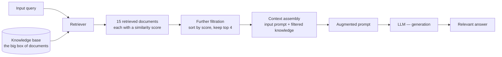

LLMs have a knowledge problem. Their knowledge is frozen at a training cutoff, they've never seen your company's private documents, and when they don't know something they tend to answer anyway. The fix that emerged for all of this is surprisingly simple in spirit: don't retrain the model — **put the missing knowledge inside the prompt at the moment you ask**, and let the model's in-context learning do the rest. (The full story of those problems gets its own note; here we take the fix as the starting point.)

**RAG — Retrieval-Augmented Generation — is the technique that automates that fix.** And the best way to understand it is the way its name is built: three words, each naming exactly one job the system does. Read the name correctly and you've read the architecture.

Let's take the words in order of difficulty, easiest first.

---

## Word 1 — Generation: RAG doesn't generate anything

The **generation** in the name refers to the part RAG **doesn't** do itself.

Inside RAG, we use the capabilities of generative AI — concretely, an **LLM**. The work of generating the response — actually writing the answer in fluent language — is not done by RAG's machinery at all. It is done by the LLM, exactly as it always was.

> [!info] RAG is not a new model and not a modified model. It's a system built **around** an ordinary LLM. The LLM keeps its one job — generating responses — and everything else in the name (retrieval, augmentation) is the machinery that decides **what the LLM gets to read before it answers.**

This is worth internalising early, because it kills a common misconception: **RAG** is not some special AI that knows your documents. The intelligence that writes the answer is the same off-the-shelf model — GPT, Claude, Gemini, anything. What changes is what arrives in its prompt.

---

## Word 2 — Retrieval: a database that's only half about storage

Now the interesting word. Where does the missing knowledge live, and how does the right piece of it get found?

### The knowledge base — a big box you keep filling

Picture a very large box. Into this box you keep putting all your files, all your documents — everything the LLM doesn't know. Your **updated knowledge**: information newer than the model's training cutoff, current events, and above all your **private data** — internal policies, product docs, anything that never appeared on the public internet.

This box is the **central knowledge base**, and if you squint, it behaves like a **database**: a place where information is stored and maintained. (How things actually get fed into it and maintained — loading, chunking, embedding — is the subject of the pipeline notes that follow. For now, the box is enough.)

### Storage is only half of what a database does

Here's the pivot the whole word turns on: a database isn't just for putting things **in**. The entries you added — sometimes you need to get them back **out**. Storage and **retrieval** are the two halves of any database's job, and RAG's name comes from the second half.

The retrieval process asks one question:

> Given the user's **input query** — does knowledge **similar to this query** exist anywhere in my knowledge base?

If yes, that similar knowledge is pulled out. What comes out the other end is the **retrieved documents** — the handful of pieces, out of everything in the box, that relate to what the user just asked.

### Dynamic filtering — a different answer for every query

Look at what that step really is: **filtering**. Out of the entire knowledge base, only the relevant pieces pass through. And not a fixed filter — a **dynamic** one, driven entirely by the input query:

```
Query A: "what's the refund policy?"     → retrieves the refund / returns documents
Query B: "how do I claim insurance?"     → retrieves completely different documents
```

Same knowledge base, different query, different documents retrieved. The filter reshapes itself for every question — based not on matching words, but on the **context of the query, its semantic meaning**.

### The smart database and the retriever

This is why a plain database isn't enough. An ordinary database gives back what you ask for by exact keys and exact matches. This one behaves like a **smart database** — and what makes it smart is a component sitting in front of it called the **retriever**. The retriever takes the input query and returns the **relevant** documents, where relevance means one specific thing:

> [!important] The retriever matches on **semantic meaning** — what the query and the documents are **about**. And the standard is **similar, not same**. The query and the retrieved document don't need to share wording, and won't be identical; their meanings need to be close. A query about a **refund** can retrieve a document about **return of an item** — different words, similar meaning.

### One more step — the similarity score and further filtration

The documents that come back from the retriever are **not used directly**. There's one more piece of information the retriever attaches, and it earns its keep immediately.

Suppose the retriever, matching on semantic similarity, returns **15 documents** — but for the current scenario you only wanted **4**. Which 4? The retriever doesn't just fetch documents; it assigns each one a **similarity score** — a number saying **how** close its meaning is to the query. Now the choice is mechanical:

```
15 retrieved documents
  → sort descending by similarity score
  → take the top 4  =  the most similar documents
  → these are what actually get used
```

This is **further filtration**: the retriever may bring back more than you need, and the similarity score is the knob that cuts the pile down to the few most relevant pieces. Two filters, back to back — first the semantic retrieval itself (everything in the box → 15 related documents), then the score-based cut (15 → top 4).

---

## Word 3 — Augmented: enhancing the prompt

The last word is plain English. **Augmentation means to enhance something** — steps taken to increase a thing's capability.

So what does RAG enhance? Not the model. Not the documents. It enhances **your input — specifically, your input prompt.**

By this point the retriever has handed you the top most-similar-meaning documents — external knowledge, already filtered against the input query. Augmentation is the step where that knowledge gets injected into the prompt:

```
input prompt  +  external retrieved knowledge (filtered)  =  the assembled context
```

This whole operation has a name: **context assembly**. You're building the context the LLM will actually see — and **in the process of assembling it, the input prompt gets augmented**: enhanced with external information it didn't originally contain. That's the **A** in RAG.

Then the augmented prompt — the enhanced, context-assembled prompt — goes to the LLM as input, **in-context learning** kicks in (the model's ability to absorb and use information given inside the prompt itself), and out comes a **relevant answer**, grounded in your documents.



---

## Why filtered context is the whole trick

It's tempting to skip the filtering entirely — why not shove **all** your documents into the prompt and let the model sort it out? The benefits of sending only the small, filtered context are exactly what make RAG work in practice:

**1. You respect the context window.** An LLM's prompt has a hard size limit — the context window. Because only the essential external knowledge that matches the query gets added, the assembled prompt stays nowhere near that limit. Dump everything in instead, and you breach it almost immediately.

**2. You dodge the lost in the middle problem.** There's a well-documented failure mode of LLMs: in a very long prompt, the model pays the most attention to the beginning and the end — and information buried in the middle tends to get overlooked, even when it's exactly what's needed. The fatter the context, the worse it gets. RAG's added context is deliberately small and limited, so there **is** no sprawling middle for the answer to get lost in.

**3. The context is relevant — and it re-shapes itself per query.** Most essential of all: what got added isn't just small, it's **the right** material for this specific question. And tomorrow, when the query changes, the external context **moulds itself to the new query** — a different question retrieves different documents, assembles a different context. Nothing is hard-wired. This dynamic behaviour is what makes RAG so powerful.

> [!important] The three benefits are really one benefit seen from three sides: **small, relevant, per-query context.** Small keeps you inside the window, small-and-positioned keeps you out of the lost-in-the-middle trap, and per-query relevance is what makes the answer actually grounded.

---

## The name, re-read

Now read the name again, and notice it's a one-line spec of the whole system:

> **Retrieval-Augmented Generation** — **generation** by an ordinary LLM, whose prompt has been **augmented** with knowledge that a smart **retrieval** step fetched, per query, from your knowledge base.

- **Retrieval** → an external knowledge base holds your additional documents; a retriever pulls out the most semantically similar ones per query, with similarity scores enabling further filtration
- **Augmented** → the filtered external knowledge is assembled with the input prompt (context assembly), enhancing it
- **Generation** → the LLM — unchanged, un-retrained — answers from the augmented prompt via in-context learning

> [!tip] Interview framing — **what is RAG?**
> **Retrieval-Augmented Generation — and the name is the architecture. Generation stays with an ordinary LLM; RAG doesn't generate anything itself. Retrieval means an external knowledge base holding documents the model never trained on — updated info, private data — with a retriever that pulls the most semantically similar documents for each query and scores them, so you can filter down to a top-k. Augmentation means enhancing the input prompt: assembling it together with that filtered knowledge — context assembly — so the LLM answers via in-context learning. The filtering is the trick: the added context stays small enough for the context window, avoids lost-in-the-middle, and reshapes itself dynamically for every query.**

