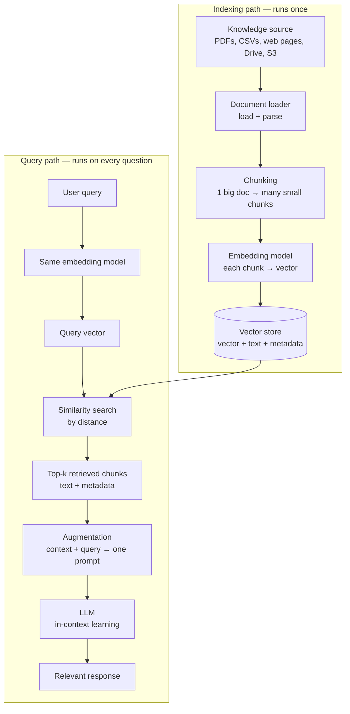

An LLM knows an enormous amount — and none of it is **yours**. Ask GPT or Gemini **what is our company's refund policy?** and it has nothing to work with: your policy lives in a PDF on someone's drive, and that PDF was never part of the model's training data. The model's parameters contain zero context about your documents.

There is one honest way to fix that without retraining the model: **put the relevant knowledge directly into the prompt** and let the model read it at answer time. This ability — answering from material supplied in the prompt rather than from training — is called **in-context learning**, and it is the engine RAG is built on.

> [!info] RAG (Retrieval-Augmented Generation) is the machinery that, for every question, **finds** the right small slice of your external knowledge and **injects** it into the prompt — so the LLM answers from your documents instead of guessing from its training data.

But **put the knowledge in the prompt** hides a real problem. Your knowledge is a 100-page PDF. You cannot paste 100 pages into every prompt — context windows have limits, and even when they fit, most of those pages have nothing to do with the question. What you need is a system that, given a question, returns **only the few paragraphs that matter**. That system is the RAG pipeline.

---

## The two halves of the pipeline

Everything in RAG belongs to one of two paths:

- The **indexing path** — preparing your documents so they can be searched by meaning. This runs **once** (and again only when documents change).
- The **query path** — taking a user's question, finding the relevant material, and generating the answer. This runs **on every single query**.

Why two paths instead of one straight line? That split is not cosmetic — it is the single most important engineering decision in the pipeline, and it is worth deriving rather than memorising.

---

## Why the indexing path runs once — the reasoning

Imagine the naive version: no storage, one straight line. A query arrives, so you load the 100-page PDF, parse it, split it into 100 chunks, embed all 100 chunks into vectors, embed the query, compare, retrieve, answer. Done.

Now the second query arrives. You load the same PDF again. Parse it again. Chunk it again. Embed the same 100 chunks again.

Look at what those steps actually are:

1. **Loading and parsing** — reading a file from disk or a URL into memory while preserving its structure. Slow, I/O-bound.
2. **Chunking** — splitting it into pieces. Cheap, but pointless to repeat.
3. **Embedding** — running every chunk through a neural network. The genuinely expensive step: 100 chunks means 100 model inferences, every time.

All three steps are **time-consuming**, and — this is the key observation — **their output never changes** as long as the document doesn't change. Your refund policy PDF is the same PDF at query #1 and query #10,000. Re-deriving the same 100 vectors ten thousand times is pure waste.

The logical fix follows immediately: **do the expensive work once, store the result, and reuse it forever.** Compute the 100 vectors one time, put them in a database, and let every future query search that database directly. The database that holds them is the **vector store** — and its existence is **why** the pipeline splits into an indexing half and a query half.

> [!important] The vector store is not an optimisation bolted on later — it is the load-bearing idea. Indexing is expensive and repeatable-free, querying is frequent and cheap. Separating them is what makes RAG usable in production.

---

## Walking one real query through the whole pipeline

The components each have their own deep-dive note; here is the complete journey once, end to end, so the shape of the system is clear.

**Indexing (already done, once):** The company's 100-page policy PDF sits in the knowledge source. A document loader read it into memory and parsed it without destroying its structure. A chunker split it page-wise into 100 chunks, each carrying metadata (source file, page number). An embedding model turned each chunk into a fixed-length vector — say 128 numbers that capture that chunk's **meaning**. All 100 vectors, plus each chunk's original text and metadata, now sit in the vector store.

**Query time:**

1. A user asks: **What is the company's policy on refund or return of an item?**
2. That query is text, but the store holds vectors — you cannot compare text against numbers. So the query goes through the **same embedding model** and becomes a **query vector** of the same 128 dimensions.
3. The vector store runs a **similarity search**: it measures the distance between the query vector and every stored chunk vector. Shorter distance = closer meaning. The chunks about refunds and returns land nearest; the chunks about, say, the office dress code land far away.
4. The top matches — say 4 chunks — are **retrieved**. Crucially, what comes back is not the vectors but each winning chunk's **text and metadata**. The vectors existed only to make the search mathematical; you can't paste numbers into a prompt.
5. **Augmentation** assembles the final prompt: **From the given context, answer the query** + the 4 retrieved chunks + the user's original question.
6. The **LLM** receives that prompt and uses in-context learning: it reads the supplied policy text and generates a **relevant response**, grounded in the actual document.

Ask a different question tomorrow and the whole query path simply re-runs: new query vector, different nearest chunks, different context, different answer. The indexing work is never repeated.

---

## Does RAG actually solve the problems it was built for?

RAG exists because a plain LLM has four well-known limitations. Having seen the full pipeline, we can now check each one honestly.

**1. Knowledge cutoff — solved.** The model's training data ends at some date; the world doesn't. With RAG, you embed data about the latest events into the knowledge base, and the query path retrieves it like any other context. The model answers about things it was never trained on.

**2. Hallucination — reduced, not eliminated.** A model hallucinates when it generates confidently without grounding. Handing it real retrieved context to answer from cuts hallucination substantially — but it does not make it zero.

> [!danger] RAG **reduces** hallucination; it cannot eliminate it. The model can still misread the supplied context or blend it with its priors. Claiming **RAG fixes hallucination** in an interview is an overclaim — say **grounds the answer and reduces hallucination** instead.

**3. No source attribution — solved.** A plain LLM cannot tell you **where** an answer came from. In RAG, every retrieved chunk carries its metadata — source file, page number — so the system can show exactly which document and page the answer was built from.

**4. No access to private data — solved.** This is the headline use case: the pipeline above just answered questions over a private 100-page company PDF that no foundation model has ever seen.

---

## What this pipeline guarantees — and what it doesn't

**Guarantees:** answers grounded in your own documents, no retraining or fine-tuning needed, source attribution via metadata, and freshness that is only as stale as your last indexing run.

**Does not guarantee:** correct answers. Two components can still fail — the retriever can fetch the wrong chunks, and the generator can misuse the right ones. Those two failure modes are the subject of **Where RAG Fails — Retriever Failures vs Generator Failures**.

> [!tip] Interview framing — **RAG in a nutshell**
> **RAG grounds an LLM in external knowledge. Offline, you load, chunk, and embed your documents into a vector store — that's done once because the output doesn't change until the documents do. At query time, you embed the question with the same model, do a similarity search by distance, retrieve the matching chunks' text, augment the prompt with that context plus the query, and let the LLM answer from it via in-context learning. It solves knowledge cutoff, private data, and attribution — and it reduces, but doesn't eliminate, hallucination.**
