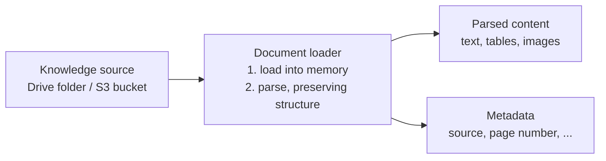

Every RAG pipeline starts with the same unglamorous reality: the knowledge you want your LLM to answer from is scattered across files. Company policies in PDFs. Product data in CSVs. Internal docs in Word files, wikis in markdown, public information on web pages. Before any retrieval cleverness can happen, the pipeline needs two things: a place where all this raw knowledge **lives**, and a component that can **read it in** without mangling it.

Those two things are the **knowledge source** and the **document loaders**.

---

## The knowledge source — the input of the pipeline

> [!info] The knowledge source is simply where your external knowledge lives — the collection of files and locations that hold the data you want the LLM to answer from. It is the entry point of the RAG pipeline: everything downstream begins here.

The word **source** is doing exact work: this is where you **source**
your knowledge from. Concretely, a knowledge source can contain:

- **PDF files** — policies, reports, manuals
- **CSV files** — tabular and product data
- **Word documents and plain text files**
- **Markdown files** — wikis, READMEs, internal docs
- **Web pages** — anything reachable by URL
- and in **multimodal** setups, even **video files** (mp4, mkv) and **audio files** (mp3) — their spoken content is knowledge too

And it doesn't have to be a folder on your laptop. In practice a knowledge source is often a **Google Drive folder** the whole company dumps documents into, or an **S3 bucket** on AWS where large volumes of data are collected in one place. The defining property isn't the technology — it's the role: **one designated place where external knowledge is gathered so the pipeline can consume it.**

The classic motivating case: you want to chat with your LLM about your **company's private data**. That data sits in the company's PDFs and text files. The way you **give the LLM access** is not some API into the model's brain — you simply point your RAG pipeline's knowledge source at those files. RAG then extracts the textual information from each of them and takes it from there.

---

## Knowledge source vs knowledge base — don't confuse the two

These two names sound interchangeable, and mixing them up muddles every later conversation about RAG. They are different things at opposite ends of the indexing pipeline:

| | **Knowledge source** | **Knowledge base** |
|---|---|---|
| What it holds | Raw files — PDFs, CSVs, web pages | Processed, embedded chunks — vectors + text + metadata |
| Position | The **input** of the pipeline | The **output** of the indexing path (the vector store) |
| Searchable by meaning? | No — it's just files | Yes — that's its whole purpose |

> [!important] The knowledge **source** is where raw knowledge **comes from**. The knowledge **base** is where processed, searchable knowledge **ends up** — it's another name for the vector store. Raw in, searchable out. (The full story of the knowledge base is in **RAG Embeddings and the Vector Store**.)

---

## Document loaders — loading is not parsing

The knowledge source is passive — files sitting somewhere. The component that actually reads them into the pipeline is the **document loader**. And a loader has **two distinct jobs**, and the distinction between them matters more than it first appears:

**Job 1 — Loading.** Getting the document into memory, wherever it lives — a file on your hard drive, or a document available at a URL. This is pure transport: from storage to memory.

**Job 2 — Parsing.** Reading the textual content **out of** the loaded document — **while maintaining the structure of the document**. This is the part people underestimate.

Why does structure preservation deserve that emphasis? Take a real PDF. Inside it there isn't just a stream of words — there's flowing text, there are **tables**, there are **images**. A naive text extraction flattens all of that into word soup: a pricing table becomes a meaningless run of numbers, a diagram disappears entirely. A proper document loader parses each element **as what it is**:

```
text    → read as text
tables  → loaded as tables
images  → loaded as images
```

Lose the structure at this step and no later component can recover it — the chunker will happily split a mangled table across three chunks, the embedder will embed nonsense, and the retriever will retrieve garbage. Structure preservation at the loader is the first quality gate of the whole pipeline.

Because every file format has different structure to preserve, **every document type has its own specialised loader** — a PDF loader that only works on PDFs and understands their layout, a CSV loader that understands rows and columns, a web loader that understands HTML, and so on. You pick the loader that matches the source.



---

## Metadata — born at the loader, useful forever

Loaders extract one more thing besides content: **metadata** — the information **about** each document, kept as **key-value pairs** (think of a dictionary): which file this came from, which page, and whatever else the format offers.

This seems like bookkeeping trivia at this stage. It is not. The loader passes metadata forward into chunking, chunking keeps it attached to every chunk, and the vector store saves it alongside each vector and its text. Then, much later, when the LLM answers a question, that little dictionary is what lets the system say **this answer came from policy.pdf, page 12.**

> [!tip] Interview connection — when an interviewer asks **how does a RAG system cite its sources?**, the answer traces all the way back here: **metadata captured at load time, preserved through chunking, stored in the vector store, and surfaced with the retrieved chunk.** Attribution is not a feature you bolt on at the end; it's a property you preserve from the first step.

---

## What this stage guarantees — and what it doesn't

**Guarantees:** all your scattered knowledge has a single entry point; every document is in memory with its structure intact; every piece of content carries metadata about where it came from.

**Doesn't guarantee:** that the content is **usable** for retrieval yet. What you have after loading is whole documents — and whole documents are far too big to embed meaningfully. Making them retrieval-sized is the next component's job: **RAG Chunking — Why You Can't Embed a 100-Page PDF as One Vector**.
