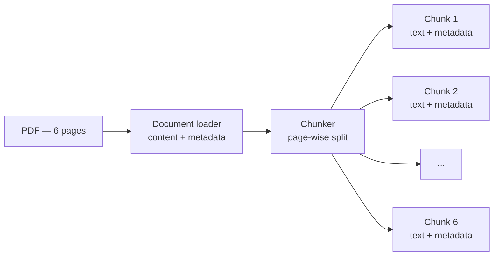

After loading, you have a whole document in memory — say a 100-page company PDF, structure intact, metadata attached. The tempting next move is to embed the whole thing and be done. One document, one vector, straight into the store.

That move quietly destroys the pipeline, and understanding *why* teaches you more about RAG than any definition of chunking ever will. So let's make the mistake first.

---

## The naive approach — embed the whole document

An embedding model has a property that sounds harmless until you think it through: **its output dimension is fixed.** If your embedding model produces 128-dimensional vectors, then *everything* you feed it comes out as exactly 128 numbers:

```
Input: a 500-word chunk        → 128 numbers
Input: a 5,000-word chapter    → 128 numbers
Input: the whole 100-page PDF  → 128 numbers
```

The model does not grow its output to match its input. Feed it more text and it doesn't produce a bigger vector — it produces the *same-sized* vector that now has to summarise vastly more meaning.

Now run the numbers on the naive plan. Your 100-page PDF covers refund policy on page 12, shipping rules on page 40, warranty terms on page 78, dress code on page 95 — a hundred pages of *distinct* topics. Embedding it whole crushes all of that into **one single 128-dimensional point**. That vector is a smeared average of everything the document discusses — refunds, shipping, warranties, dress code, all blended into 128 numbers. It captures the document's meaning the way a single colour captures a photograph: technically derived from it, practically useless.

And at query time it gets worse. In the vector store, **each document is now one point**. A user asks "what is the refund policy?" — the similarity search can only say *"this entire 100-page PDF is somewhat related."* It can never point at page 12, because page 12 doesn't exist as a searchable thing. Retrieval returns either the whole document (which you can't fit into a prompt — the very problem RAG was meant to solve) or nothing useful at all.

> [!danger] Fixed output dimension is the load-bearing fact: an embedder gives one vector of the *same size* no matter how much text you feed it. Embed too much at once and you get **semantic dilution** — one blurry point trying to represent a hundred distinct meanings.

---

## The fix — chunking

> [!info] Chunking means breaking one large document into smaller parts — chunks — and treating each chunk as its own document from here on.

Take the same 100-page PDF and apply the simplest strategy, **page-wise chunking**: split on page boundaries.

```
Before chunking: 1 document  (100 pages, one blurry vector-to-be)

After chunking:  100 documents (1 page each, one precise vector each)
```

What was one document is now 100 documents. Each goes through the embedder *individually*, so each page gets its own 128-dimensional vector capturing *that page's* meaning — the refund page's vector is purely about refunds, the warranty page's vector purely about warranties. In the vector store, the document is no longer one smeared point but **100 sharp points**.

Now the same query — "what is the refund policy?" — has something real to match against. The query vector lands close to page 12's vector and far from the dress-code page. Retrieval returns exactly the pages that matter, small enough to drop straight into the prompt. Compare the two worlds directly:

```
Whole-document embedding:  query → nearest neighbour = "the entire PDF, vaguely"

Page-wise chunking:        query → nearest neighbours = pages 12 and 13, precisely
```

More context captured per vector, more precise matching, prompt-sized retrieval — chunking buys all three at once.

A smaller worked example makes the mechanics concrete. A 6-page PDF enters the loader: the content of all 6 pages is loaded into memory, along with the document's metadata. The chunker splits it page-wise into 6 chunks — and here's the part that's easy to miss: **each chunk keeps the metadata**, now enriched with its own specifics (source file, *this chunk's* page number). Chunks don't just carry text; they carry their provenance.



> [!important] Chunking transforms the *unit of retrieval*. Before: the searchable unit is "a document" — too big to match precisely or to fit a prompt. After: the searchable unit is "a chunk" — small enough to have one clear meaning, one precise vector, and a seat in the prompt.

---

## Page-wise is one strategy, not the strategy

Page-wise splitting is the training-wheels example because it's easy to picture. It is not the only chunker, and often not the best one — a page can cut a paragraph in half mid-sentence, or lump two unrelated sections together. There is a whole family of chunking techniques (fixed-size with overlap, recursive splitting, semantic chunking...) with real trade-offs between them; they deserve — and will get — their own dedicated deep dive. What never changes across strategies is the goal you now understand: **each chunk should hold one coherent piece of meaning, sized for precise embedding and prompt-friendly retrieval.**

> [!tip] Interview framing — "why do we chunk?"
> "Because embedding models have fixed output dimensions. A 100-page PDF and a single paragraph both come out as, say, 128 numbers — so embedding a whole document smears a hundred topics into one blurry vector, and retrieval can only ever match the whole file. Chunking makes each piece its own vector: precise matching, and results small enough to fit the prompt. The chunk, not the document, is RAG's unit of retrieval."

