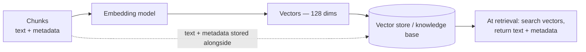

At this point in the pipeline you have chunks — small, coherent pieces of text, each carrying its metadata. Now comes the step the whole system revolves around: making those chunks **searchable by meaning**. A user will ask about a "refund", and the right chunk might say "return of an item" without using the word refund even once. Keyword search dies right there. RAG needs something better — and that something is embeddings.

---

## Text has to become numbers — but *which* numbers?

Computers compare numbers, not prose. So the first requirement is mechanical: convert text into numbers. If you've done any classical NLP, you already know ways to do that — **bag-of-words**, **TF-IDF**. Count word occurrences, weight them, out comes a vector.

So why not use those here? Because of *what* they capture. Bag-of-words and TF-IDF represent **keywords** — which words appear and how often. They don't represent what the text *means*. "Refund policy" and "return of an item" share almost no keywords, so keyword-derived vectors put them far apart — even though they mean nearly the same thing. For retrieval, that's fatal: retrieval's entire job is to find text with *similar meaning* to the query, whatever words it happens to use.

> [!info] An **embedding model** converts text into a vector that captures its **semantic meaning** — the underlying intent of the text, not its surface keywords. Simply representing text as numbers is easy; representing *meaning* as numbers is the job.

So during embedding, we deliberately skip the classical techniques. What we want in the vector isn't "which words appeared" — it's "what is this text about", because at retrieval time, similarity of *meaning* is the thing we'll measure.

---

## How embedding behaves — fixed dimensions, learned features

Feed a chunk into the embedding model and out comes a vector — say **128 numbers**. Feed in the next chunk: another 128 numbers. Two properties of this process matter:

**The output dimension is fixed.** Whether the input is 500 words or 5,000 words, the output is exactly 128 numbers for a 128-dimensional model. Every chunk — and later, every query — lands in the *same* 128-dimensional space. (This fixed size is also exactly why you had to chunk before embedding — one vector can only hold so much meaning, as *RAG Chunking* showed with the 100-page PDF.)

**The individual numbers are the model's learned features.** What does dimension 37 mean? Honestly: nothing you can name. The numbers are features the embedding model learned during its training; no single one maps to a human concept. What matters is the *geometry*: texts with similar meaning get vectors that sit close together. The space is meaningful even though the coordinates aren't.

```
Chunk 1: "Customers may return items within 30 days..."   → [0.78, -0.12, 0.44, ...]  (128 numbers)

Chunk 2: "Our office dress code requires..."              → [-0.35, 0.91, -0.08, ...] (128 numbers)

Chunk 3: "Refunds are processed to the original card..."  → [0.74, -0.09, 0.51, ...]  (128 numbers)
```

Notice chunks 1 and 3 — different words, related meaning, similar-looking vectors. Chunk 2 lives somewhere else entirely. That's the property everything downstream depends on.

*(How embedding models pull this off — their architectures, choosing between them, what those learned features really are — is a deep topic that gets its own dedicated notes. For the pipeline, the behaviour above is what you need.)*

---

## The expensive-work problem — why a store must exist

Now step back and look at what the indexing path has cost so far, for one 100-page PDF:

1. **Load + parse** the document — slow, I/O-bound
2. **Chunk** it into 100 pieces
3. **Embed** all 100 chunks — 100 neural-network inferences, the expensive part

Here's the observation that forces the next component into existence: these three steps are **time-consuming**, and they are **not repetitive work** — their output doesn't change. If your PDF isn't updating, the 100 vectors you computed today are byte-for-byte the vectors you'd compute tomorrow. Yet the naive pipeline recomputes them *for every single query*. Ten thousand queries against a stable document = ten thousand identical loading-chunking-embedding runs, 9,999 of them pure waste.

Wouldn't it be logical to do this whole task **once**, and store the 100 vectors somewhere — so every future query just *reuses* them? Create once, reuse forever.

That storage is the **vector store**: the database of the RAG pipeline.

> [!important] The vector store exists because indexing is expensive and its output is stable. You pay the loading-chunking-embedding cost once, park the results in the store, and every query thereafter searches precomputed vectors. This one decision is what splits RAG into an "index once" path and a "query many times" path.

---

## The vector store — and why it's called the knowledge base

The vector store is a database purpose-built for vectors. Like any database, it supports the full set of **CRUD operations**: you can **add** newly created vectors, **read/retrieve** them (this is retrieval's home), **update** them when a document changes, and **delete** them when a document is removed.

And it has a second name you've already met: the **knowledge base**. Back at the start of the pipeline we drew a hard line between the knowledge *source* and the knowledge *base* — here's where that line completes. The knowledge source held your **raw** files. After loading, chunking, and embedding, their processed, meaning-indexed form lands here. The vector store *is* the knowledge base: the same knowledge, transformed from "files a human can read" into "vectors a machine can search by meaning."

```
Knowledge source  →  [load → chunk → embed]  →  Knowledge base (vector store)
raw files                                        searchable meaning
```

---

## The subtle part — the store holds three things, not one

The name "vector store" undersells what's inside. For every chunk, the store keeps:

1. **The vector** — 128 numbers capturing the chunk's meaning
2. **The chunk's text** — the actual words
3. **The chunk's metadata** — source file, page number, the key-value dictionary born at the loader

Why all three? Follow the logic of what each is *for*. The **vector** exists for exactly two purposes: to be stored, and to be compared — similarity search is math on vectors. But think one step ahead: after the search finds the winning vectors... what do you put into the LLM's prompt? You can't paste `[0.78, -0.12, 0.44, ...]` into a prompt and expect the model to learn anything — augmenting *numbers* into a prompt is meaningless. What the prompt needs is the chunk's **text**. And the **metadata** rides along so the final answer can cite its source — file and page.

> [!important] Similarity search runs on **vectors**; the prompt is augmented with **text**; attribution comes from **metadata**. The store keeps all three together per chunk because retrieval needs to *search* by one and *return* the others.



---

## What this stage guarantees — and what it doesn't

**Guarantees:** every chunk of your knowledge is represented by its meaning, in one shared vector space; the expensive indexing work is done exactly once; everything needed downstream — searchable vectors, promptable text, citable metadata — sits in one database.

**Doesn't guarantee:** that a search will find the *right* chunks. The store is ready; whether the query path uses it well is the next story: *RAG Query Path — From User Question to Grounded Answer*.
