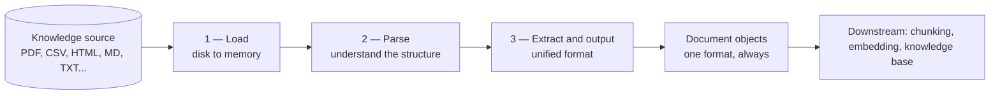

Every RAG pipeline begins at the same place: **data ingestion** — the step where your knowledge actually enters the system. And the component that does the ingesting is the **document loader**. It sounds like a boring plumbing detail, and that's exactly why it's worth understanding properly: everything downstream — chunking, embedding, retrieval — silently depends on this step having been done right.

To see why loaders must exist at all, we need to rewind the story one step.

---

## The story so far — and why it forces a first step

Recall the chain of reasoning that produced RAG in the first place. LLMs came out of training with **four problems**: a knowledge cutoff date, hallucinations, no source attribution, and no access to private data. The solution direction was to supply the missing knowledge **externally** — inject it into the prompt and let **in-context learning** (the LLM's ability to read context available in the input prompt and answer from it, very accurately) do the rest.

But that ran into a roadblock — two, actually:

1. **The context window.** An LLM accepts only a fixed number of input tokens. Feed it more than that and it starts hallucinating again; responses get badly inaccurate.
2. **Lost in the middle.** Even *within* the window, dump in a lot of context and the LLM struggles to build relationships across the text in the middle of the input — and accuracy takes a hit again.

So the additional context has to be **filtered**: only relevant information goes into the prompt, everything unnecessary gets discarded. That demand shaped what retrieval must be — a process that is both **smart** (the retrieved context is highly relevant, no junk) and **dynamic** (the retrieved text changes with each input query — whatever the query is, the retrieved text matches *it*). Then augmentation — also called **context assembly** — adds that filtered context to the prompt, and the LLM's generation capabilities produce the response. That's RAG.

Now here's the consequence that creates our topic. Because retrieval is *dynamic*, **you never know beforehand which piece of context you'll need** — queries keep changing, and the needed context changes with them. So you can't prepare just one document; you have to make **all** your external knowledge searchable in advance. That means converting all of it into **embeddings** — vectors that capture the semantic meaning of text as numbers — and storing them in the **knowledge base**, the database where comparison and retrieval will happen.

But those vectors are made *from text*. And that text has to come from somewhere.

---

## Knowledge source vs knowledge base — two different things

The place the text originally lives is the **knowledge source**, and it must never be confused with the knowledge base:

| | **Knowledge source** | **Knowledge base** |
|---|---|---|
| What it is | The original source of your text — the raw files | A database storing the *embeddings* of that text |
| What's inside | Documents in many formats | Vectors (plus what's needed for retrieval) |
| What happens there | Nothing — it just holds the originals | Comparison and retrieval, per query |

> [!info] Think of the knowledge source as **a folder on your laptop** — a directory holding multiple files, and those files are in all sorts of formats. Text files, PDFs, Markdown, webpages written in HTML, tabular data in CSVs — whatever external knowledge you've collected, dumped in one place.

That format diversity is not an edge case — it's the *normal* condition. Your company's knowledge doesn't arrive as one tidy text file; it's scattered across many files, in many structures.

And that is precisely the problem data ingestion has to solve.

---

## The requirement — a translator

State the problem sharply: the data you need is available in **multiple formats**, scattered across multiple files — but the rest of the pipeline wants to process it uniformly.

So the requirement is a special component with a specific contract:

> **Input:** a document in *any* format.
> **Output:** always the *same, unified* format.

In other words, the component should act as a **translator** — whatever language (format) the input speaks, the output comes out in the one language the rest of the pipeline understands. That unified output is what gets passed to every downstream process in the RAG pipeline.

That component is the **document loader**.

---

## What a document loader does — three tasks

A document loader performs exactly three tasks, in order.

### Task 1 — Load the document

Your document — say a Word file — is sitting on your hard disk or SSD. Before anything can read it, it has to be **properly loaded into memory**. That's the loader's first, most literal job: disk → memory.

### Task 2 — Parse the document

Here's where it gets interesting. The text inside different formats lives inside **different structures**, and you can't extract text without understanding the structure it's wrapped in.

Two concrete examples:

**HTML** has its own structure: tags. `<div>` tags, `id` attributes, dozens of tag types — and your actual text sits *between* the tags. Extracting it means understanding the tag structure, not just reading bytes.

**CSV** has a completely different structure: a **header row** first — say `ID, name, age, gender`, comma-separated — and then value rows beneath it:

```
ID, name, age, gender
1,  Rahul, 20, male
2,  Neha,  28, female
```

The meaning of "Rahul" depends on knowing it sits under the `name` header. Markdown, PDF, DOC — every format has its own special structure like this.

So the loader needs a **highly specialized parser**: a piece of logic that *understands the document's structure* and, using that understanding, pulls the text out of it. Parsing is exactly that — structure comprehension first, extraction second.

### Task 3 — Extract and output — in the unified format

Once the parser has understood the structure, the relevant text is fetched out and the output is generated. But — and this is the contract from the requirement — the output must be in the **unified format**, regardless of what the input was. PDF in, CSV in, DOC in — it makes no difference; the extracted text always comes out in one single format.



---

## Why the unified format is the whole point

Follow the benefit downstream. The next step after loading is chunking, then embedding. If loaders emitted a different shape per source format, every downstream step would need PDF-handling logic, CSV-handling logic, HTML-handling logic... conflicts everywhere, forever.

With a unified output, **the format of the knowledge source stops mattering the moment loading is done.** Chunking applies to the unified output — so chunking works *exactly the same way* whether the text originally came from a PDF, a CSV, or a DOC file. Same for embedding, and everything after. One translation at the boundary buys uniformity for the entire pipeline.

> [!important] The document loader is the **only** component in the pipeline that ever knows or cares what format your knowledge arrived in. From its output onward, every document is just "a document."

---

## Not just text — the metadata rides along

Is unified *text* enough, though? Think about what the pipeline needs later. The text you convert into vectors carries something with it: **metadata** — information *about* the text. Its job is to tell you the **source** of the text — and it also enables **filtering** (you can filter retrievals by metadata).

So the unified output must contain not only the extracted text but also the **metadata related to that text**: which file it came from, which page, who created it, when — everything relevant about the text's origin. Without it, source attribution — one of the four problems RAG exists to solve — is dead on arrival.

---

## LangChain's answer — the Document object

LangChain (the framework the course builds in) makes all of this concrete with the **Document object**. Use *any* document loader in LangChain — its output is a Document object, and a Document object has exactly **two attributes**:

1. **`page_content`** — a string: the actual extracted text, read out of your knowledge source
2. **`metadata`** — a dictionary: the information about the source — for a PDF, things like the total number of pages, which page *this* text came from, which section, who the creator of the PDF was, when it was created, its size...

```
Document
├── page_content: "Customers may return items within 30 days..."   (str)
└── metadata:     {"source": "policy.pdf", "page": 12,
                   "total_pages": 100, "creator": "...", ...}       (dict)
```

Any input format → one Document shape out: original text + its provenance, together.

### How LangChain enforces the contract — the BaseLoader class

This uniformity isn't a convention loaders politely follow — it's inherited. Every document loader class in LangChain **inherits from the `BaseLoader` class**, an **abstract class** that contains the code defining how document loaders are implemented — including how extracted text gets converted into the unified Document output. Define a new loader, inherit from `BaseLoader`, and the guarantee comes with it: your output is always received as Documents.

---

## One specialized loader per format — and why

On the input side, LangChain's developers made a deliberate choice: **a special document loader for every specific document type.** The reason is the parsing task from earlier: every file type has a different structure, so its **parsing technique is different** — which means the parser must be specialized to that one structure.

> [!important] Some loaders appear to handle multiple file types — but those are **wrappers**. Internally, the specialized loaders are still doing the work, because a parser can only extract text from one kind of structure. Specialization isn't an implementation accident; it's forced by the nature of parsing.

---

## Document loaders in one breath

The knowledge source holds files in many different formats. The document loader **reads** them, **parses** them — understands each format's structure — and **extracts** the text into one unified output: the Document object, with `page_content` holding the actual text and `metadata` holding its source information. One specialized loader (with its specialized internal parser) per input type; one identical output shape for the whole pipeline.

> [!tip] Interview framing — "what does a document loader do?"
> "It's the data-ingestion component of RAG — a translator. Input in any format, output always unified. Three tasks: load the file from disk into memory, parse it — which means understanding that format's structure, HTML's tags versus CSV's header-and-rows — and extract the text into a single output shape. In LangChain that's the Document object: `page_content` for the text, a `metadata` dict for provenance, enforced by every loader inheriting from `BaseLoader`. The unified output is the point — chunking and embedding then work identically no matter where the text came from, and the metadata is what makes source attribution and filtering possible later."

---
