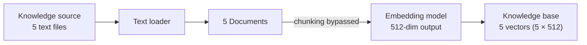
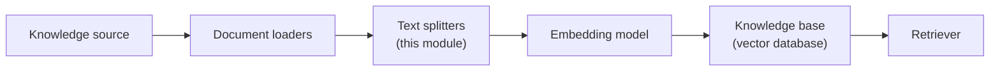

The document loaders module ended with a quiet victory: whatever the format — text, PDF, CSV, JSON, web page — everything comes out as a uniform list of Document objects. But look at what's actually *inside* those Documents. A text loader hands back an entire file as one Document. A PDF loader hands back whole pages. Load a book and you're holding a Document with tens of thousands of words in `page_content`.

And that raises the next problem in the pipeline: **these pieces are too big to be useful.** This module is about the component that fixes that — the **text splitter**, which takes a large text and divides it into multiple smaller pieces called **chunks**.

```
One large document
        │
        ▼  text splitter
┌─────────┬─────────┬─────────┐
│ chunk 1 │ chunk 2 │ chunk 3 │
└─────────┴─────────┴─────────┘
```

The obvious question: why? The loaded documents were fine — why chop them up? There are three separate reasons, and the third one is the one that makes chunking non-negotiable.

---

## Reason 1 — the context window is a hard limit

Every LLM has a **context window** — the maximum amount of input it can accept in a single call. It's a threshold, not a suggestion. If you stuff an enormous document into the prompt and breach that threshold, the model can no longer properly track the relationships spread across the input. Accuracy of the responses drops, and the model can even start hallucinating.

So rule one of feeding an LLM: never breach the context limit. Splitting a large text into smaller documents is the mechanism that makes this guarantee possible — no individual chunk is ever anywhere near the window size.

---

## Reason 2 — lost in the middle

Even *within* the context window, LLMs have a well-documented weakness: given a long input, the model focuses well on the **beginning** and the **end** of the text, and loses focus on everything **in the middle**. This is called the **lost-in-the-middle problem** — and it shows up even when you're only using around 50% of the maximum context limit. The model still struggles to pay equal attention across one long continuous text.

Splitting attacks this directly. Take the long text and cut it into chunk 1 (the start), chunks 2 and 3 (the middle portions), chunk 4 (the end). Each piece is now small enough that the model can hold its focus across *all* of it — there is no "middle" left to get lost in.

---

## Reason 3 — retrieval needs small units, or it isn't retrieval at all

This is the big one, and it's easiest to see by running a thought experiment: what happens downstream if we **skip** chunking?

Say the knowledge source is a folder with just **5 text files**. We follow the pipeline but bypass the splitting step entirely:



The loader returns 5 Documents. Each one goes to the embedding model, which converts a text into a vector of numbers capturing its meaning — say a 512-dimensional vector. Result: the knowledge base holds exactly **5 vectors**, a 5 × 512 array.

Now a user query arrives. The query becomes a vector, and we do a similarity search against the knowledge base to fetch the most relevant pieces. And here the whole idea collapses: there are only 5 vectors *in existence*. If retrieval fetches the top 5, it has fetched **everything** — whatever the query is. There is no selection happening, because there's nothing to select *between*:

- **Retrieval is no longer specific to the query.** Any question returns the same result: all 5 documents.
- **The full corpus lands in the context.** And with the entire knowledge source in the prompt, both earlier problems come straight back — context window breaches and lost-in-the-middle.

Now rewind and *keep* the chunking step. Split each of the 5 documents into 10 parts — the knowledge base holds **50 vectors**. The same query now runs a similarity search across 50 candidates and picks the 5 best-matching chunks. That is a real selection — a **filtered context** that actually depends on what was asked.

The size difference is dramatic. Say each file is about 100 lines. Retrieving all 5 whole documents = 500 lines entering the prompt. Retrieving the best 5 chunks (each 10 lines) = about 50 lines — **a 10× reduction**, and every one of those lines earned its place by being relevant.

> [!important] Chunks are the unit of retrieval. The retriever can only ever be as precise as the pieces it chooses between. Whole-document pieces mean no real choice; small, focused chunks mean the context you assemble is genuinely about the question.

---

## The bonus reason — embeddings get *better* when the text is smaller

There's a subtler effect underneath all this, and it comes from how embedding models work.

An embedding model has a **fixed output dimensionality**. The model used in this course returns **512 numbers** — no matter what you feed it. One sentence in? 512 numbers out. An entire book in? Still 512 numbers out.

That means embedding is **compression**, and the compression ratio depends entirely on the input size:

- **Scenario 1:** embed a whole 10,000-word document → squeeze 10,000 words of meaning into 512 numbers. Brutal compression. A lot of semantic meaning simply doesn't survive.
- **Scenario 2:** split that document into 10 chunks of 1,000 words, embed each → each vector squeezes only 1,000 words into 512 numbers. The compression is **10× gentler**, so far more of each chunk's meaning is preserved in its vector.

Which vector will match a query about one specific topic better? The one that had room to actually encode that topic.

And there's a second wrinkle: **one page is not one topic.** A single page of a document can easily discuss multiple different things. Embed the whole page and you get one vector that smears several meanings together — a mediocre match for *any* of them. Split at meaningful boundaries and each vector represents one coherent idea sharply.

Finally, there's plain speed: creating an embedding for one giant document is a single, slow, sequential job. Fifty small chunks can be embedded independently — in parallel.

---

## Where the splitter sits



The text splitter is the second station of the pipeline: loaders bring documents in, splitters cut them into retrieval-sized chunks, and everything downstream — embeddings, storage, retrieval — works on chunks, never on raw documents.

One more piece of LangChain symmetry worth knowing: just as every document loader inherits from a common `BaseLoader` class (which is why they all share `load()` and `lazy_load()`), all text splitters inherit from a common base splitter class — so every splitter you'll meet exposes the same two methods, `split_text` and `split_documents`. Learn one splitter's interface and you've learned them all; only the *strategy* for deciding where to cut changes.

That strategy — where exactly to cut — turns out to be a surprisingly deep question, and it's what the rest of this module is about, starting with the simplest possible answer: just count characters.
