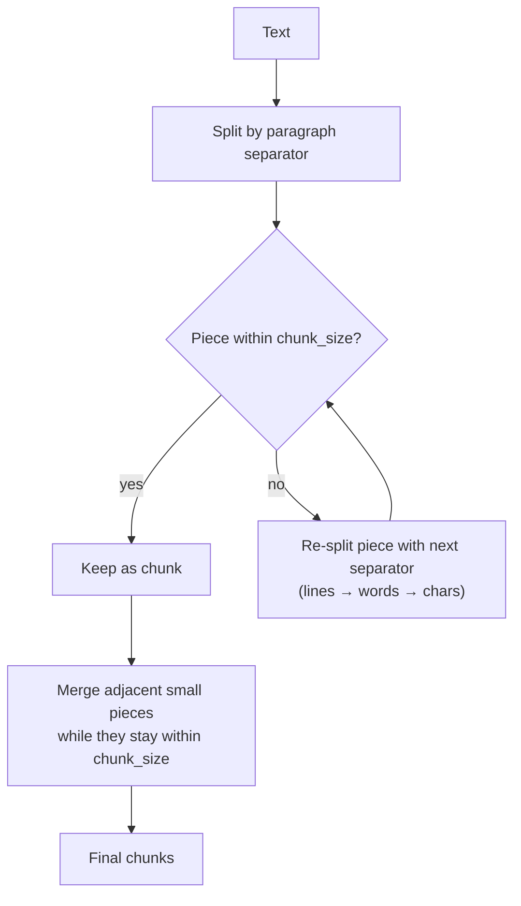

The character splitter's two sins were established at the end of the last note: it cuts words and sentences mid-flow, and it's blind to how a document is organised. Both sins have the same root cause — it has exactly **one** separator. Told to cut at spaces, it can't see paragraphs. Told to cut at paragraphs, it has no fallback when a paragraph is too big (remember the 216-character chunk that blew past `chunk_size=100` with just a warning).

But text isn't flat. Written language has a built-in **hierarchy**:

```
document → paragraphs → lines/sentences → words → characters
```

A paragraph is a complete unit of thought. A sentence is a complete unit of meaning. A word is the smallest unit that means anything at all. The right way to split is to respect that hierarchy: keep paragraphs whole if they fit, fall back to sentences when they don't, fall back to words only when even a sentence is too big — and touch characters only in the pathological case where a single word exceeds the chunk size (which in practice never happens with a sane `chunk_size`).

That strategy is the **`RecursiveCharacterTextSplitter`** — and it is LangChain's default recommendation for splitting ordinary text.

---

## How it works — a hierarchy of separators, tried in order

Where `CharacterTextSplitter` takes one separator, the recursive splitter holds an ordered **list** of separators, from coarsest to finest:

```python
["\n\n",  "\n",  " ",  ""]
# paragraphs → lines → words → characters
```

The algorithm, in plain words:

1. **Split by the top separator** (`"\n\n"`) — the text falls apart into paragraphs.
2. **Measure each piece** against `chunk_size`.
3. A piece that **fits** → keep it as a chunk. Done — no further cutting.
4. A piece that's **too big** → recursively split **that piece** with the **next** separator down (`"\n"` — lines), and repeat the measurement.
5. Still too big at the line level → split by spaces into words. (And in theory, characters after that.)
6. **Merge small neighbours back together.** After the recursive splitting, adjacent small pieces are re-combined — as long as the combination stays within `chunk_size` — so the final chunks approach the optimal length instead of arriving as confetti.

That last step is what makes the output usable: the recursion cuts **down** until pieces fit, then the merge builds **up** until chunks are as full as the limit allows.



---

## A worked example you can trace by hand

The course walks this tiny text — four short lines, two paragraphs — with an absurdly small `chunk_size=10` so every decision is visible:

```python
text = """Hi how are you
My name is Rahul

I am teaching RAG
We are Learning about RAG"""
```

Count the lines: `Hi how are you` is 14 characters, `My name is Rahul` is 16, `I am teaching RAG` is 17, `We are Learning about RAG` is 25. **Every single line breaches the limit of 10.**

Trace the algorithm:

1. **Paragraph split** (`"\n\n"`): two pieces — the first two lines, the last two lines. Both far over 10.
2. **Line split** (`"\n"`): four pieces of 14, 16, 17, 25 characters. Still all over 10.
3. **Word split** (`" "`): now the pieces are individual words — `Hi` (2), `how` (3), `are` (3), `you` (3), `My` (2), `name` (4), `is` (2), `Rahul` (5)… Every piece finally fits.
4. **Merge back up**: walk the words left to right, greedily packing neighbours while staying ≤ 10. `Hi` + `how` = 6 characters — keep packing. Add `are` → `Hi how are` = 10 — exactly at the limit, still legal. Add `you`? That would breach 10 → cut. `you` starts the next chunk. And so on, never merging across a line boundary — the hierarchy is preserved even while packing.

Run it and watch the trace come true:

```python
from langchain_text_splitters import RecursiveCharacterTextSplitter

splitter = RecursiveCharacterTextSplitter(
    chunk_size=10,
    chunk_overlap=0
)

splitter.split_text(text)
# ['Hi how are', 'you',
#  'My name', 'is Rahul',
#  'I am', 'teaching', 'RAG',
#  'We are', 'Learning', 'about RAG']
```

Ten chunks, none over 10 characters, and — look closely — **not one broken word anywhere**. The plain character splitter with `separator=""` would have produced `Hi how are`, ` you\nMy na`, `me is Rahu`… slicing `name` and `Rahul` mid-word. The recursive splitter, forced into an impossibly small budget, degraded **gracefully**: whole words, packed as tightly as the limit allowed.

> [!info] That is the recursive splitter's core promise: it always cuts at the **most meaningful boundary that still fits**. Paragraphs if possible, sentences if not, words as the last practical resort. `chunk_size` is respected **and** meaning is respected — the two things the plain character splitter couldn't do at the same time.

---

## On realistic text

The hand-traceable example proves the mechanics; here's the behaviour on real prose. This passage has four paragraphs — an intro, a paragraph on ML/deep learning, one on NLP (Transformers, GPT, BERT), one on computer vision, and one on industry impact:

```python
example_text = """Artificial intelligence is transforming technology and shaping the future.

Machine learning algorithms are becoming more sophisticated every day.
Deep learning models can now process vast amounts of data efficiently.

Natural language processing has made significant strides in recent years.
Transformers architecture revolutionized the field in 2017.
Models like GPT and BERT have set new benchmarks.

Computer vision systems can now identify objects with remarkable accuracy.
Convolutional neural networks excel at image recognition tasks.
Self-driving cars rely heavily on advanced computer vision.

The impact of AI extends across multiple industries including healthcare, finance, and transportation.
Ethical considerations around AI development are becoming increasingly important.
Researchers are working on making AI systems more transparent and explainable."""

splitter = RecursiveCharacterTextSplitter(
    chunk_size=150,
    chunk_overlap=20
)

chunks = splitter.split_text(example_text)
```

Nine chunks come back, and every boundary lands on a sentence or paragraph edge:

```
Chunk 1 (74 chars):  Artificial intelligence is transforming technology and shaping the future.
Chunk 2 (141 chars): Machine learning algorithms are becoming more sophisticated every day.
                     Deep learning models can now process vast amounts of data efficiently.
Chunk 3 (133 chars): Natural language processing has made significant strides in recent years.
                     Transformers architecture revolutionized the field in 2017.
Chunk 4 (49 chars):  Models like GPT and BERT have set new benchmarks.
...
```

Read chunk 2: it's the **complete** machine learning paragraph — both sentences, one topic, one clean unit of meaning. Where a paragraph didn't fit in 150 characters (the NLP one is three sentences), the splitter dropped one level and cut between sentences — chunk 4 is the GPT/BERT sentence standing alone, whole. No chunk merges the end of one topic with the start of the next, which is exactly the school-textbook failure (physics chapter's last page welded to chemistry's first) that sank the character splitter.

The chunk sizes are no longer uniform — 74, 141, 133, 49… — and that's the honest trade: the recursive splitter treats `chunk_size` as a ceiling and lets **structure** decide the actual cut, so sizes vary with the shape of the text. You trade the character splitter's predictable sizes for semantically whole chunks. For retrieval, that trade is almost always worth it: an embedding of **the complete ML paragraph** matches an ML query far better than an embedding of **half the ML paragraph plus the first NLP sentence.**

---

## Documents, not just strings

Same as every splitter: `split_text` for strings, **`split_documents`** for the Document objects your loaders actually produce. Given several texts, wrap them into Documents (a list comprehension does it neatly) and split them all in one call:

```python
from langchain_core.documents import Document

list_of_text = [text, example_text]

docs = [Document(page_content=t) for t in list_of_text]

chunks_docs = splitter.split_documents(docs)
len(chunks_docs)   # 10 — chunks from BOTH documents, each still a Document
```

The output is one flat list of chunk-Documents — the small demo text contributed one chunk (it fits inside 150 whole), the AI text contributed nine — each carrying its parent Document's metadata forward, ready for the embedding step.

---

## Why this is the default choice

Pull the threads together:

- **Chunks are semantically meaningful.** Cuts happen at paragraph and sentence boundaries, so each chunk is a coherent unit of thought — which is exactly what you want a single embedding vector to represent.
- **No mid-word, no mid-sentence breaks** in practice. The continuity-destruction that plagued the character splitter simply doesn't occur, because words are the practical floor of the hierarchy.
- **It preserves the document's natural structure.** The paragraph → sentence → word hierarchy that the author put into the text is the same hierarchy the splitter uses to take it apart.
- **`chunk_size` is still respected** — unlike the character splitter with a paragraph separator, there's always a next level to fall back to, so no chunk silently blows past the limit.

> [!tip] Interview framing: **For plain text I default to `RecursiveCharacterTextSplitter`. It tries a hierarchy of separators — paragraphs, then lines, then words — recursively re-splitting anything that exceeds `chunk_size` and merging small pieces back up toward the limit. That gives me chunks that are both bounded in size and aligned with the text's semantic structure, which is exactly what the embeddings downstream need.**

One boundary remains, though. This splitter understands the structure of **prose** — paragraphs and sentences. But a knowledge source can also contain **Python files, Markdown documents, JSON** — formats whose structure isn't made of paragraphs at all. A function definition, a Markdown heading, a nested JSON object each need their own notion of **a meaningful boundary** — and that's where the document-structure-based splitters come in.
