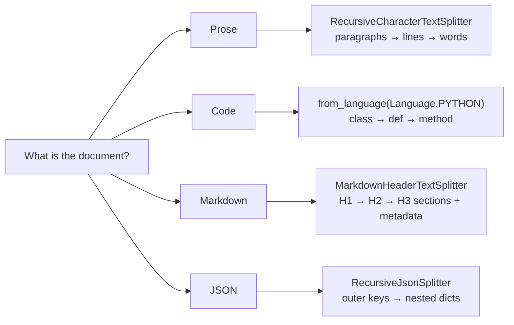

The recursive splitter closed the story for prose: paragraphs, then lines, then words — the hierarchy written language naturally has. But a knowledge source is rarely just prose. The moment your loaders start pulling in **Python files, Markdown docs, JSON APIs**, the paragraph hierarchy stops describing the text. A Python file has no paragraphs — it has functions and classes. A Markdown file's real structure is its headings. A JSON object nests dictionaries inside dictionaries. Split those with `["\n\n", "\n", " ", ""]` and you'll slice a function in half or weld two unrelated JSON records together.

The fix is not a new algorithm. It's the same recursive strategy with a different **separator hierarchy — one that matches the document's own structure**. That's all **document-structure-based splitting** means.

---

## Splitting code — the `Language` enum

Take a real Python file: imports at the top, two standalone functions (`calculate_mean`, `calculate_median`), a `StatisticalAnalyzer` class with three methods, and a `main()` function. The meaningful boundaries here are obvious to any programmer: **a chunk should be a function or a class**, not **700 characters starting wherever.**

LangChain ships this as a classmethod on the splitter you already know:

```python
from langchain_text_splitters import RecursiveCharacterTextSplitter, Language

python_splitter = RecursiveCharacterTextSplitter.from_language(
    language=Language.PYTHON,
    chunk_size=700,
    chunk_overlap=100
)

code_chunks = python_splitter.split_text(python_code)
```

`Language` is an enum with dozens of members — `PYTHON`, `JS`, `JAVA`, `CPP`, `GO`, `MARKDOWN`, `HTML`, and more. Picking one doesn't change the algorithm at all; it swaps in a separator list built from that language's syntax. You can see exactly what it swapped in:

```python
python_splitter.get_separators_for_language(Language.PYTHON)
# ['\nclass ', '\ndef ', '\n\tdef ', '\n\n', '\n', ' ', '']

python_splitter.get_separators_for_language(Language.JS)
# ['\nfunction ', '\nconst ', '\nlet ', '\nvar ', '\nclass ',
#  '\nif ', '\nfor ', '\nwhile ', '\nswitch ', '\ncase ', '\ndefault ',
#  '\n\n', '\n', ' ', '']
```

Read the Python list top-down and it's a programmer's priority order: cut at `class` definitions first, then top-level `def`s, then indented methods, and only then fall back to the familiar paragraphs → lines → words → characters tail. Same recursion, same merge-back-up step — only the notion of **a meaningful boundary** changed.

Run it on the statistics file with `chunk_size=700` and four chunks come back:

```
Chunk 1 (592 chars): the imports + calculate_mean + calculate_median
Chunk 2 (675 chars): class StatisticalAnalyzer — __init__, analyze, and most of get_summary
Chunk 3 (58 chars):  return f"Mean: {self.mean:.2f}, Median: {self.median:.2f}"
Chunk 4 (158 chars): def main(): ... the complete main function
```

Chunk 1 is a coherent unit — the two standalone helper functions, whole, with their imports. Chunk 4 is the entire `main()` function, untouched. That's the promise delivered: cuts land on code boundaries.

> [!important] But look honestly at chunk 3 — a lonely 58-character `return` line. The class was 733 characters, too big for the 700 budget, so the splitter had to cut **inside** it, and the cut fell mid-method. Language-aware splitting makes good boundaries far more likely; it does not make bad ones impossible. When a single class outgrows `chunk_size`, something has to give — your two levers are a bigger `chunk_size` or accepting an occasional orphan line (which `chunk_overlap` then papers over, since the next chunk re-carries context).

---

## Splitting Markdown — headings are the structure

A Markdown document declares its own outline: `#` for the top-level title, `##` for sections, `###` for subsections. The course example is an AI overview document — `# Artificial Intelligence Overview` at the top, `## Machine Learning` and `## Deep Learning` and `## Applications` as sections, each with `###` subsections like Supervised Learning, Neural Networks, Healthcare.

Two different tools can split it, and they do **different jobs**:

**Option 1 — `from_language(Language.MARKDOWN)`.** Same recursive splitter, Markdown-flavoured separators:

```python
python_splitter.get_separators_for_language(Language.MARKDOWN)
# ['\n#{1,6} ', '```\n', '\n\\*\\*\\*+\n', '\n---+\n', '\n___+\n', '\n\n', '\n', ' ', '']
```

Headings of any level first (`#{1,6}` is a regex — one to six hashes), then fenced code blocks, then horizontal rules, then the usual prose tail. You get size-bounded chunks that prefer to break at headings. Output: plain strings, like every other `split_text`.

**Option 2 — `MarkdownHeaderTextSplitter`.** This one doesn't think in `chunk_size` at all — it thinks in **sections**, and it remembers **where each section sits in the outline**:

```python
from langchain_text_splitters import MarkdownHeaderTextSplitter

headers_to_split_on = [
    ("#", "Header_1"),
    ("##", "Header_2"),
    ("###", "Header_3")
]

markdown_splitter = MarkdownHeaderTextSplitter(
    headers_to_split_on=headers_to_split_on,
    strip_headers=False      # keep the heading line inside the chunk text
)

markdown_chunks = markdown_splitter.split_text(MARKDOWN_TEXT)
```

The AI document comes back as **10 chunks — one per section** — and here's the part that matters: this `split_text` returns **Document objects, not strings**. Each Document carries its full heading trail as metadata:

```python
markdown_chunks[2].metadata
# {'Header_1': 'Artificial Intelligence Overview',
#  'Header_2': 'Machine Learning',
#  'Header_3': 'Supervised Learning'}

markdown_chunks[2].page_content
# ### Supervised Learning
# Supervised learning algorithms learn from labeled training data.
# They make predictions based on input-output pairs.
# Common algorithms include:
# - Linear regression
# - Decision trees
# - Support vector machines
```

> [!info] That metadata is a breadcrumb trail. When retrieval later surfaces this chunk, you don't just know it says **labeled training data** — you know it lives under **AI Overview → Machine Learning → Supervised Learning**. The chunk carries its own table-of-contents position, which the LLM can use for context and your system can use for filtering.

> [!danger] Watch the return-type inconsistency: every other splitter's `split_text` gives `list[str]`, but `MarkdownHeaderTextSplitter.split_text` gives `list[Document]` — because strings have nowhere to put the header metadata. Forgetting this is a classic source of type errors in a pipeline.

And the two options compose: split by headers first to get semantically clean sections with metadata, then run any section that's still too large through a recursive splitter to enforce a size budget. Structure first, size second.

---

## Splitting JSON — respect the nesting

JSON's structure is nesting: dictionaries containing lists containing dictionaries. The course example is a company record — `AI Research Corp`, a `departments` list (Machine Learning with two projects, Data Engineering with one), a `technologies` dict, a `metadata` dict. Cut that at character 200 regardless of structure and you'd produce fragments like `"team_members": ["Alice", "Bo` — broken JSON that no downstream step can parse.

The dedicated tool recursively descends the nesting:

```python
from langchain_text_splitters import RecursiveJsonSplitter

json_splitter = RecursiveJsonSplitter(max_chunk_size=200)

chunks_dict = json_splitter.split_json(json_data=JSON_DATA)   # → list of dicts
chunks      = json_splitter.split_text(JSON_DATA)             # → list of JSON strings
```

Same split, two output formats — `split_json` hands back Python dictionaries (still walkable data), `split_text` hands back serialized JSON strings (ready to embed). On the company record both produce 3 chunks:

```
Chunk 1 (635 chars): {"company": ..., "departments": [ ...both departments, all projects... ]}
Chunk 2 (157 chars): {"technologies": {"frameworks": [...], "languages": [...], "cloud": [...]}}
Chunk 3 (82 chars):  {"metadata": {"founded": 2020, "headquarters": "San Francisco", ...}}
```

Every chunk is **valid, parseable JSON** — keys with their values, brackets balanced. No chunk ends mid-string.

> [!important] But chunk 1 is 635 characters against a `max_chunk_size` of 200 — a 3× breach. Why? The splitter descends into **dictionaries**, but it treats a **list** as a single value it won't tear apart — and the entire `departments` list is one value. Same lesson as the character splitter's oversized-paragraph warning and the Python splitter's oversized class: **every structure-respecting splitter treats your size limit as best effort within the structure.** When an atomic unit of structure is bigger than the budget, structure wins and the limit is exceeded.

---

## The pattern across all three



One idea, four costumes: **let the document's own structure supply the separator hierarchy.** The recursion and the merge-up step never change; only the definition of **a meaningful place to cut** does.

> [!tip] Interview framing: **For structured formats I don't invent a splitter — I reuse the recursive strategy with format-aware separators. `from_language` gives me class/function boundaries for code, `MarkdownHeaderTextSplitter` gives me one chunk per section with the heading trail as metadata, and `RecursiveJsonSplitter` descends the nesting so every chunk stays parseable. The common trap to mention: all of them treat `chunk_size` as best-effort — an oversized class, section, or list will still exceed it, because breaking the structure would be worse.**

All the splitters so far — character, recursive, structure-based — share one blind spot, though: they cut where the **formatting** changes, never where the **meaning** changes. A document that drifts from machine learning into cooking recipes inside one long paragraph will sail through every splitter above as a single chunk. Splitting on meaning itself needs a fundamentally different ingredient.
