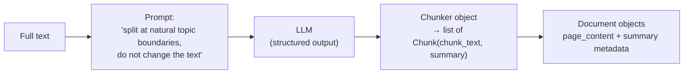

Semantic chunking ended on a diagnosis: judging **where the topic changes** by pairwise cosine similarity of adjacent sentences is **local and mechanical** — it compares neighbours, it never reads the document. But there is a tool whose entire pre-training was about reading documents. An LLM has natural language understanding baked into it from the massive text it trained on; it understands hidden semantic meaning, and it recognises **topic boundaries** — where one subject ends and another begins — the way a human editor does.

So the final chunking strategy is almost cheeky in its simplicity: **hand the whole text to an LLM and ask it to do the splitting.** The LLM analyzes the document and decides the optimal chunk boundaries based on its semantic understanding. No separators, no thresholds, no embeddings-per-sentence — the model that will eventually **answer** from your chunks is the same kind of model now **making** them.

---

## The code — a chunker built from a prompt

There's no `LLMChunker` class to import — you assemble it yourself from pieces you already know: a chat model, a prompt, and structured output. That last part is the trick worth studying.

**Step 1 — define the output shape with Pydantic.** If you just ask an LLM to **split this text**, you get back one big string you'd have to parse. Instead you declare, as Python classes, exactly the structure you want:

```python
from pydantic import BaseModel

class Chunk(BaseModel):
    chunk_text: str
    summary: str          # bonus: a 1–2 line summary per chunk

class Chunker(BaseModel):
    chunks: list[Chunk]
```

**Step 2 — bind the model to that shape.**

```python
from langchain_openai.chat_models import ChatOpenAI

model = ChatOpenAI(model="gpt-5-mini")
llm_chunker = model.with_structured_output(schema=Chunker)
```

`with_structured_output` forces the model's response to arrive as a real `Chunker` object — `response.chunks` is a genuine Python list of `Chunk` objects, no string parsing anywhere.

**Step 3 — the prompt is the algorithm.** Everything the previous splitters encoded in separator lists and thresholds, this splitter encodes in plain English instructions:

```python
from langchain_core.prompts import ChatPromptTemplate

prompt = ChatPromptTemplate(messages=[
    ("system",
     """You are an expert Text Chunker that splits the given text and outputs them as a
     list of strings. You understand the natural topic boundaries of text and
     also do not change the existing text. You just split the text where ever applicable.
     Once you create the chunk, you also generate a 1-2 line summary of the chunk also"""),
    ("human", "Split the given text into chunks\nText: {text}")
], input_variables=["text"])
```

Read the system prompt closely — two instructions are load-bearing. **Do not change the existing text**: an LLM is a text generator; without this it may paraphrase your document while chunking it, and a chunk that's a paraphrase is a corrupted source. **Generate a 1-2 line summary**: this is a capability **no other splitter has** — because the chunker actually understands the text, it can produce metadata about it for free.

**Step 4 — chain and run.**

```python
model_chain = prompt | llm_chunker
response = model_chain.invoke({"text": text})   # the same AI/pasta/climate text

response.chunks       # list of Chunk objects
len(response.chunks)
```

On the 12-sentence AI/pasta/climate text — the exact text that made the semantic chunker stumble — the LLM cleanly separates the topics: the AI sentences together, the pasta recipe sentences together, the climate sentences together, each chunk arriving with its own little summary.

**Step 5 — back into the pipeline.** Downstream stages expect Document objects, so wrap each chunk, tucking the summary into metadata:

```python
from langchain_core.documents import Document

docs = [
    Document(page_content=chunk.chunk_text, metadata={"summary": chunk.summary})
    for chunk in response.chunks
]
```



---

## Why this is the quality ceiling — and what it costs

**What it guarantees:**

- **The best boundaries available.** The judge actually reads the document. It knows a topic changed even when the formatting didn't — the exact case that defeats every formatting-based splitter.
- **Format independence.** Code, Markdown, PDFs' extracted text, mixed documents — the LLM has seen every kind of document in pre-training, so one chunker handles them all. No per-format separator lists.
- **Instructable.** Want chunks that never split a legal clause? Want the summary in a specific style? Say so in the prompt. No other splitter takes instructions.
- **Richer chunks.** The per-chunk summary is generated understanding — usable later for filtering, display, or better retrieval.

**What it doesn't guarantee:**

- **Cost.** Every document you chunk is a full LLM call over its entire text. The character splitter is a string operation; this is paid inference on your whole corpus. At ingestion scale, that bill is real.
- **Scale.** The document must fit in the LLM's **context window** — the same hard input limit from the why-RAG story. A 1,000-page handbook cannot be handed over in one call. LLM chunking fits **small** documents; ironically, the huge documents that most need good chunking are the ones it can't swallow whole.
- **Speed.** An LLM round-trip per document is orders of magnitude slower than any local splitter. Ingesting a big corpus this way turns minutes into hours.

> [!important] So the sweet spot is narrow but real: **small-but-complex text** — documents short enough for one call, whose topic structure is too subtle for formatting-based rules. For bulk ingestion, the recursive splitter remains the workhorse; LLM chunking is the premium tool you point at the documents that deserve it.

---

## The full splitter toolbox

Module 2's chunking story, end to end:

| Strategy | Cuts on | Cost | When |
|---|---|---|---|
| `CharacterTextSplitter` | one separator + size | free | quick, predictable, don't care about meaning |
| `RecursiveCharacterTextSplitter` | structure hierarchy + size | free | **the default** for prose |
| `from_language` / Markdown / JSON splitters | the format's own structure | free | code, Markdown, JSON |
| `SemanticChunker` | embedding similarity dips | embedding calls | topic-drift text, experimental |
| LLM-based chunking | genuine understanding | LLM call per doc | small, complex, high-value docs |

> [!tip] Interview framing: **There's a spectrum: formatting-based splitters (character, recursive, structure-aware) are free and fast but never read the text; semantic chunking reads it shallowly through embeddings; LLM-based chunking reads it properly — you prompt a model to split at natural topic boundaries without changing the text, returned as structured output, and you even get per-chunk summaries for free. Its limits are cost, latency, and the context window, so I'd reserve it for small high-value documents and default to recursive splitting for bulk ingestion.**

With loading and splitting done, the pipeline's next stage is the one every splitter kept gesturing at: turning chunks into those meaning-carrying vectors — embedding models, what they are, how they work, and the proprietary-vs-open-source choice between them.
