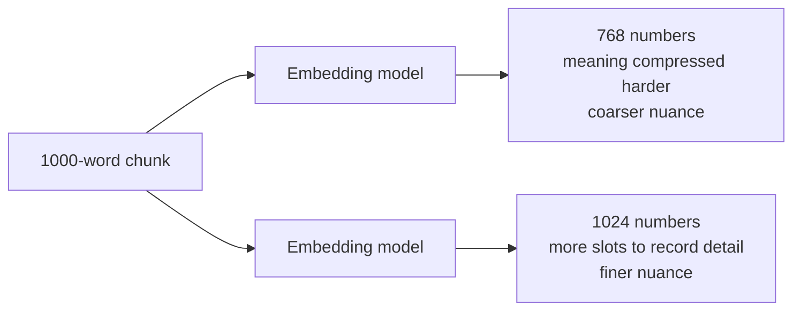

The last note left us picking a distance metric, and the winner — dot product on normalized vectors — works **element-wise**: multiply the first number of vector A by the first number of vector B, the second by the second, and so on, then add it all into one scalar. Which means the amount of work you do is set by one thing: **how many numbers are in the vector.** That count has a name — the **dimensionality** of the embedding — and it turns out to be one of the most consequential knobs in the whole pipeline. Push it up and you capture more meaning but pay more in storage, bandwidth, and compute; push it down and you save on all three but blur the meaning. Before you can turn that knob sensibly, you have to answer a question we've dodged so far: what **is** a single dimension actually holding?

---

## What one dimension actually represents

An embedding model takes text in and returns a fixed-length vector out — say 768 numbers. We've been calling those numbers **the meaning of the text as coordinates,** but let's get concrete about what each individual number is doing.

Think of each dimension as a **learned feature** — one specific question about the text, answered as a number. The model has, during training, decided that position number 80 in the vector will track something like **how robotics-related is this text?** and position 150 will track something like **how peace-loving is this text?** Feed in a sentence and the model fills every slot with its answer:

![[AI-Engineering/07-RAG/03-Embeddings/Images/07-Dimension-As-Features.png]]

Take a piece of text about military drones. Dimension 80 — **robotics?** — comes back high, say `0.95`, because drones are deeply robotics-related. Dimension 150 — **peace-loving?** — comes back low, say `0.1`, because the text is about defense, casualties, damage: the opposite of peaceful. Every one of the 768 dimensions gets filled in this same way, each one capturing some nuance, some minor detail of the text's meaning, all at once.

> [!info] A dimension is a single learned feature of meaning. The embedding vector is the model's answer sheet — one number per feature, all filled in for the same input text. A **high** number means **this text scores strongly on that feature**; a **low** number means **weakly.** The full set of 768 answers **is** the text's meaning, encoded numerically.

There's a useful mental model for this from plain old databases. When you store people in a table, you commit to a **fixed set of columns** up front — `Name`, `Age`, `Address`, `Contact` — and every single row fills those same columns in the same order. You never put an age in the name column. An embedding works the same way: it's a fixed set of feature-slots, and every text that goes through the model fills the **same** slots in the **same** order. That fixed, aligned structure is exactly why two vectors can be compared element-wise in the first place — position 80 always means the same thing across every vector.

```
Database row:   [ Name    | Age  | Address     | Contact    ]   ← fixed columns, same order every row
Embedding:      [ dim-1   | dim-2| ...         | dim-768    ]   ← fixed features, same order every text
```

### The honest caveat — we don't actually know what each dimension means

Here's the part that trips people up. When I said **dimension 80 tracks robotics,** that was a **wild guess** to make the idea concrete. In reality nobody hand-labels these features. The model learns them on its own during training, and the meaning of any single dimension is not something a human can read off. Dimension 50 might be **tech-ness,** or it might be some abstract blend of ideas we have no word for. It is genuinely uninterpretable at the individual level.

> [!important] What each dimension **means** is not human-readable — the features are learned by a deep network, not designed by a person. What you **can** rely on is the aggregate behaviour: text with similar meaning produces similar sets of numbers, so similar vectors land near each other. You trust the geometry, not any one coordinate. (This is the same **you can't read the dimensions** caveat from the contextual-embeddings note, now made concrete.)

---

## Why more dimensions capture more meaning

Now the knob. Common embedding sizes you'll see in the wild are **384, 512, 768, 1024, 1536, and 3072**. Why would you want more, and why would you ever want fewer?

Reframe what the model is really doing: it is **compressing** your text into a fixed number of slots. A chunk might be 1000 words of English. The embedding squeezes all of that meaning down into — with a 768-dim model — just 768 numbers. Now bump the model up to 1024 dimensions. You're compressing the same 1000 words into **more** slots, which means less has to be thrown away. More slots = more room to record fine distinctions = more **nuance** preserved.



A concrete case makes it click. Suppose your knowledge base is a company's **leave policy**, and the text covers several kinds of leave — casual leave, sick leave, earned leave — each with its own subtle rules. With few dimensions, the model has so little room that all these leave-types get squashed into nearly the same region of space: it captures **this is about leave** but smears the differences between them. Give it more dimensions and it has the room to place casual leave, sick leave, and earned leave at genuinely distinct spots — capturing not just **leave** but the finer relationships **between** the types. More dimensions means the model can tell apart the small differences that fewer dimensions would blur together.

> [!tip] Rule of thumb: raising the dimensionality lets the model capture **more nuanced semantic relationships** — the fine-grained differences inside a topic, not just the broad topic itself. If your corpus needs those fine distinctions (legal clauses, medical sub-conditions, policy sub-types), higher dimensions help.

### But the returns diminish — fast

If more were always better you'd just crank it to the maximum and stop reading. The catch is that the benefit doesn't grow forever. As you add dimensions, quality rises steeply at first, then flattens into a **plateau**: past some point, extra dimensions add almost nothing to how well the meaning is captured — they just add cost. You're paying more for a vector that isn't meaningfully richer.

```
quality
  ▲
  │           ________________  ← plateau: extra dimensions add cost, not quality
  │        __/
  │      _/
  │    _/
  │  _/  ← steep early gains
  │_/
  └───────────────────────────►  dimensions
   384    768   1536   3072
```

The two ends of the range tell the story. Something very small like **384** captures relatively little of the text's meaning — fine if your documents are simple or you need maximum speed. Something very large like **3072** only earns its keep when your corpus is genuinely broad and diverse — documents spanning wildly different topics (healthcare here, farming there, software over there), where you need the extra room to keep all those distant meanings cleanly separated. For most workloads the sweet spot sits in the middle, and the only honest way to find it is to experiment.

---

## The cost side of the knob — storage and network

The plateau tells you extra dimensions stop **helping** past a point. This next part tells you they never stop **costing**. And the cost is not abstract — it's gigabytes and bandwidth, and it scales with the size of your knowledge base. Here's the exact arithmetic the way it plays out in practice.

![[AI-Engineering/07-RAG/03-Embeddings/Images/08-Embedding-Storage-Cost.png]]

Start with how much space one number takes. Embedding values are stored as floating-point numbers, and the common choice is **32-bit** (single precision), which is **4 bytes** per number. (The alternative, 64-bit double precision, is 8 bytes — twice as heavy.) Take a modest **384-dimensional** model:

```
one vector  = 384 numbers × 4 bytes  = 1,536 bytes  ≈ 1.5 KB
```

So every chunk you embed costs about **1.5 KB** to store. That sounds trivial — until you multiply by a real knowledge base. Imagine a company that has dumped all its documents, policies, and product data into its knowledge base, and it comes to **2 million** vectors:

```
2,000,000 vectors × 1.5 KB  ≈  3 GB   of storage, just for the embeddings
```

Now watch what the dimensionality knob does to that number. Bump the model from 384 dimensions up to **1536** — a 4× increase in dimensions. Every vector is now 4× larger, so the whole store scales by exactly the same factor:

```
 384 dimensions  →   3 GB
1536 dimensions  →  12 GB      (exactly 4× — same corpus, just wider vectors)
```

Same two million documents, same everything — and quadrupling the dimensions quadrupled your storage bill from 3 GB to 12 GB. And storage isn't the only meter running. Every one of those vectors also has to travel over the **network** — from the embedding service to your vector database, and back out during retrieval — so wider vectors mean proportionally more **bandwidth** consumed on every ingest and every query, too.

> [!danger] Dimensionality is a direct multiplier on storage **and** network cost. Storage per vector = `dimensions × bytes-per-number`, then × number-of-vectors. Doubling dimensions doubles your storage and your bandwidth for the entire corpus, forever. This is the counterweight to **more dimensions capture more nuance** — you are trading gigabytes and bandwidth for that nuance, and past the quality plateau you get the bill without the benefit.

---

## The catch that overrides everything — garbage in, garbage out

There's a trap in everything above: it makes dimensions sound like the thing that determines quality. It isn't. The number of dimensions only sets the **capacity** for meaning — how well that capacity is actually used depends entirely on the **model** that produced the vectors.

A poorly trained model, or one with a weak architecture, produces bad features no matter how many dimensions you give it — a big vector full of low-quality numbers. A well-trained model with a good architecture produces genuinely informative features that capture the text's nuances well, **even with fewer dimensions.** It is simply **garbage in, garbage out**: feed a bad model a big dimension budget and you get big garbage.

```
Well-trained 768-dim model      ✅  rich, informative features
  vs
Poorly-trained 1536-dim model   ❌  twice the size, worse retrieval
```

So a carefully trained 768-dimensional model will very often **beat** a 1536-dimensional model that was trained on a poor dataset — despite having half the dimensions. The dimension count is a knob on the model you've chosen; it is not a substitute for choosing a good model.

> [!important] Pick the model first, tune the dimensions second. Dimensionality controls capacity and cost, but **model quality controls how good the numbers actually are.** More dimensions on a bad model is just more expensive garbage. Choose a well-trained model for your domain, then experiment with dimensionality to trade nuance against storage, bandwidth, and compute until you hit the sweet spot for your corpus.

That framing — a well-chosen model, dialed to the right dimensionality — is exactly what the next two notes put into code: first with a proprietary model from OpenAI, then with an open-source model you run yourself.
