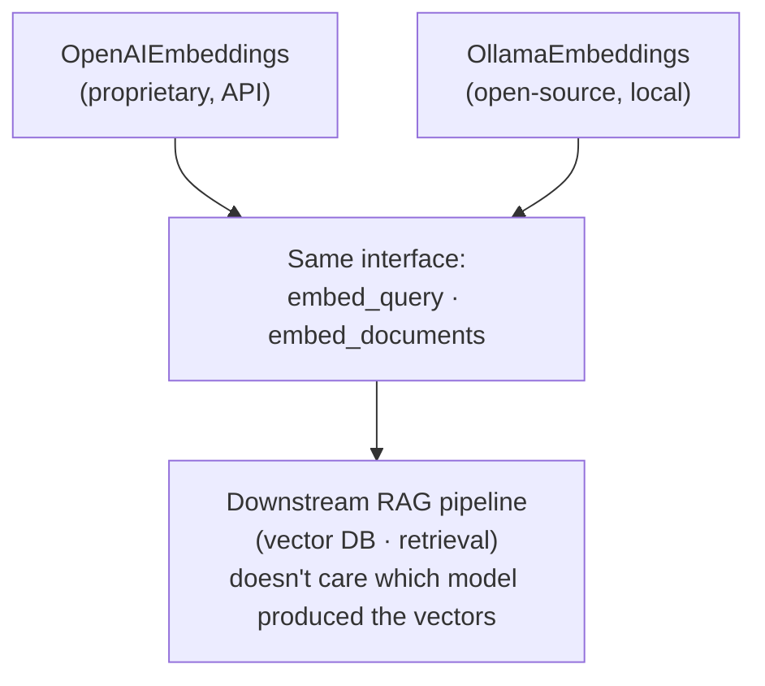

The previous note reached OpenAI's embedding models through an API — the text left your machine, got embedded on OpenAI's servers, and you paid per call. This note takes the other road from that same fork: an **open-source** model that you download and run on your own hardware, so nothing leaves your infrastructure and there's no per-call bill. The tool that makes this easy is **Ollama**, and the model we'll run is Google's open embedding model, **embeddinggemma**.

---

## Pulling an open-source model with Ollama

Ollama is a runtime that downloads open-source models and serves them locally. Unlike the proprietary path, there's no API key and no `.env` — the weights are public, so you just fetch them onto your machine:

```python
!ollama pull embeddinggemma
```

That one command downloads the full model. From this point on, every embedding is computed **on your own hardware** — the text never travels to anyone else's server. The imports mirror the OpenAI note, but point at Ollama instead:

```python
from dotenv import load_dotenv
import ollama
from langchain_ollama.embeddings import OllamaEmbeddings
from langchain_text_splitters import RecursiveCharacterTextSplitter
from langchain_community.document_loaders import PyPDFLoader
```

Notice there are **two** ways in here: the raw `ollama` library, and LangChain's `OllamaEmbeddings` wrapper. We'll use both — the raw one to see what's happening underneath, the wrapper because it's the one that slots into the rest of the pipeline.

---

## The raw Ollama API — `ollama.embed`

The direct call is `ollama.embed`, which takes the model name and the input text. Embed a single query first:

```python
query = "What is Openclaw/Moltbot and what are the major security concerns regarding this tool"

query_embeddings = ollama.embed(model="embeddinggemma", input=query)
```

The one wrinkle versus OpenAI: the result isn't a bare list of numbers — it's a **dictionary**, and the vector lives under the `"embeddings"` key:

```python
query_embeddings["embeddings"]          # → the actual vector(s)

# check the dimensionality
print(len(query_embeddings["embeddings"][0]))     # → 768   (embeddinggemma's native size)
```

`embeddinggemma` returns **768**-dimensional vectors by default. And just like OpenAI's `dimensions` parameter, you can dial that down — ask for a smaller vector to trade nuance for cheaper storage and faster comparison:

```python
query_embeddings = ollama.embed(model="embeddinggemma", input=query, dimensions=512)
print(len(query_embeddings["embeddings"][0]))     # → 512
```

Batch embedding works by handing `input` a **list** instead of a single string — the same corpus-side job as OpenAI's `embed_documents`. Reuse the load-and-split path from the earlier modules:

```python
# load + split, exactly as before
loader = PyPDFLoader(file_path="../Openclaw_Research_Report.pdf")
docs = loader.load()

chunker = RecursiveCharacterTextSplitter(chunk_size=300, chunk_overlap=50)
chunks = chunker.split_documents(docs)

text_documents = [doc.page_content for doc in chunks]

# embed the whole list in one call
document_embeddings = ollama.embed(model="embeddinggemma", input=text_documents)
document_embeddings = document_embeddings["embeddings"]

print(len(document_embeddings))        # → one vector per chunk
print(len(document_embeddings[0]))     # → 768, the dimensionality of each
```

> [!info] `ollama.embed(model=..., input=...)` runs an open-source model locally and returns a **dict** whose `"embeddings"` key holds the vector(s). Pass a single string to embed one text, or a list to embed a batch. `dimensions=` truncates the output just like OpenAI's parameter. The vectors are identical in kind to the proprietary ones — dense floats in a shared space — they're just computed on your machine for free.

---

## The LangChain wrapper — `OllamaEmbeddings`

The raw API works, but it hands back dicts and has its own call shape — which means every downstream step would have to know it's talking to Ollama specifically. LangChain's `OllamaEmbeddings` wrapper fixes that by giving Ollama the **exact same interface** as `OpenAIEmbeddings`: the same `embed_query` and `embed_documents` methods, returning plain lists of vectors:

```python
langchain_embedder = OllamaEmbeddings(model="embeddinggemma")

langchain_document_embeddings = langchain_embedder.embed_documents(texts=text_documents)

len(langchain_document_embeddings)        # → one vector per chunk
len(langchain_document_embeddings[0])     # → 768
```

This is the **preferred** way to use Ollama in a real pipeline, and the reason is swappability. Because `OllamaEmbeddings` exposes the same `embed_query` / `embed_documents` methods as `OpenAIEmbeddings`, every stage that comes after — loading vectors into a database, embedding the query, running retrieval — talks to **one** interface and neither knows nor cares whether a proprietary or an open-source model is behind it. You can switch from OpenAI to embeddinggemma by changing a single line, and nothing downstream breaks.



> [!important] Prefer the LangChain `OllamaEmbeddings` wrapper over raw `ollama.embed` in a pipeline. It exposes the identical `embed_query` / `embed_documents` interface as `OpenAIEmbeddings`, so the model becomes a swappable component — proprietary or open-source, one line to change, zero downstream rewrites. The raw API is useful for understanding what's underneath; the wrapper is what you ship.

---

## Choosing between them — the real trade-off

Now that both paths are on the table, here's how to actually pick. It comes down to who owns the compute and who sees the data:

| | Proprietary (OpenAI API) | Open-source (Ollama, local) |
|---|---|---|
| **Where it runs** | Provider's servers | Your own hardware |
| **Cost model** | Pay per call / token | Free to run (you own the compute) |
| **Data privacy** | Text leaves your infrastructure | Text never leaves your machine |
| **Setup / ops** | None — just an API key | You host, update, and scale it yourself |
| **Quality ceiling** | Often state-of-the-art | Strong, and improving fast |
| **Best when** | Fast start, top quality, don't mind per-use billing | Sensitive data, high volume, or cost-sensitive at scale |

The two axes that usually decide it are **privacy** and **cost-at-scale**. If your corpus is sensitive — internal company documents, medical records, anything you can't send to a third party — the local route keeps every byte on your own machine, which can be the whole ballgame for compliance. And if you're embedding at high volume, per-call API pricing adds up, whereas a local model has a fixed hardware cost no matter how many vectors you push through it. On the other side, the API route gets you started in minutes with no infrastructure to run and often the best raw quality available. And thanks to the shared LangChain interface, this isn't a one-way door — you can prototype on OpenAI and move to a local model later without rewriting the pipeline.

> [!tip] Interview framing: **Embedding models come in two flavours — proprietary API models like OpenAI's `text-embedding-3`, and open-source models you self-host, like `embeddinggemma` via Ollama. I reach for the API when I want top quality with zero ops and the data isn't sensitive; I self-host when data privacy or high-volume cost dominates. Because LangChain gives both the same `embed_query` / `embed_documents` interface, the model stays a swappable component — I can switch providers without touching the rest of the RAG pipeline.**

---

That closes the embeddings module. Across these notes we went from **why text has to become numbers**, through **what those numbers mean** and **how the space is shaped**, to **how you measure distance in it**, **how dimensionality trades nuance against cost**, and finally **how to generate embeddings in code** — with both a proprietary model and an open-source one. What's still missing is where all those chunk-vectors actually **live** so a query can search them at scale. That's the next component: the **vector database**.
