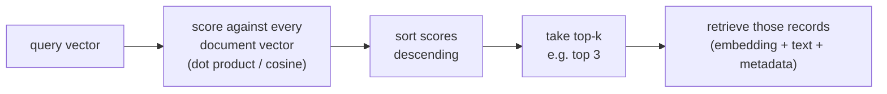
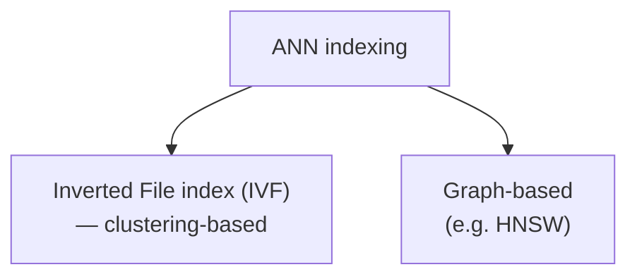
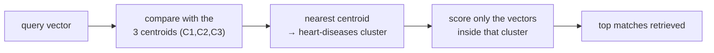

The previous note established what a vector store *is* — a persistent home for document embeddings that supports a similarity search. It quietly glossed over the hardest part, though: *how does that search actually run?* When a query arrives, the store has to find the nearest vectors among possibly tens of millions of them, fast enough that a user isn't left waiting. The obvious way to do it collapses under its own weight at scale, and the fix — **indexing** — is one of the most important ideas in the whole vector-database world.

---

## How a similarity search actually runs

Start with the mechanics, because the scaling problem only makes sense once you've seen the work involved.

A query comes in and gets embedded into a **query vector**. To find the relevant documents, the store compares that query vector against the document vectors it holds. "Compare" means running a similarity computation — a dot product or cosine similarity — between the query vector and a document vector, which produces a single number: a **score**. The rule is simple: *the higher the score, the more similar that document's meaning is to the query.*

So the store scores every document vector, then **sorts** those scores in descending order, and the **top few** are the winners. Ask for the top 3, and it hands back the three highest-scoring documents — and because each record in the store is a full unit (the embedding *plus* the original text *plus* metadata), retrieving those three brings back everything you need to build the prompt, not just bare numbers.



That phrase — "score against **every** document vector" — is where the trouble is hiding.

---

## The problem: exact search scales linearly

Let's make the work explicit. Call the similarity function `S`. For a query `Q` and document `Dᵢ`, you compute `S(Q, Dᵢ)`. To find the nearest documents *exactly*, you have to compute this for **every** document — `i` running from 1 all the way to `N`, the number of documents in the store.

If the store holds **1 lakh (100,000)** vectors, one query triggers **one lakh** similarity computations before you can even sort. This approach — compare against all of them — is called **exact search** or **brute force**, and it has one great virtue: it is 100% accurate, because it genuinely checks everything and cannot miss the true nearest neighbour.

Its fatal flaw is how it grows. Watch the corpus scale up:

```
documents in store        similarity computations per query
100,000  (1 lakh)    →    100,000
1,000,000 (10 lakh)  →    1,000,000
10,000,000 (1 crore) →    10,000,000
100,000,000 (10 cr)  →    100,000,000
```

The cost rises in a straight line with `N` — this is **linear**, O(N), latency. Every new batch of documents you add makes *every* query slower, permanently. At a crore of vectors, a single search is doing a hundred million computations, and the user is sitting there watching a spinner. Exact search is correct but unusable at real scale.

> [!danger] Exact search (brute force) is **O(N)** — it computes a similarity against every one of the N stored vectors.
>  It's perfectly accurate but its latency grows linearly with the corpus, so at 1 crore–10 crore vectors a single query balloons to hundreds of millions of computations. Correctness you can't wait for is no use in production.

---

## The fix: indexing — organise the embeddings so you search a subset

The way out is to stop comparing against everything. If you could look at only a small **subset of documents** — the ones actually likely to be relevant — and ignore the rest, latency would stop tracking the full corpus size. The technique that makes this possible is **indexing**.

![[AI-Engineering/07-RAG/04-Vector-Stores/Images/04-Indexing-Organizes-Embeddings.png]]

In plain words, **indexing is a way to organise your embeddings** so retrieval is fast. Instead of leaving the vectors as an undifferentiated pile that you have to scan end to end, indexing pre-arranges them into a structure that lets a query jump straight to the promising region and score only what's there. The goal is **fast retrieval**: run `S(Q, Dᵢ)` over a *subset* of documents, not the whole `N`.

> [!info] Indexing is **organising the stored embeddings ahead of time so a query only has to search a subset**, not the entire corpus.
>  It's the escape from O(N): rather than scoring all N vectors, you score a small, promising fraction of them. This is what turns a vector store from a toy that works on 30 chunks into something that answers over tens of millions.

---

## Approximate Nearest Neighbour — trading a little accuracy for a lot of speed

Searching only a subset has a name, and it's an honest one: **Approximate Nearest Neighbour (ANN) search**. The word that matters is **approximate**.

![[AI-Engineering/07-RAG/04-Vector-Stores/Images/05-ANN-Accuracy-Tradeoff.png]]

Here's the bargain ANN strikes. Exact search checks every vector and is 100% accurate. ANN checks only a subset, so it runs far faster — but it can no longer *guarantee* it found the single closest vector. It might return something 99% as good instead of the absolute best. You are deliberately accepting a **sub-optimal solution** in exchange for a massive drop in latency.

Why is that an acceptable trade? Because in RAG you rarely need *the* mathematically-perfect nearest neighbour; you need a handful of genuinely relevant chunks, fast. Giving up a sliver of accuracy — from 100% to, say, 99% — to turn a hundred-million-computation query into a few-thousand-computation one is almost always the right call.

> [!important] **Approximate Nearest Neighbour (ANN)** search gives up the *guarantee* of finding the exact closest vectors in return for searching only a subset — 
> 
> Trading a small amount of accuracy (perhaps 99% instead of 100%) for an enormous reduction in latency. 
> 
> Exact search is accurate-but-linear; ANN is approximate-but-fast. Production vector stores run ANN, because at scale "fast and 99% right" beats "perfect but too slow to use."

### Why "approximate" can actually miss the best answer

It's worth being concrete about what accuracy you're giving up, because "approximate" isn't hand-waving. Imagine a tiny store of 10 documents and a query vector `q1`. Exact search would score all 10, sort, and correctly hand you the true best — say `D7`.

Now suppose an ANN method, to save time, scores only 5 of the 10 documents. It returns the best *of those five*. But nothing stops the reality that the document it **skipped** — say `D10` — was actually the most similar to the query, with `D9` second. By only looking at a subset, ANN can genuinely overlook the true top result. That's the precise cost of "approximate": the subset you search might not contain the real winner. The whole craft of ANN indexing is choosing that subset cleverly enough that this almost never happens.

---

## Two families of ANN indexing

There isn't one ANN algorithm; there are several, but they fall into two well-known families:



The first is the **Inverted File index (IVF)**, which is **clustering-based** — it groups the vectors into clusters and searches only the relevant cluster. The second is **graph-based** indexing, which links vectors into a navigable graph you can hop through toward the query's neighbourhood. The rest of this note walks through the clustering approach in detail, because it makes the whole "search a subset" idea tangible.

---

## Inside a clustering index (IVF) — build once, then search a cluster

The clustering index does its heavy lifting **once**, at initialisation — the moment you build the vector store — not on every query. Here's the setup phase.

As embeddings are added, the index groups them into **multiple clusters** by broad topic. Vectors about the same kind of thing land together. Picture three clusters forming: a blue one that's all about **Python**, a pink one about **heart diseases**, and a green one about **AQI (air quality)**. Each cluster is a neighbourhood of semantically-related vectors.

![[AI-Engineering/07-RAG/04-Vector-Stores/Images/06-IVF-Clustering-Centroids.png]]

Every cluster then gets a single representative point called its **centroid** — the *average* of all the vectors in that cluster (this is exactly the centroid from the k-means algorithm). Because it's the average of the whole group, the centroid stands in as the cluster's **average semantic meaning** — think of it as a one-vector *summary* of everything in that cluster.

Now the payoff, at query time. Instead of scoring the query against every individual vector, the index scores it against the **centroids** — just three of them here (`C1`, `C2`, `C3`). It computes the cosine similarity (the angular distance) from the query vector to each centroid and finds the closest one. Say the query is *"what is the average heart rate of a human male"* — its nearest centroid turns out to be the **heart-diseases** cluster's. That single comparison tells the index which neighbourhood the answer lives in, so it now searches only **inside that one cluster**, ignoring Python and AQI entirely.



Count the work. In a 10-vector store, brute force does 10 computations. The clustering index instead does 3 (one per centroid to pick the cluster) plus 3 (the vectors inside the chosen cluster) — **6 computations** instead of 10. That looks modest at 10 vectors, but scale it up: over a million vectors split into, say, a thousand clusters, a query compares against a thousand centroids and then only the ~thousand vectors in the winning cluster — a few thousand computations instead of a million. The **search space collapsed** from the entire corpus to one cluster. That is precisely the "search a subset" promise, made real.

And this is also exactly where the *approximate* risk lives: if the true best vector happened to sit in a *different* cluster than the one the centroid picked, this index will never look at it. The accuracy you traded away is the chance that the right answer was in a cluster you skipped.

> [!info] A clustering (IVF) index groups vectors into topic clusters, each summarised by a **centroid** (the average of the cluster's vectors, ak k-means clusterimg). 
> 
> At query time it compares the query against the handful of centroids, picks the nearest cluster, and searches **only inside it** — turning a scan of N vectors into "compare with a few centroids + scan one cluster." The approximation cost is that the true nearest vector might live in a cluster the centroid comparison passed over.

---

## The index is built once, then reused

The one idea to carry away about cost: the index — the clusters, the centroids, the whole organised structure — is constructed a **single time**, during the initialisation phase when you build the vector store. From then on, every query simply *uses* that structure to jump to the right subset. You don't rebuild the index per query, just as you don't re-embed the corpus per query. Both are one-time costs paid up front so that each individual search stays cheap.

```
initialisation (once):   embed corpus  →  build index (form clusters, compute centroids)
every query (cheap):     embed query   →  compare with centroids  →  search one cluster
```

---

## What it guarantees — and what it doesn't

**What indexing / ANN gives you:**

- **Sub-linear search** — a query scores a small subset of vectors instead of all N, so latency stops tracking the full corpus size.
- **Scale that brute force can't reach** — searches over tens of millions of vectors return in milliseconds.
- **A one-time build cost** — the index is constructed once at initialisation and reused by every query.

**What it does not give you:**

- **A correctness guarantee** — ANN is *approximate*; it can miss the true nearest neighbour if that vector sits outside the searched subset (e.g. in an unpicked cluster). You trade a little accuracy for the speed.
- **Zero build cost** — organising the vectors (clustering, computing centroids) is real work done up front; it just isn't repeated per query.
- **A tuning-free experience** — how many clusters, how many to probe, exact-vs-approximate: these are knobs you set based on your accuracy-versus-latency needs.

> [!tip] Interview framing: "A naive vector search is exact but O(N) — it scores the query against every stored vector, so at tens of millions of vectors it's too slow. Production stores use **indexing** to search only a subset, which means **Approximate Nearest Neighbour** search: you trade a guarantee of the exact best match for a huge latency win. The two common families are **IVF (clustering)** and **graph-based (HNSW)**. In IVF you cluster the vectors once at build time and represent each cluster by a **centroid**; a query compares against the centroids, picks the nearest cluster, and only searches inside it — cutting a million-vector scan down to a few thousand comparisons. The catch is the approximation: if the true best vector is in a cluster the centroid missed, you won't find it."

