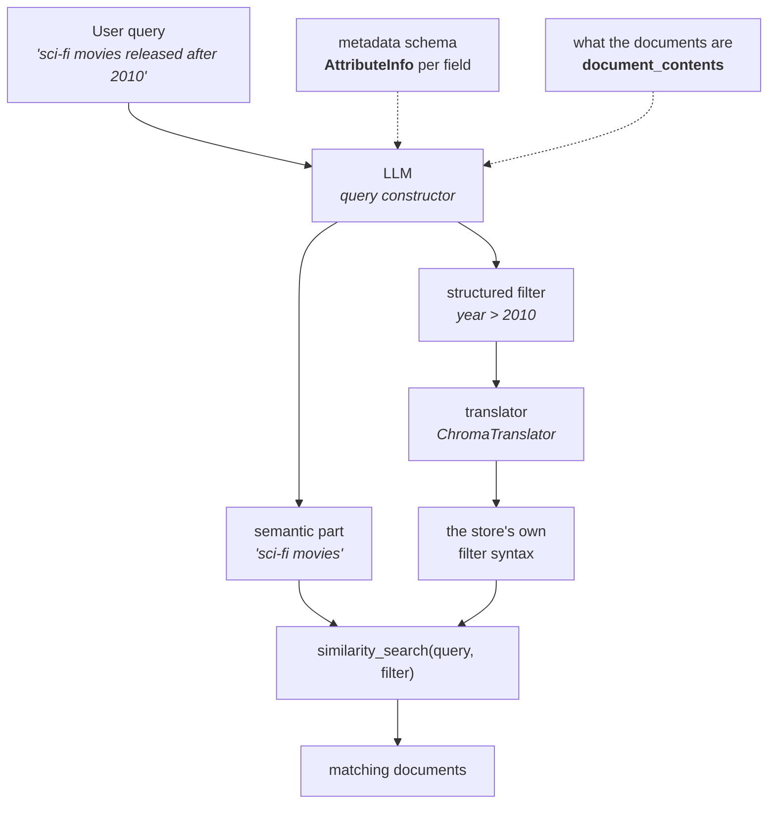

Every retriever so far has taken your question, turned the whole thing into one vector, and gone looking for chunks whose meaning sits nearby. That works because the question and the documents are both **about** something, and **aboutness** is exactly what an embedding captures.

This note is about the class of question where that quietly stops working — not because retrieval is weak, but because part of what you asked was never a matter of meaning at all.

---

## Where we are: the query is free-flowing text

Start with what a normal similarity search actually does with your question.

You type something in ordinary language — the lecture calls it **free-flowing text**, meaning natural language, the way a person would write it. That text goes to the embedding model, comes back as a **query vector**, and that vector is compared against the document vectors already sitting in the store. What gets matched is **semantic meaning**: the question's meaning against each chunk's meaning.

One input, one vector, one comparison. Everything the retriever knows about your question is squeezed into that single point in space.

---

## A shop with a hundred products

Now a concrete system, because the problem doesn't show up until the data has structure.

You're building a chatbot for an e-commerce company — think of an Amazon-style catalogue, and to keep it small, say the catalogue holds exactly **100 products**.

![[AI-Engineering/07-RAG/06-Advanced-Retrievers/Images/04-Self-Query-The-Hidden-Structure.png]]

The knowledge source is a **CSV**, one row per product. A document loader reads it **row by row**, so you end up with **100 documents** — one per product. Each of those goes through the embedding model and into the vector store. Standard pipeline, nothing new.

But look at what a product row actually contains. There's a description — the prose about what the thing is — and alongside it a set of **fields**: `category`, `price`, `specs`. Those fields become the document's **metadata**.

Now a customer asks:

> **Recommend 5 laptops with price under 60K and having a bigger screen.**

Read that sentence again and notice it is doing **two different jobs at once**:

- **laptops… bigger screen** — this is about **meaning**. It describes the kind of thing wanted.
- **price under 60K** — this is **not** about meaning. It is a numeric constraint. Either a product's price is below 60,000 or it isn't. There is no **sort of under 60K.**

The sentence looks like free-flowing text. It is really a **structured query wearing natural language as a disguise**.

---

## Why similarity search cannot honour under 60K

Here is the part worth being precise about, because it's the whole reason this retriever exists.

![[AI-Engineering/07-RAG/06-Advanced-Retrievers/Images/05-Metadata-Is-Not-In-The-Embedding.png]]

When each product document was indexed, **only its `page_content` went through the embedding model.** The prose description became a vector carrying its semantic meaning. The metadata — `category`, `price`, `specs` — travelled alongside the document as ordinary stored fields. It was **never embedded**.

So the vectors in your store contain no notion of price. Not a weak notion. None.

Which means when the query vector goes hunting for neighbours, the number 60,000 has nowhere to land. At best the phrase **price under 60K** nudges the query vector slightly toward documents whose descriptions happen to **talk about** being affordable — which is a completely different thing from costing less than sixty thousand rupees.

> [!warning] A constraint cannot be satisfied by similarity. 
> Similarity is a matter of degree; 
> 
> a constraint is a matter of yes or no. 
> 
> Asking an embedding to enforce `price < 60000` is asking a ruler to enforce a rule.

And notice you already own the fix. The metadata **is** stored. Vector stores let you pass a filter alongside the search. The information is right there — the retriever just has no idea it was asked for, because it was asked for in English.

---

## Query decomposition

So the job is to pull the sentence apart before retrieving.

![[AI-Engineering/07-RAG/06-Advanced-Retrievers/Images/06-Query-Decomposition.png]]

The lecture calls this the **query decomposition task**, and it splits one natural-language query into two outputs:

- the **semantic part** → becomes the query that gets embedded and searched
- the **filtering part** → becomes the **metadata filter**

Then you run one operation that uses both:

```
similarity_search(query, filter)
```

The semantic part decides **what** you're looking for. The filter decides **which documents are even eligible**. Same 100 documents, but now the constraint is enforced by the store — exactly, as a yes-or-no test — while meaning is still matched by the embedding.

### Why it's called self-query

The name confuses people, so take it apart. The retriever isn't querying itself. It is performing a **transformation on its own query** before using it — it rewrites the input it was handed rather than passing it straight through. The transformation happens on itself, hence **self**.

---

## The transformation needs a language model

Splitting **Recommend 5 laptops with price under 60K and having a bigger screen** into a semantic string and a numeric filter is a language-understanding problem. Code can't do it — there's no pattern to match, because the same constraint can be phrased a hundred ways (**under 60K**, **below sixty thousand**, **cheaper than 60,000**, **not more than 60k**).

So this retriever puts an **LLM inside the retrieval path**:

![[AI-Engineering/07-RAG/06-Advanced-Retrievers/Images/07-Semantic-And-Metadata-Parts.png]]

The query goes to the LLM, which decomposes it into:

1. **Semantic part** → **Recommendations for laptops**
2. **Metadata part** → a filter, built from **operators** (also called **comparators**) — `$and`, `$gt`, `$lt`, and friends

> [!important] This is the first retriever in the course where an LLM sits **inside retrieval**, not after it.
>  Everything up to now — similarity, MMR, BM25, ensemble, parent-document — was pure maths over vectors and text. 
>  
>  Contextual compression introduced an LLM but only **after** the documents came back. 
>  
>  Self-query puts one **before** the search runs, and that changes the cost and failure profile of the whole component.

### What the LLM produces

Concretely, for the query **Action movies from the 1990s rated above 7**:

![[AI-Engineering/07-RAG/06-Advanced-Retrievers/Images/08-Structured-Query-Output.png]]

```python
query_string = "action movies"

filter = {
    "$and": [
        {"genre":  {"$eq":  "action"}},
        {"year":   {"$gte": 1990}},
        {"year":   {"$lte": 1999}},
        {"rating": {"$gt":  7}},
    ]
}
```

Look at what the model did with **the 1990s** — it became **two** filters, `year >= 1990` **and** `year <= 1999`. A decade is a range, and the model had to know that to express it. That single detail is the clearest picture of what **structured query** means here: the English was compressed; the filter is explicit.

---

## Two things you must tell the LLM

The model cannot invent your schema. It has to be told what fields exist and what the documents are, and both are arguments you supply.

**1. The metadata schema — `AttributeInfo`.** One entry per filterable field: its name, a description, and its type. The description matters more than it looks: it is what lets the model map **how good is it** onto the field called `rating`.

**2. A description of the content.** What the `page_content` of a document actually is. This tells the model what the **semantic** half should look like — without it, it doesn't know whether it's searching plot summaries, product descriptions, or support tickets.

---

## The whole flow



The **translator** is the piece that's easy to miss. The LLM produces a filter in a generic, store-independent shape. Every vector store then wants that filter written in its own dialect — Chroma's `$eq`/`$and` is not Pinecone's, which is not Qdrant's. `ChromaTranslator` is the adapter that rewrites the generic filter into Chroma's native language. Swap the store and you swap the translator.

---

## In code

The imports already tell you this retriever is unusual — it needs an **LLM** alongside the embeddings, and it needs a translator:

```python
from dotenv import load_dotenv
from langchain_core.documents import Document
from langchain_chroma import Chroma
from langchain_openai import OpenAIEmbeddings, ChatOpenAI
from langchain_classic.retrievers import SelfQueryRetriever
from langchain_classic.chains.query_constructor.schema import AttributeInfo
from langchain_community.query_constructors.chroma import ChromaTranslator

load_dotenv()

embeddings = OpenAIEmbeddings(model="text-embedding-3-small")
llm = ChatOpenAI(model="gpt-5", temperature=0)
```

> [!note] `SelfQueryRetriever` comes from `langchain_classic` — the same deprecation family as `EnsembleRetriever` and the contextual-compression pieces. Support for that module is ending around Dec 2026, which is exactly why the companion note builds this from scratch.

`temperature=0` is not decoration here. The LLM is generating a filter that decides which documents are **eligible**. You want that deterministic.

### The documents

Eight movies. `page_content` is a plot summary; everything structured lives in metadata:

```python
docs = [
    Document(
        page_content="A masked vigilante fights crime in a corrupt city with the help of a "
                     "billionaire's technology. An iconic supervillain pushes him to his "
                     "limits in a battle for Gotham's soul.",
        metadata={"title": "The Dark Knight", "genre": "action", "year": 2008,
                  "rating": 9.0, "director": "Christopher Nolan"},
    ),
    Document(
        page_content="A thief who steals secrets through dream-sharing technology is offered "
                     "a chance to have his past erased if he can plant an idea in someone's "
                     "mind. A visually stunning exploration of the subconscious.",
        metadata={"title": "Inception", "genre": "sci-fi", "year": 2010,
                  "rating": 8.8, "director": "Christopher Nolan"},
    ),
    # … Interstellar (sci-fi, 2014, 8.6, Nolan), The Matrix (sci-fi, 1999, 8.7, Wachowski),
    #   Pulp Fiction (drama, 1994, 8.9, Tarantino), MASH (comedy, 1970, 7.4, Altman),
    #   Sunshine (sci-fi, 2007, 7.3, Boyle), Source Code (sci-fi, 2011, 7.5, Jones)
]

vectorstore = Chroma.from_documents(
    docs, embedding=embeddings, collection_name="movies_collection"
)
```

The dataset is built to be a trap: several sci-fi films spread across **1999, 2007, 2010, 2011, 2014**. Any query with a year constraint will separate a retriever that understands the constraint from one that only feels it.

### Describing the schema

```python
metadata_field_info = [
    AttributeInfo(name="title",    description="The title of the movie",                              type="string"),
    AttributeInfo(name="genre",    description="The genre of the movie (action, sci-fi, drama, comedy)", type="string"),
    AttributeInfo(name="year",     description="The year the movie was released",                     type="integer"),
    AttributeInfo(name="rating",   description="The IMDb rating of the movie (0-10)",                 type="float"),
    AttributeInfo(name="director", description="The director of the movie",                           type="string"),
]

document_content_description = "Brief plot descriptions of movies"
```

Notice the `genre` description **lists the allowed values**. That's deliberate — it lets the model map **space movies** onto `genre = "sci-fi"` instead of inventing a genre that doesn't exist in your data.

### Building the retriever

```python
retriever = SelfQueryRetriever.from_llm(
    llm=llm,
    vectorstore=vectorstore,
    document_contents=document_content_description,
    metadata_field_info=metadata_field_info,
    structured_query_translator=ChromaTranslator(),
    enable_limit=True,
)
```

`enable_limit=True` turns on one more extraction: the model may also pull a **count** out of the sentence. Say **recommend 2 movies** and it sets `k=2` for you — the query controls how many documents come back.

---

## Watching it work

### First, the failure it exists to fix

Plain similarity search, asked for **sci-fi movies released after 2010**:

```
Sunshine        (2007)
Interstellar    (2014)
The Matrix      (1999)
```

Two of the three are wrong, and they're wrong in the way that matters. **Sunshine is from 2007. The Matrix is from 1999.** The query said **after 2010**.

They came back because they're all genuinely, semantically science fiction — the embedding did its job perfectly. The year was simply invisible to it. This is not a tuning problem; no value of `k`, no threshold, no reranker fixes it, because the information required to exclude those films was never in the vectors.

### Now the self-query retriever

```python
retriever.invoke("Recommend me 2 sci-fi movies released after 2000")
```

```
Inception     (2010)
Interstellar  (2014)
```

**Exactly two**, both sci-fi, both after 2000. Three separate things were extracted from that one sentence: the semantic part (**sci-fi movies**), a filter (`year > 2000`), and a limit (`2`).

### It also knows when not to filter

```python
retriever.invoke(
    "movie about a superhero who is a billionaire by day and a masked vigilante by night"
)
```

```
The Dark Knight  (2008)
The Matrix       (1999)
Pulp Fiction     (1994)
Inception        (2010)
```

No constraint in that sentence, so no filter is produced, and it degrades to an ordinary similarity search — correctly putting The Dark Knight first. This matters more than it looks: a self-query retriever that invented filters for every query would be worse than useless.

### And the pure-metadata case

```python
retriever.invoke("What movies did Christopher Nolan direct?")
```

```
Inception       (2010)
Interstellar    (2014)
The Dark Knight (2008)
```

All three Nolan films, nothing else. Here the **semantic** half is nearly empty — the question is almost entirely a metadata lookup, and the filter does the real work. The same component handles a pure-meaning query and a pure-lookup query.

---

## What it costs

This retriever is not free, and the costs are structural rather than incidental.

- **An LLM call before every retrieval.** Latency and money on the critical path of every single query — where previously retrieval was a vector lookup measured in milliseconds.
- **A new failure mode: a wrong filter.** If the model mis-parses, it doesn't return worse results — it returns **the wrong set entirely**, or an empty one. A hallucinated filter on a field that doesn't exist can wipe out your results. Compare that with a bad embedding match, which merely ranks things poorly.
- **It only works if the metadata exists and is clean.** Self-query cannot filter on `year` if half your documents lack a `year`, or if some store it as `"2010"` and others as `2010`. The retriever is only as good as the ingestion that populated the fields.
- **The schema is hand-written and drifts.** Add a field to your documents and the retriever keeps working — badly, silently, unable to filter on the thing you just added, because nobody updated `metadata_field_info`.

> [!tip] Reach for self-query when your corpus has **genuinely structured metadata** that users **naturally refer to in prose** — dates, prices, ratings, authors, categories, regions. If your documents are undifferentiated prose with no useful fields, there is nothing to filter on and this is pure overhead.

---

> [!tip] Interview framing
> **A self-query retriever handles queries that mix semantics with hard constraints — 'sci-fi movies released after 2010'. Plain similarity search can't honour the year, because only `page_content` gets embedded; metadata is stored alongside but never enters the vector, so a numeric constraint has nothing to match against. In our movie set, a vanilla retriever answered 'after 2010' with Sunshine from 2007 and The Matrix from 1999 — both correctly sci-fi, both wrong. Self-query puts an LLM in front of retrieval to decompose the natural-language query into a semantic string plus a structured metadata filter, then a store-specific translator rewrites that filter into Chroma's or Pinecone's dialect and it runs as `similarity_search(query, filter)`. You give it an `AttributeInfo` schema per field and a description of what the documents are. The trade is a language-model call on the critical path of every query, and a new failure mode — a mis-parsed filter returns the wrong set or nothing at all, which is a louder failure than merely ranking poorly.**
