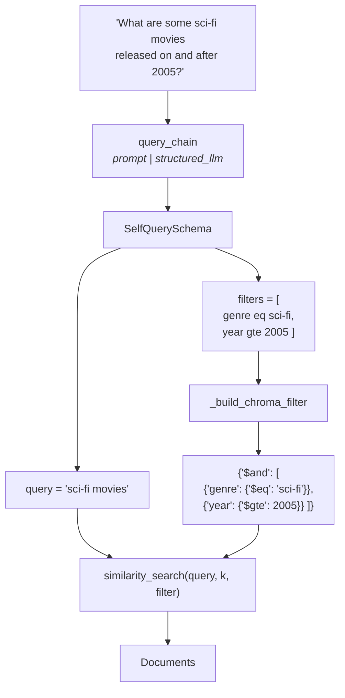

The built-in `SelfQueryRetriever` hides four separate jobs behind one constructor. That's fine until you need to change one of them — or until the module it lives in stops shipping.

Both apply here. `langchain_classic` support ends around December 2026, and the built-in gives you no way to see or adjust the prompt that produces your filters. So this note rebuilds the whole thing from parts, which is also the fastest way to understand what the built-in was doing.

---

## The four jobs

Written out, a self-query retriever does this:

1. **Parse** — turn natural language into a semantic string plus a list of filters
2. **Translate** — rewrite those filters into the vector store's own filter dialect
3. **Search** — run `similarity_search` with both halves
4. **Conform** — expose all of it behind `.invoke()` so it composes like any other retriever

The built-in does all four. We'll do them one at a time.

---

## Job 1 — describing the output you want

The parse step has an awkward property: you're asking a language model for something that is *not* language. You want a data structure, with the right field names and the right types, every single time.

Describing it in the prompt and hoping is not good enough. So define the shape as **Pydantic models** and make the model fill them in.

```python
class MetadataFilter(BaseModel):
    field: str = Field(description="The metadata field name to filter on")
    value: str | int | float = Field(description="The value to filter by")
    operator: str = Field(
        default="eq",
        description="Comparison operator: eq, ne, gt, gte, lt, lte",
    )
```

**One filter is exactly three things** — which field, which value, and how to compare them. That triple is the whole vocabulary:

| field | operator | value | means |
|---|---|---|---|
| `year` | `gte` | `2005` | released in 2005 or later |
| `title` | `eq` | `Inception` | the title is exactly *Inception* |
| `rating` | `gt` | `7` | rated above 7 |

`operator` defaults to `eq`, because equality is what most constraints turn out to be — *"directed by Nolan"*, *"in the comedy genre"*. The model only has to say something when it's *not* equality.

Then the outer shape:

```python
class SelfQuerySchema(BaseModel):
    query: str = Field(
        description="The semantic search query extracted from the user's query"
    )
    filters: Optional[list[MetadataFilter]] = Field(
        default=None,
        description="Metadata filters extracted from the query. None if no filters apply.",
    )
```

Two fields, mirroring the decomposition exactly: the semantic half, and a **list** of filters — a list because one sentence can carry several constraints, and `Optional` with `default=None` because plenty of queries carry none at all.

> [!important] Those `description=` strings are not documentation. They are shipped to the model as part of the schema, and they are what it reads to decide what goes where. *"None if no filters apply"* is the line that stops the model from inventing a filter for every query. A vague description here produces a vague parser.

---

## Job 1, continued — the prompt

```python
system_prompt = """You are a query parser for a movie database. Parse the user's
natural language query into:
1. A semantic search query (the conceptual meaning to search for)
2. Optional metadata filters on fields: title (string), genre (string),
   year (integer), rating (float), director (string)

Supported operators: eq, ne, gt, gte, lt, lte
Only add filters when the user explicitly specifies metadata constraints."""
```

This is the thing the built-in wouldn't let you touch, and it's carrying the schema by hand — every field with its type, and the operator list.

The last line does the real work: **"Only add filters when the user explicitly specifies metadata constraints."** Without it you get a parser that manufactures constraints out of thin air, turning *"movies about dreams"* into some guess at a genre filter and quietly excluding most of your corpus.

```python
prompt = ChatPromptTemplate.from_messages([
    ("system", system_prompt),
    ("human", "query: {query}"),
])

structured_llm = llm.with_structured_output(SelfQuerySchema)
query_chain = prompt | structured_llm
```

`with_structured_output(SelfQuerySchema)` is the piece that makes this reliable. Rather than returning text you then have to parse, the model is constrained to return something that validates against the schema — and you get a `SelfQuerySchema` **object** back, not a string that looks like one.

So for *"What are some sci-fi movies released on and after year 2005?"* the chain returns:

```python
SelfQuerySchema(
    query="sci-fi movies",
    filters=[
        MetadataFilter(field="genre", value="sci-fi", operator="eq"),
        MetadataFilter(field="year",  value=2005,     operator="gte"),
    ],
)
```

---

## Job 2 — translating to Chroma's dialect

Those `MetadataFilter` objects are generic. They mean something to us and nothing to Chroma, which wants its own JSON shape. So we convert:

```python
def _build_chroma_filter(self, filters: list[MetadataFilter]) -> dict:
    op_map = {"eq": "$eq", "ne": "$ne", "gt": "$gt",
              "gte": "$gte", "lt": "$lt", "lte": "$lte"}
    if len(filters) == 1:
        f = filters[0]
        return {f.field: {op_map.get(f.operator, "$eq"): f.value}}
    return {"$and": [{f.field: {op_map.get(f.operator, "$eq"): f.value}}
                     for f in filters]}
```

Two things are happening.

**The operator map.** Our vocabulary is `eq`, `gte`, `lt`. Chroma's is `$eq`, `$gte`, `$lt`. A dictionary bridges them, and `.get(f.operator, "$eq")` falls back to equality if the model produces an operator we don't recognise — so a hallucinated operator degrades to a sane default instead of crashing.

**The single-versus-many split**, which is the part that catches people. Chroma will not accept a bare list of conditions. One filter is written directly:

```python
{"director": {"$eq": "Christopher Nolan"}}
```

But two or more must be wrapped in an explicit conjunction:

```python
{"$and": [
    {"genre": {"$eq":  "sci-fi"}},
    {"year":  {"$gte": 2005}},
]}
```

Same meaning, different shape, and the shape depends on how many filters there are. Writing the one-filter case as `{"$and": [...]}` with a single element is rejected by some versions, which is why the branch exists rather than always wrapping.

> [!note] This function is precisely what `ChromaTranslator` was doing inside the built-in retriever. Swapping to Pinecone means rewriting this one function — nothing else in the file changes. That's the same leaky-abstraction boundary you meet everywhere in this stack: the call shape is portable, the filter dialect is not.

---

## Jobs 3 and 4 — search, behind the standard interface

Now assemble. Subclass `BaseRetriever` and implement `_get_relevant_documents`, exactly as the custom ensemble retriever did:

```python
class CustomSelfQueryRetriever(BaseRetriever):
    vectorstore: Any
    query_chain: Any
    k: int = 4

    def _build_chroma_filter(self, filters: list[MetadataFilter]) -> dict:
        ...   # as above

    def _get_relevant_documents(self, query: str, *, run_manager) -> list[Document]:
        parsed = self.query_chain.invoke({"query": query})

        chroma_filter = None
        if parsed.filters:
            chroma_filter = self._build_chroma_filter(parsed.filters)

        return self.vectorstore.similarity_search(
            parsed.query, k=self.k, filter=chroma_filter
        )
```

The whole thing in four steps: parse, translate if there's anything to translate, search with both halves, return documents.

Two details worth pausing on. `parsed.query` — **not** the original `query` — is what gets embedded; the point of the exercise was to search on the semantic half alone. And when `parsed.filters` is `None`, `chroma_filter` stays `None`, so `similarity_search` runs unfiltered and the whole thing gracefully becomes an ordinary retriever.

```python
retriever = CustomSelfQueryRetriever(vectorstore=vectorstore, query_chain=query_chain)
results = retriever.invoke("What movies did Christopher Nolan direct?")
```

Because it subclasses `BaseRetriever`, that `.invoke()` is the same `.invoke()` as everything else — so this drops into an LCEL chain, or inside a `ContextualCompressionRetriever`, or as one leg of an `EnsembleRetriever`, without anything downstream knowing it's homemade.

---

## The full path



---

## What you gained by rebuilding it

- **The prompt is yours.** You can add few-shot examples, teach it domain vocabulary (*"'recent' means the last two years"*), or tighten the rule about when not to filter. The built-in gives you none of that.
- **The schema is yours.** Want a `limit` field, or `$or` support, or case-insensitive matching? Add it to the Pydantic model and mention it in the prompt.
- **No dependency on `langchain_classic`.** Everything here is `langchain_core` plus Pydantic plus your store.
- **You can see the parse.** `query_chain.invoke({"query": ...})` on its own prints exactly what the model decided — which is the only practical way to debug "why did my retriever return nothing?" The answer is nearly always a filter you didn't expect.

What you lose is the built-in's ready-made translators for every supported store, and `enable_limit`. Both are a few lines to add back.

> [!tip] Debug the parser before you debug the retrieval. When a self-query retriever returns an empty list, the failure is almost never the vector search — it's a filter on a field that doesn't exist, a value with the wrong type (`"2005"` instead of `2005`), or a constraint the model invented. Running the chain alone tells you in one line.

---

> [!tip] Interview framing
> "I rebuilt the self-query retriever from parts rather than using LangChain's, partly because it lives in `langchain_classic` which is being retired, and partly because the built-in hides the prompt. It's four jobs: parse, translate, search, conform. Parsing is a Pydantic schema — a `MetadataFilter` of field, value, operator, and an outer object holding the semantic query plus an optional list of filters — driven through `with_structured_output`, so the model returns a validated object rather than text I have to parse. Translation converts our generic operators into the store's dialect, and it has to branch on filter count because Chroma takes a bare condition for one and an explicit `$and` for several. Then `similarity_search(semantic_query, filter=...)`, wrapped in a `BaseRetriever` subclass so it still composes with everything else. The main lesson was that the field descriptions in the schema are load-bearing — 'None if no filters apply' is what stops it hallucinating a constraint on every query."
