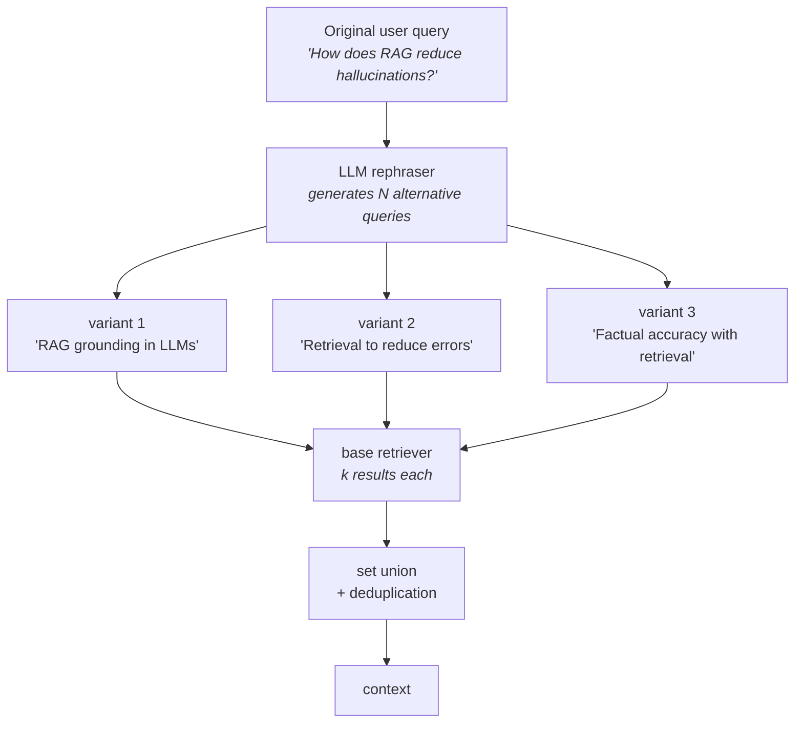

The self-query retriever fixed a query whose constraint was invisible to the embeddings. This one fixes a query that is perfectly visible and still retrieves badly — because it is **too vague to point anywhere in particular**.

The distinction is worth holding onto. There, the information simply wasn't in the vectors. Here it is all in the vectors; the problem is that one query can only look in one place at a time.

---

## One query, one point in space

Recall what vanilla retrieval does. Your query becomes **one vector**. That vector sits at **one location** in the embedding space, and retrieval returns whatever is nearest to that location.

That is a strength when the question is sharp. It becomes a limitation the moment the question is broad, because a broad question does not have one location — it has several, and the embedding model is forced to average them into a single point that may sit in the middle of nowhere.

---

## A medical consultant that answers a third of the question

Say you're building a RAG chatbot that acts as a **medical consultant** for small everyday health issues. Behind it is a knowledge base of medical documents covering a wide spread of topics — **physical health, mental health, immunity**, and more.

![[AI-Engineering/07-RAG/06-Advanced-Retrievers/Images/09-Multi-Query-The-Generic-Question.png]]

A user arrives and asks:

> **"How can I boost my health?"**

This is a perfectly reasonable question and a **completely generic** one. And here is why it retrieves poorly.

**Good embedding models are specific.** That is the property you normally want — a strong model picks up the fine distinctions in a document and stores them in its vector. So documents about physical fitness land in one neighbourhood, documents about mental wellbeing land in a *different* neighbourhood, and immunity documents in a third. The better your embedding model, the further apart those regions are.

Now embed *"How can I boost my health?"* That vector lands somewhere. Wherever it lands, `k=3` returns the three nearest chunks — which will overwhelmingly come from **one** of those regions.

> [!warning] The user asked about health. They will get an answer about physical fitness, or about mental health, or about immunity — but not all three. The retrieval isn't wrong; every chunk it returned is genuinely relevant. It is **incomplete**, and incompleteness is invisible in the output. Nothing in the response says *"there were two other areas I didn't look at."*

This is a **coverage** problem, and no amount of tuning fixes it. Raising `k` pulls in more neighbours of the same point, which mostly means more physical-health chunks. MMR diversifies within the candidate pool, but the pool was drawn from one neighbourhood to begin with.

---

## Rephrase one query into several

The fix follows directly. If one vague query lands in one place, then write **several specific queries** that deliberately land in *different* places.

![[AI-Engineering/07-RAG/06-Advanced-Retrievers/Images/10-Rephrase-Into-Specific-Queries.png]]

Take the generic input and rephrase it into three specific ones, each aimed at a different aspect:

| # | Rephrased query | Aims at |
|---|---|---|
| 1 | *"How can I boost my physical health?"* | physical health |
| 2 | *"How can I keep my mental health in check?"* | mental health |
| 3 | *"How to boost my immunity and stay fit?"* | immunity |

Run the retriever **once per query**. With `k=3` that is **9 results instead of 3** — and, more importantly, nine results drawn from three different regions rather than three from one.

The lecture's phrasing for the goal is exact: *"I am increasing my coverage."*

### Then merge and deduplicate

Those three result lists will overlap, because a document about general wellbeing is plausibly near all three queries. So the last step is a **set union followed by deduplication**:

```
variant 1 →  [chunk 1, chunk 3, chunk 6]
variant 2 →  [chunk 3, chunk 5, chunk 8]
variant 3 →  [chunk 1, chunk 3]

merge     →  [1, 3, 6, 3, 5, 8, 1, 3]
dedupe    →  [1, 3, 6, 5, 8]
```

Chunk 3 was retrieved by all three variants; it appears **once**. Without this step you would spend your context window on duplicates, which is the exact waste MMR exists to prevent.

---

## The whole flow

![[AI-Engineering/07-RAG/06-Advanced-Retrievers/Images/11-Multi-Query-Retrieval-Flow.png]]

The lecture's second example makes the shape clearer, because the aspects are less obvious than *physical / mental / immunity*. Original query: **"How does RAG reduce hallucinations?"** The rephraser produces:

- *"RAG grounding in LLMs"*
- *"Retrieval to reduce errors"*
- *"Factual accuracy with retrieval"*

Three genuinely different angles on one question, each of which will match different chunks.



**N defaults to 3** and is configurable. The prompt driving the rephrasing is also replaceable — which is what the companion note does.

> [!important] Notice what multi-query does **not** touch. It never changes the retriever, the embeddings, the index, or the similarity metric. It runs the *same* retriever several times on *different inputs* and unions the results. That is the entire idea, and it's why it composes with anything — your base retriever can be similarity, MMR, hybrid, or self-query.

---

## What it costs

![[AI-Engineering/07-RAG/06-Advanced-Retrievers/Images/12-Multi-Query-Costs.png]]

The lecture is blunt about the downside, and it is the same shape as self-query's but larger:

- **An LLM call before every retrieval.** Latency on the critical path.
- **N retrieval calls instead of one.** With `N=3` you do three vector searches per user question.
- **The more variants, the slower.** Every extra rephrasing is another search and more documents to merge. **Slow retrieval** is written on the board next to **latency ↑** for a reason.
- **More context consumed.** Higher coverage means more chunks, and your context window is finite. Coverage and precision pull against each other.

What you buy is a genuine **user-experience** win: you stop requiring users to write good queries. They ask vaguely, as people do, and still get broad, accurate answers.

---

## In code

```python
from dotenv import load_dotenv
from langchain_core.documents import Document
from langchain_core.vectorstores import InMemoryVectorStore
from langchain_openai import OpenAIEmbeddings, ChatOpenAI
from langchain_classic.retrievers import MultiQueryRetriever
from langchain_text_splitters import RecursiveCharacterTextSplitter

load_dotenv()

embeddings = OpenAIEmbeddings(model="text-embedding-3-small")
llm = ChatOpenAI(model="gpt-5-mini", temperature=0.3)
```

> [!note] **`temperature=0.3`, not `0`.** The self-query retriever used `temperature=0`, because it was generating a *filter* — a fact about the query, where any variation is a bug. Here the model is generating **alternative phrasings**, and the entire point is that they differ from one another. A little randomness is doing useful work. That contrast is worth remembering: match the temperature to whether you want one right answer or several different ones.

The corpus is six documents spanning **biotechnology, cybersecurity, neuroscience, renewable energy, robotics and genetic engineering** — deliberately spread out, so a broad query has several plausible directions to go:

```python
splitter = RecursiveCharacterTextSplitter(chunk_size=300, chunk_overlap=50)
docs = splitter.split_documents(docs)          # → 18 chunks

vectorstore = InMemoryVectorStore.from_documents(docs, embedding=embeddings)
base_retriever = vectorstore.as_retriever(search_kwargs={"k": 3})
```

And the retriever itself is a **wrapper around that base retriever**, which is why it's only two arguments:

```python
retriever = MultiQueryRetriever.from_llm(retriever=base_retriever, llm=llm)
```

A retriever to run, and a model to rephrase with. Everything else is defaults.

### The result

Query: **"How are modern technologies improving human health?"** — broad, spanning several of those six domains.

| Retriever | Unique documents |
|---|---|
| base retriever (`k=3`) | **3** |
| `MultiQueryRetriever` | **6** |

Twice the coverage from the same index, the same embeddings, and the same base retriever. The only thing that changed was **how many different ways the question got asked**.

### Keeping the original question

```python
retriever_with_original = MultiQueryRetriever.from_llm(
    retriever=base_retriever, llm=llm, include_original=True
)
```

`include_original=True` adds the user's own wording as one more query alongside the generated variants. Worth switching on: the rephraser is an LLM, and there is no guarantee its three variants are better than what the user actually typed. This keeps the original phrasing in the union as insurance.

---

## Against the other advanced retrievers

Four retrievers, four different failures — worth keeping straight:

| Retriever | The failure it fixes | Where it intervenes |
|---|---|---|
| Contextual compression | retrieved chunks carry **noise** | after retrieval |
| Parent document | small chunks retrieve well but give **thin context** | at indexing and after |
| Self-query | the constraint is **not in the embeddings** | before retrieval, on the filter |
| **Multi-query** | one vague query reaches **one region only** | before retrieval, on the query text |

Self-query and multi-query both put an LLM in front of retrieval, but they extract different things from the sentence — a *filter* versus *more sentences*. They are not alternatives, and stacking them is reasonable: rephrase into variants, then let each variant carry its own metadata filter.

---

> [!tip] Interview framing
> "Multi-query fixes a coverage problem. A vague question — 'how can I boost my health' — embeds to a single vector, so it lands in one region of the space and `k` nearest neighbours all come from that one region. If the knowledge base covers physical health, mental health and immunity, the user gets one of the three and nothing signals that the other two were never looked at. Good embedding models make this *worse*, because they separate those regions more cleanly. The fix is to have an LLM rephrase the query into N alternative phrasings — three by default — aimed at different aspects, run the same base retriever once per variant, then take the set union and deduplicate, since the variants overlap. In our demo it took unique documents from three to six on the same index. The cost is an LLM call plus N vector searches per question, so latency and context consumption both rise, and I'd usually set `include_original=True` so the user's own phrasing stays in the union — there's no guarantee the rephrasings beat it."
