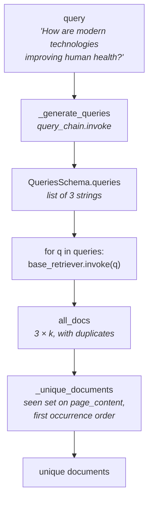

`MultiQueryRetriever.from_llm(retriever=..., llm=...)` is two arguments and does a surprising amount. Rebuilding it takes about thirty lines, and it's worth doing for the same two reasons as the self-query version: it lives in `langchain_classic`, whose support ends around December 2026, and the built-in gives you no access to the prompt that decides what your alternative queries look like.

That prompt is the entire component. Everything else is a loop and a set.

---

## What has to be rebuilt

1. **Generate** N alternative phrasings from the user's question
2. **Retrieve** with each one
3. **Deduplicate** the merged results
4. **Conform** to `BaseRetriever` so it composes like anything else

---

## Job 1 — asking for a list, reliably

The output we want is a **list of strings**. Not prose containing a list, not a numbered paragraph — a list, every time, so we can loop over it.

Same technique as the custom self-query retriever: describe the shape as Pydantic and let structured output enforce it.

```python
class QueriesSchema(BaseModel):
    queries: list[str] = Field(
        description="List of 3 alternative versions of the question"
    )
```

One field. That's genuinely all the structure needed here — which is the difference from self-query, where a filter needed a field, a value and an operator.

### The prompt

```python
prompt = ChatPromptTemplate.from_template(
    "You are an AI language model assistant. Your task is to generate 3 different versions of "
    "the given user question to retrieve relevant documents from a vector database. "
    "By generating multiple perspectives on the user question, your goal is to help the user "
    "overcome some of the limitations of distance-based similarity search. "
    "Provide these alternative questions separated by newlines.\n\n"
    "Original question: {question}"
)
```

Read the middle sentence closely, because it is the whole design stated in one line:

> *"By generating multiple perspectives on the user question, your goal is to help the user overcome some of the limitations of **distance-based similarity search**."*

The prompt **tells the model why it is doing this**. It isn't asked for synonyms or paraphrases — it's asked for *perspectives*, and told the reason is that a single point in space can only reach so far. That framing is what produces variants aimed at genuinely different regions instead of three ways of saying the same thing.

> [!important] This is the line worth stealing for your own systems. A rephrasing prompt that just says *"rewrite this question three ways"* will give you three near-identical sentences, which retrieve the same chunks and buy you nothing. Explaining the *purpose* — coverage across a vector space — is what makes the variants diverge.

```python
llm_structured_output = llm.with_structured_output(QueriesSchema)
query_chain = prompt | llm_structured_output
```

---

## Jobs 2-4 — the retriever

```python
class CustomMultiQueryRetriever(BaseRetriever):
    """Retriever that generates multiple query perspectives via an LLM and deduplicates results."""

    base_retriever: BaseRetriever
    query_chain: Any

    def _generate_queries(self, query: str) -> list[str]:
        result: QueriesSchema = self.query_chain.invoke({"question": query})
        return result.queries

    def _unique_documents(self, documents: list[Document]) -> list[Document]:
        seen: set[str] = set()
        unique: list[Document] = []
        for doc in documents:
            if doc.page_content not in seen:
                seen.add(doc.page_content)
                unique.append(doc)
        return unique

    def _get_relevant_documents(self, query: str) -> list[Document]:
        queries = self._generate_queries(query)
        all_docs: list[Document] = []
        for q in queries:
            all_docs.extend(self.base_retriever.invoke(q))
        return self._unique_documents(all_docs)
```

Three methods, and the third is only five lines: generate, loop, dedupe.

### Why deduplication is by `page_content`

This is the one detail that would bite you if you wrote it carelessly.

Each variant runs a **separate** `base_retriever.invoke(q)` call. Even when two variants retrieve the same chunk, they come back as **two different Python objects**. So the obvious approaches both fail:

- `set(all_docs)` — `Document` objects aren't hashable that way, and identity isn't what you mean
- comparing by object identity — every retrieval creates fresh objects, so nothing ever matches

What actually identifies a chunk is **its text**. Hence a `set` of `page_content` strings as the seen-marker, with the `Document` itself appended to a separate list.

And the list matters as much as the set. A `set` alone would deduplicate but **destroy the ordering**, and ordering here is meaningful — documents from the first variant arrive first, and within each variant they arrive ranked by relevance. Keeping a parallel list preserves that, which is what the notebook's docstring means by *"deduplicate by page content preserving the first occurrence order."*

> [!note] The first occurrence wins, so a chunk that ranked first for variant 1 keeps that position even if it also ranked third for variant 3. Given that most LLMs weight the start of a context window more heavily, the surviving order is not cosmetic.

### Running it

```python
retriever = CustomMultiQueryRetriever(base_retriever=base_retriever, query_chain=query_chain)
results = retriever.invoke("How are modern technologies improving human health?")
```

Same 6 documents, same 300/50 splitter, same in-memory store, same `k=3` base retriever as the built-in version — so the outputs are directly comparable.

---

## The full path



---

## What rebuilding bought you

- **The prompt is editable.** Change 3 to 5, add few-shot examples of good perspective-splits for your domain, or instruct it to cover named aspects explicitly (*"one variant per product line"*).
- **The dedup rule is yours.** `page_content` is the sensible default, but if your chunks carry a stable `id` in metadata, keying on that is cheaper and more robust to whitespace differences.
- **You can inspect the variants.** `query_chain.invoke({"question": ...})` alone shows exactly what was generated — which is the first thing to check when multi-query fails to improve anything. Near-identical variants mean the prompt isn't pushing hard enough for different perspectives.
- **No `langchain_classic` dependency.**

What you drop is `include_original`, and that one is worth adding back — it's a single line before the loop:

```python
queries = self._generate_queries(query)
queries.append(query)          # keep the user's own phrasing in the union
```

---

> [!tip] Interview framing
> "The custom version is about thirty lines. A Pydantic schema with one field — a list of alternative questions — driven through `with_structured_output` so I reliably get a list rather than prose I'd have to parse. Then a `BaseRetriever` subclass that generates the variants, invokes the base retriever once per variant, and deduplicates the merged results. The detail that matters is the deduplication: each variant is a separate retrieval call, so the same chunk comes back as distinct Python objects — you have to dedupe on `page_content`, and keep a parallel list rather than just a set so you preserve first-occurrence order, since relevance ranking is encoded in the ordering. The other thing worth copying is the prompt: it tells the model *why* it's rephrasing — to overcome the limits of distance-based similarity search. Prompts that just say 'rewrite this three ways' produce near-identical variants that retrieve the same chunks, so the component does nothing."
