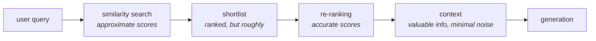

You have already met reranking once, without it being called that. Back in the ensemble retriever, results from two different retrievers were merged using **RRF — Reciprocal Rank Fusion** — which takes documents that already have ranks and gives them new ones. That is reranking. What was never explained is *why* anyone would want to re-rank a list that a retriever has already ranked carefully.

The answer turns out to be a property of embeddings themselves, and once you see it you cannot unsee it: **the scores your vector store returns are approximations, and they were always going to be.**

---

## Where the question arises

A RAG pipeline has two phases. **Ingestion** happens once, offline: raw documents are loaded, split into chunks, embedded, and stored. **Retrieval** happens per query, live: the question is embedded, compared against the stored vectors, and the closest chunks come back.

![[AI-Engineering/07-RAG/07-Reranking-And-Query-Transforms/Images/01-Ingestion-And-Lossy-Compression.png]]

Look at what the embedding model is actually asked to do in that first phase. A chunk of roughly **1000 characters** goes in. What comes out is a **dense representation** — in the lecture's example, **256 numbers**.

That is a compression ratio of about four to one, and it is not a filing trick. The model is being told: *whatever matters in these thousand characters, encode all of it into 256 numbers.*

It cannot. Something has to go.

---

## The decoder thought experiment

Here is the cleanest way to see what is lost. An embedding model is an **encoder** — it turns text into numbers. Imagine building its opposite: a **decoder** that takes one of those 256-number vectors and reconstructs the original text chunk.

Feed a chunk in, embed it, decode it back. Do you get your original thousand characters?

No. You get something close. The gist survives — the subject matter, the general claim, the overall shape. What does not survive is the **fine-grained detail**: the precise qualifier, the specific number, the small nuance that distinguished this chunk from a similar one.

> [!important] This is what "lossy compression" means, and it is not a defect to be fixed. It is the price of turning language into a fixed-size vector. A JPEG loses pixels; an embedding loses nuance. Both are lossy because both throw information away to fit a budget.

---

## Both sides are lossy, so the comparison is too

Now follow the consequence through the retrieval phase.

![[AI-Engineering/07-RAG/07-Reranking-And-Query-Transforms/Images/02-Approximate-Similarity-Search.png]]

The user's question is embedded the same way, into a **query vector**. Then similarity search compares that query vector against every stored document embedding and sorts by score. What is being compared is *semantic meaning against semantic meaning* — the compressed gist of the question against the compressed gist of each chunk.

But the document embeddings were lossy. And the query embedding is lossy. So the comparison between them inherits both losses.

![[AI-Engineering/07-RAG/07-Reranking-And-Query-Transforms/Images/03-Lossy-Compression-Wrong-Ranks.png]]

The similarity score you get back is therefore **approximate**. The lecture's word for it is *vague*: you are not calculating the actual similarity between question and chunk, you are calculating the similarity between two lossy summaries of them.

---

## What that costs you in practice

Approximate scores produce **mis-ranked results**, and they fail in both directions at once:

- A document that isn't especially relevant gets a **higher score than it deserves** and lands near the top. It may carry a little relevant information — but alongside it, **added noise**.
- A document that *was* genuinely the best answer gets a **lower score**, and a lower rank, possibly falling out of your top-k entirely.

And the reason is the same in both cases: **the detail that would have separated them is the detail the compression destroyed.** You wanted the ranking decided by a fine distinction, and you deleted that distinction before the ranking happened.

> [!warning] This failure is silent. The retriever returns k documents ranked by score, exactly as it promised. Nothing in the output says "ranks 1 and 4 should be swapped." You only discover it when the generated answer is subtly wrong or misses the point, and by then the cause is three steps upstream.

---

## Why not just use a better embedding model?

The obvious response is to fix the encoder. It doesn't work, and the reason is worth stating precisely: **you need the embedding model, and you need exactly the thing it does.**

Its job is to convert text into numbers, because **any mathematical comparison requires numbers**. Similarity, distance, nearest-neighbour search — none of these operate on sentences. Something must map language into a vector space first, and that mapping is inherently a compression into fixed dimensions.

A better model loses less. It does not lose nothing.

So the embedding model stays. What you want is a **second opinion** on the shortlist it produces, computed differently:

1. A comparison where the representation is **not lossy**
2. A comparison that can **actually see fine-grained detail** when deciding

Get those two, and the genuinely most relevant document can be moved to rank 1, while the one that was over-scored gets pushed back down.

---

## Why this happens *after* retrieval, not instead of it

Reranking re-embeds and re-compares. Both are expensive. So the natural question is why not simply do the accurate thing from the start — and the answer is the subject of the next note.

But there is a second reason it belongs at the end, and it is about what you are building the whole time: **the context window**.

Everything that survives retrieval gets packed into the prompt. That space is precious and finite. You want it to contain **only valuable information, with as little noise as possible** — because every noisy chunk you include is both a wasted slot and an active distraction for the generator.

Reranking is the last filter before the context is assembled. It is the step that decides what the model actually gets to read.

---

> [!tip] Interview framing
> "Reranking exists because vector similarity is approximate by construction. An embedding model compresses a thousand-character chunk into a few hundred dimensions, which is lossy — if you could decode that vector back to text you would not recover the original, you would lose the fine-grained nuance. Both the document embeddings and the query embedding lose information, so the similarity score between them is a comparison of two lossy summaries. That mis-ranks in both directions: an irrelevant document scores too high and carries noise into the context, and the genuinely best document can score too low and fall out of top-k. You can't fix it by swapping embedding models, because the compression is the point — that's what makes text mathematically comparable at all. So you keep the fast approximate search to build a shortlist, then re-score that shortlist with something lossless and accurate before anything reaches the context window."
