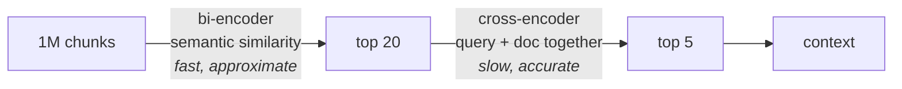

Reranking, stated plainly: **take the documents retrieval gave you, embed them again alongside the query, and assign fresh scores.** Sort by those scores, and you have re-ranked.

The word **again** is doing a lot of work there, because the second embedding is not the same kind of thing as the first. Two differences, and both matter:

- These embeddings are **lossless** — nothing is being squeezed into a fixed summary of the text.
- They do **not** capture semantic meaning. **These are not your regular embeddings.** What they capture is the **relationship between the query and this particular document chunk** — how well these two specific things match.

That second point is the one people skip past. A normal embedding answers **what does this text mean?** A reranking model answers a different question entirely: **given this query and this document, how related are they?** It never has to represent either one in isolation, so it never has to compress either one into a standalone summary.

---

## So why not do this from the very start?

If the accurate method exists, why run the vague one at all? The answer is not about quality. It is about **what can be computed in advance.**

### Documents are static

Your documents sit still. You load them once, chunk them once, embed them once, and store the vectors. A user query arriving three weeks later does not change any of that. Because document embeddings are **static in nature**, they can be computed **offline**, before any query exists — which is exactly why a vector store works at all.

### The query is dynamic

The query changes every turn. There is no way to precompute it. It must be embedded **on a per-use basis**, at runtime, while the user waits.

![[AI-Engineering/07-RAG/07-Reranking-And-Query-Transforms/Images/04-Bi-Encoder-Initial-Filtering.png]]

This split — static side precomputed, dynamic side computed live — is the **bi-encoder** technique, and it is what ordinary retrieval has been doing all along.

> [!info] **Bi** because there are **two separate encoding passes**: one for documents, one for the query. They happen at different times, on different machines, possibly months apart.

---

## The bi-encoder's blind spot

Here is the consequence of encoding the two sides separately.

While the document is being encoded, **it has no information about the query**. While the query is being encoded, **it has no information about the document**. They never meet. Each is turned into a vector in isolation, and only afterwards are those two finished vectors compared with a distance formula.

So a bi-encoder **can never establish a relationship** between a query and a document — not because the model is weak, but because the architecture gives it no opportunity. The two texts never saw each other.

> [!note] It is tempting to conclude the bi-encoder is therefore a poor technique. It isn't — it is an enormously useful one, and it is useful precisely because of the static/dynamic split. Encode a million documents once, then serve every future query with a single embedding call plus a nearest-neighbour lookup. Nothing else scales that way.

---

## The cross-encoder

The cross-encoder makes the opposite trade. Instead of encoding query and document separately, it takes **both together as one input**.

![[AI-Engineering/07-RAG/07-Reranking-And-Query-Transforms/Images/05-Cross-Encoder-Joint-Encoding.png]]

Because the query and the document are processed jointly, the model can compare them at the level of individual words while it works. The output is not a general-purpose vector for either text — it is a statement about **the relationship between the two**.

That is why its similarity is **accurate** where the bi-encoder's is **approximate**.

And that is also why it cannot be precomputed. The query is dynamic, so the pair **(query, document)** is dynamic, so **nothing about a cross-encoder run can be cached ahead of time**. The work must be repeated:

- **for every new query**, and
- **for every document** you want scored, one pair at a time

| | Bi-encoder | Cross-encoder |
|---|---|---|
| Input | query and document **separately** | query and document **together** |
| Can precompute documents? | yes — encode once, store | no — depends on the query |
| Captures | semantic meaning of each text | **relationship** between the pair |
| Similarity quality | approximate | accurate |
| Speed | fast, easy to scale | slow |
| Cost per query | 1 embedding + index lookup | one full model pass **per document** |

> [!warning] Run the numbers before assuming the accurate method is simply better. With a million chunks, a cross-encoder scoring every one of them means **a million model passes per user question**. That is not **slower** — it is a different order of magnitude, and it is not something you can serve.

---

## The smart approach: filter cheap, refine deep

Neither technique is usable alone. The bi-encoder is fast but vague; the cross-encoder is accurate but unaffordable at corpus scale. So production RAG uses **both, in sequence** — each on the job it is actually good at.

![[AI-Engineering/07-RAG/07-Reranking-And-Query-Transforms/Images/06-Two-Stage-Retrieve-Then-Rerank.png]]

**Stage 1 — approximate filtering.** Run ordinary similarity search over the whole corpus with the bi-encoder. But instead of asking for your final 5 documents, set **`k` higher — say 20**.

This stage is doing **major filtering**: from a million chunks down to 20. Its scores are approximate, but they are more than good enough to throw away the overwhelming majority of the corpus, which is obviously irrelevant. Whatever is genuinely useless — the noise, the waste — is gone after this step.

**Stage 2 — deep refinement.** Those 20 survivors go to the **reranker** along with the query. The cross-encoder scores each of the 20 pairs properly, assigns new scores, and you sort by them. Take the top 5 of **those**.

The insight is that **the two stages are asked different questions**. Stage 1 answers **which 20 of these million are worth a serious look?** — a question approximate scores can answer well. Stage 2 answers **of these 20, which 5 are actually best?** — a question that needs accuracy, and which is now cheap because 20 is a small number.

> [!important] The ordering coming out of stage 1 is approximate too — that is the whole point. You are not keeping the top 20 because their ranks are right. You are keeping them because the **set** is roughly right, and then fixing the ranks with a better tool.

---

## What this does and doesn't buy you

**It guarantees:** the final ordering is decided by a model that saw the query and the document together, so fine-grained distinctions the embeddings compressed away can influence the result.

**It does not guarantee:** that the right document is in your final answer at all. If a genuinely relevant chunk did not survive stage 1, no reranker can rescue it — **the reranker only ever reorders what it is given.** Setting stage-1 `k` too low quietly caps how good your results can be.

**It costs:** one cross-encoder pass per surviving document, on the critical path, per query. Raise `k` from 20 to 100 and you have five times the reranking latency.

---

> [!tip] Interview framing
> **The distinction is bi-encoder versus cross-encoder. A bi-encoder embeds the query and the documents separately, which means document vectors can be computed offline and stored — that's what makes vector search scale. But because the two texts are never processed together, it can't model the relationship between them; it just compares two independently-produced vectors, and both are lossy. A cross-encoder takes the query and a document as a single joint input, so it can compare them at token level and produce an accurate relevance score — but nothing can be precomputed, so it costs a full model pass per query-document pair. Scoring a million chunks per question is a non-starter. So you stage it: bi-encoder retrieval with a wide `k`, say 20, to do the cheap bulk filtering, then the cross-encoder re-scores just those 20 and you keep the top 5. The thing to be careful about is that reranking only reorders what stage 1 returned — if the right chunk didn't make the initial cut, the reranker can't recover it, so stage-1 `k` sets a ceiling on your final quality.**
