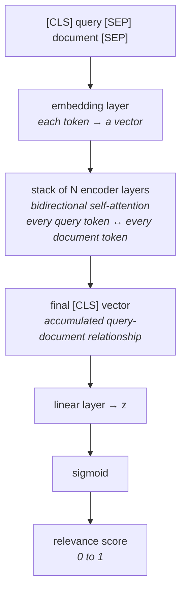

A cross-encoder scores a query against a document by reading both at once. This note opens the box far enough to see **how** that joint reading happens — deliberately at overview level, the way the lecture treats it.

> [!note] You do not need this to use a reranker. Everything here is background: it explains why a cross-encoder can see what an embedding model cannot. If you already know transformer architecture — encoders, decoders, self-attention — it will land immediately. If you don't, the shape still makes sense on its own, and nothing later depends on the internals.

---

## It is a transformer used for a different purpose

A cross-encoder is built on the **transformer** architecture, the same family that powers language models. Transformers contain a mechanism called **self-attention**, which lets each piece of the input look at every other piece and adjust itself accordingly.

In a normal language model, self-attention is used to build **context-aware embeddings** — representations of each word that account for the words around it, so that **bank** in **river bank** ends up different from **bank** in **savings bank**.

A cross-encoder repurposes the exact same mechanism. Its transformer is **not there to produce context-aware embeddings for downstream use**. It is there to **establish a relationship** between two texts and reduce it to a single number.

---

## The input: one sequence, two texts

Since query and document must be read together, they are joined into **one input sequence** using special marker tokens.

![[AI-Engineering/07-RAG/07-Reranking-And-Query-Transforms/Images/07-Cross-Encoder-Input-Format.png]]

```
[CLS]  query  [SEP]  document chunk  [SEP]
```

A **token** is roughly a word or word-piece — the unit the model reads. Two of these tokens are special and carry no text of their own:

- **`[CLS]` — the classification token.** It sits at the very front. It is called **classification** because the whole model's job here ends in producing a score, which is a classification-style output rather than generated text. This token is where the final answer will be read from.
- **`[SEP]` — the separator token.** It marks boundaries. The first one tells the model where the query ends and the document begins; the second closes the document.

That concatenated sequence then enters the **embedding layer**, which converts each text token into a vector. If the joined input is 10 tokens long you get 10 vectors; if it is 300 tokens you get 300. These are the **raw** embeddings — starting points, before any comparison has happened.

---

## The encoder stack, and why it is bidirectional

Those vectors pass into a **stack of encoder layers**. Each layer applies self-attention.

![[AI-Engineering/07-RAG/07-Reranking-And-Query-Transforms/Images/08-Bidirectional-Self-Attention.png]]

Because query tokens and document tokens are sitting in the **same** sequence, self-attention here operates across both texts, in a **bidirectional fashion**:

- every **query token attends to each document token**, and
- every **document token attends to each query token**

This is the moment the bi-encoder could never reach. In a bi-encoder the two texts are in separate sequences on separate occasions, so no attention weight can ever connect a word in the question to a word in the chunk. Here every such pairing gets a weight.

> [!important] **Why compute both directions separately?** They are not the same relationship. How the query relates to the document can differ from how the document relates to the query — the attention scores come out different because the ordering changes. The two look identical in English and are distinct inside the model, so both are calculated.

Going deeper through the stack, each layer captures a **more detailed relationship** than the last, and the token vectors are updated as they pass through. The original raw embeddings from the embedding layer are, by the final layer, substantially rewritten.

**How many layers?** That depends on the architecture. **BERT-base uses 12.** Other models use more.

---

## Only `[CLS]` reaches the end

After the last encoder layer you have an updated vector for every token in the sequence. Only **one** of them continues — the `[CLS]` vector.

![[AI-Engineering/07-RAG/07-Reranking-And-Query-Transforms/Images/09-CLS-Accumulates-The-Relationship.png]]

The natural objection: why throw away all the others?

The answer is **positioning**. `[CLS]` sits at the start of the input, ahead of everything. Given how self-attention works, that token can attend to every token that follows it — the entire query **and** the entire document. So on each pass through an encoder layer, the `[CLS]` vector is updated with a little more of what the model has worked out about how these two texts relate. Layer after layer, it **accumulates** the relationship.

By the top of the stack, `[CLS]` is not a summary of the query and it is not a summary of the document. It is a representation of **the pairing** — which is exactly the quantity you want a number for.

---

## From vector to score

![[AI-Engineering/07-RAG/07-Reranking-And-Query-Transforms/Images/10-Linear-Layer-To-Sigmoid-Score.png]]

The final `[CLS]` vector goes into a **linear layer** — a fully connected layer that collapses the vector down to a single output value, usually written **z**. Then a **sigmoid** function squashes z into the range **0 to 1**.

That is your **relevance score**: the new score the reranker sorts by.

> [!info] That linear layer is not bolted on afterwards — it is **trained together with the rest of the model**. During training the score is compared against the correct answer, a loss is computed, and backpropagation adjusts this layer along with everything else. So the mapping from **accumulated relationship** to **number between 0 and 1** is learned, not arbitrary.



---

## The whole thing on one example

![[AI-Engineering/07-RAG/07-Reranking-And-Query-Transforms/Images/11-Worked-Example-Photosynthesis.png]]

```
Query: "What is photosynthesis?"
Doc:   "Photosynthesis is how plants make food using sunlight."

        ↓ concatenate into a single input

[CLS] What is photosynthesis? [SEP] Photosynthesis is how plants... [SEP]

        ↓ bi-directional self-attention (N layers)
        ↓ every query token ↔ every document token

[CLS] final vector

        ↓ linear layer

Score: 0.97          ← highly relevant
```

A score of **0.97** says these two texts are strongly related. Run the same document against **How do jet engines work?** and the same machinery returns something near zero. That single number, produced per query-document pair, is the entire output of a reranker — and sorting a shortlist by it is all reranking is.

---

> [!tip] Interview framing
> **A cross-encoder is a transformer used for scoring rather than generation. You concatenate the query and the document into one sequence — `[CLS] query [SEP] document [SEP]` — embed the tokens, and push them through a stack of encoder layers; BERT-base has 12. Because both texts are in the same sequence, self-attention runs bidirectionally across them: every query token attends to every document token and vice versa, and those are computed separately because the two directions aren't the same relationship. That cross-text attention is exactly what a bi-encoder can't do, since it encodes the two sides in isolation. At the end you take only the `[CLS]` vector — it sits at position zero, so it attends to the entire input and accumulates the query-document relationship across the layers — and push it through a trained linear layer and a sigmoid to get a relevance score between 0 and 1. That score is what you re-sort the shortlist by.**
