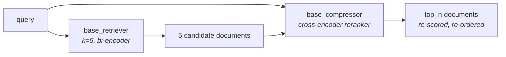

Two rerankers, one interface. **Cohere Rerank** is a hosted, best-in-class model behind a paid API; **FlashRank** is open source and runs on your own machine. Swapping between them is a one-line change, because in LangChain a reranker is not a retriever — it is a **compressor** that sits behind one.

---

## The wiring: `ContextualCompressionRetriever`

You have met this class before, in contextual compression, where it stripped irrelevant sentences out of retrieved chunks. It takes two things:

- a **`base_retriever`** — an ordinary retriever that fetches candidates
- a **`base_compressor`** — something that processes those candidates before they are returned

A reranker slots straight into that second position. It does not shorten the text of each chunk the way a compression filter would; it **re-scores and re-orders the set, then keeps the best few**. From the pipeline's point of view that is the same shape of operation: fewer, better documents out than in.



Internally, the compression retriever calls the base retriever first, then hands **each returned document together with the original query** to the compressor. The compressor is a cross-encoder, so it compares the pair properly and returns a new score. Sort, cut to `top_n`, done.

---

## Setup

The corpus is **30 documents across three domains** — 10 on machine learning, 10 on generative AI, 10 on cloud — chosen so that a query aimed at one domain has plenty of plausible-but-wrong neighbours in the others.

```python
from langchain_core.documents import Document
from langchain_text_splitters import RecursiveCharacterTextSplitter
from langchain_openai import OpenAIEmbeddings
from langchain_chroma.vectorstores import Chroma
from langchain_cohere import CohereRerank
from langchain_classic.retrievers.contextual_compression import ContextualCompressionRetriever
from dotenv import load_dotenv

load_dotenv()
```

```python
splitter = RecursiveCharacterTextSplitter(chunk_size=500, chunk_overlap=100)
splits = splitter.split_documents(docs)

embeddings = OpenAIEmbeddings(model="text-embedding-3-small")

vectorstore = Chroma.from_documents(
    documents=splits,
    embedding=embeddings,
    collection_name="reranker_demo",
)

retriever = vectorstore.as_retriever(search_kwargs={"k": 5})
```

`k=5` is the stage-1 width. In a real system you would set this much wider — the lecture's example is **retrieve 50, return 5** — but 5 keeps the demo's before-and-after readable.

---

## Cohere Rerank

```python
compressor = CohereRerank(model="rerank-english-v3.0")

compression_retriever = ContextualCompressionRetriever(
    base_compressor=compressor,
    base_retriever=retriever,
)

reranked_results1 = compression_retriever.invoke(query1)
for i, doc in enumerate(reranked_results1, start=1):
    print(f"[{i}] {doc.page_content}")
```

> [!info] **Getting a key.** Sign up on Cohere's site (Google or GitHub login works), open the dashboard, and there is an **API keys** tab. The trial tier is free but rate-limited — enough to follow along, not enough to serve traffic. `rerank-english-v3.0` is what the trial plan gives you; a v4 exists on paid plans. Cohere also ships updates frequently, so check which model version is current rather than copying a version string from any tutorial, this one included.

### Query 1

> *"How do large language models handle factual errors in their outputs?"*

| Rank | Base retriever (`k=5`) | After Cohere rerank (`top_n=3`) |
|---|---|---|
| 1 | LLMs are autoregressive… | LLMs are autoregressive… |
| 2 | Hallucination in LLMs… | **RLHF aligns model outputs…** |
| 3 | Fine-tuning adapts a pretrained model… | **Hallucination in LLMs…** |
| 4 | RLHF aligns model outputs… | — |
| 5 | Regularization techniques (L1/L2)… | — |

Two documents are dropped entirely, and the survivors are re-ordered: RLHF climbs from 4th to 2nd, hallucination slips from 2nd to 3rd. **Regularization** — which is about overfitting, not factual errors, and was only ever there because it shares vocabulary with the rest of the ML corpus — is gone.

### Query 2

> *"What are best practices for scaling compute infrastructure during traffic spikes?"*

| Rank | Base retriever (`k=5`) | After Cohere rerank (`top_n=3`) |
|---|---|---|
| 1 | Cloud auto-scaling… | Cloud auto-scaling… |
| 2 | Multi-cloud strategies… | **Kubernetes orchestrates…** |
| 3 | Kubernetes orchestrates… | **Serverless computing…** |
| 4 | Serverless computing… | — |
| 5 | Managed database services… | — |

**Multi-cloud** is the interesting casualty. It ranked 2nd on vector similarity because it is full of cloud-infrastructure language — but it is about vendor lock-in and data egress, not about handling traffic spikes. The cross-encoder, reading it *against this specific query*, drops it.

---

## FlashRank

Same interface, different compressor:

```python
from langchain_community.document_compressors import FlashrankRerank

compressor = FlashrankRerank(model="ms-marco-MiniLM-L-12-v2")

compression_retriever = ContextualCompressionRetriever(
    base_compressor=compressor,
    base_retriever=retriever,
)
```

On first use it downloads the model — about **21.6 MB** — and after that everything runs locally:

```
INFO:flashrank.Ranker:Downloading ms-marco-MiniLM-L-12-v2...
ms-marco-MiniLM-L-12-v2.zip: 100% | 21.6M/21.6M
```

> [!important] Everything after that download happens **on your own computer**. No API key, no per-call cost, and **no rate limits** — which is the practical reason to reach for it while you are still learning or iterating. `MiniLM` is a deliberately small BERT-family model; `L-12` means 12 encoder layers, the same depth discussed in the architecture note.

The constructor's parameters are worth knowing:

```python
class FlashrankRerank(
    client: Ranker,
    top_n: int = 3,
    score_threshold: float = 0,
    model: str | None = None,
    prefix_metadata: str = "",
)
```

**`top_n=3`** is the default, and it is the knob that matters — how many documents survive the rerank. `score_threshold` lets you additionally drop anything scoring below a cutoff.

### Same two queries

| | Query 1 top 3 | Query 2 top 3 |
|---|---|---|
| **Cohere** | LLMs autoregressive · RLHF · Hallucination | **Cloud auto-scaling** · Kubernetes · Serverless |
| **FlashRank** | LLMs autoregressive · RLHF · Hallucination | **Kubernetes** · Cloud auto-scaling · Serverless |

On query 1 the two agree completely. On query 2 they **disagree about first place** — Cohere keeps cloud auto-scaling on top, FlashRank promotes Kubernetes — while agreeing on the three-document *set* and, notably, both discarding multi-cloud.

That pattern is worth internalising: **rerankers agree far more about which documents belong than about their exact order.** The large win is set membership — dropping the plausible-but-wrong chunk. The ordering among genuinely relevant documents is a smaller, model-specific effect.

---

## Choosing between them

| | Cohere Rerank | FlashRank |
|---|---|---|
| Where it runs | hosted API | your machine |
| Cost | paid; free trial tier | free |
| Rate limits | yes, tight on trial | none |
| Setup | account + API key | `pip install`, auto-downloads model |
| Quality | best in class | good, notably smaller model |
| Latency | network round trip per query | local compute per query |
| Data leaves your network | yes | no |

> [!warning] Both put a model call **on the critical path of every query**. The cost scales with stage-1 `k`: at `k=50` the reranker scores 50 pairs before the user sees anything. That is the trade you are making — a wider net catches more of the right documents *and* costs proportionally more time. It is the number to tune first when reranking feels too slow.

---

> [!tip] Interview framing
> "In LangChain a reranker isn't a retriever, it's a document compressor — you wrap your normal retriever in a `ContextualCompressionRetriever` and pass the reranker as `base_compressor`. The base retriever fetches a wide candidate set, then every candidate is paired with the original query and scored by a cross-encoder, and you keep `top_n`. I've used both `CohereRerank` with `rerank-english-v3.0`, which is hosted and rate-limited on the free tier, and `FlashrankRerank` with `ms-marco-MiniLM-L-12-v2`, which is a ~20 MB model that runs locally with no API cost — that one's much better for iterating. On a 30-document corpus with `k=5` both dropped the same plausible-but-irrelevant chunk, a multi-cloud document that matched a scaling query on vocabulary but not on intent, and they agreed on the surviving set while disagreeing on the exact top-1. That matches what reranking mostly buys you: set membership rather than fine ordering. The cost is a model pass per candidate on every query, so stage-1 `k` is the latency knob."
