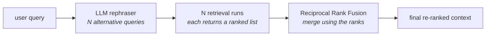

Everything a RAG pipeline produces depends on one thing you do not control: **the query the user typed.**

Follow it through. The query goes to the embedding model, becomes a query vector, goes to the vector store, and retrieval happens against that vector. Nothing clever intervenes — it is a similarity calculation against whatever the user happened to write.

Most of the time this works. Similarity search is good enough that a reasonably-phrased question finds reasonably-relevant chunks. That is the upside, and it is why the naive pipeline gets built first.

---

## The part you are not allowed to control

Here is the downside, stated as bluntly as the lecture states it:

> **We are dependent on the user to ask the right questions and use the right words — and this is a lot to ask from a user.**

As a developer you did not write that query. Your user did. And your user has no idea what is inside your knowledge base — which documents you indexed, how they were chunked, what vocabulary they use. They cannot phrase a question to match text they have never seen.

So retrieval accuracy swings on something you cannot inspect or fix:

- user phrases it well, using words that happen to match your corpus → good retrieval
- user phrases it vaguely, or uses different vocabulary for the same idea → **accuracy takes a direct hit**

The goal, then, is to **reduce the dependency on the user**. Whatever they type, the pipeline should cope.

---

## The first fix: write more queries yourself

If the user's phrasing might be wrong, stop relying on it being right. Take the query, hand it to an LLM, and ask for **3 or 5 alternative phrasings** — same meaning, different words. Then retrieve with each one.

![[AI-Engineering/07-RAG/07-Reranking-And-Query-Transforms/Images/12-Multi-Query-Recap.png]]

This is the **multi-query retriever**, and it works because the alternatives use vocabulary the original didn't. One of them is likely to match your corpus even if the user's own wording didn't.

You now have several retrieval runs, each returning its own list of documents. Multi-query finishes by **combining them and deduplicating**, and handing the result over.

And that last step is where it throws away something valuable.

---

## What deduplication discards

Each retrieval run returns a list that is **ranked**. The retriever sorted it by similarity — position 1 is the best match for that phrasing, position 3 the worst. Three runs give you three orderings, and crucially, **the orderings disagree**, because each was produced by a different phrasing of the question.

That disagreement is information. Which document keeps showing up near the top across different phrasings? Which one appeared once and never again?

Multi-query answers none of that. It takes the union, removes duplicates, and returns a set. **Rank is not considered at all** — a document that ranked first in all three runs is treated exactly like one that scraped in at position 3 of a single run.

> [!warning] Deduplication is a *set* operation, and sets have no order. The moment you deduplicate you have three ranked lists collapsing into one unordered pile, and every signal encoded in the positions is gone. The documents are right; the ordering is now arbitrary.

---

## The fix: replace deduplication with a ranking strategy

![[AI-Engineering/07-RAG/07-Reranking-And-Query-Transforms/Images/13-Deduplication-To-Ranking-Strategy.png]]

Instead of merging by deduplication, merge with a **ranking strategy** — something that reads all three ranked lists and produces one properly ordered list out of them. That is re-ranking, and the specific algorithm used here is **RRF, Reciprocal Rank Fusion**.

That is the whole of RAG Fusion:

**Multi-query + RRF = RAG Fusion.** The first half is identical to what you already know. The second half replaces *"deduplicate and hope"* with *"fuse using the rank information you already paid to compute."*

> [!note] The name is literal. You **fuse** the results of several retrievals, and you fuse them **on rank** — reciprocal rank. Hence *Reciprocal Rank Fusion*, and hence *RAG Fusion* for the pipeline built around it.

---

> [!tip] Interview framing
> "RAG Fusion starts from the observation that retrieval quality is hostage to how the user phrased their question — and the user has no idea what's in your index, so you can't expect good phrasing. Multi-query already addresses that by having an LLM rewrite the query into several alternatives and retrieving with each. But multi-query finishes by deduplicating the union, and that throws away the ranks: each retrieval run came back ordered by similarity, the orderings disagree because the phrasings differ, and that disagreement tells you which documents are robustly relevant versus which matched one phrasing by luck. RAG Fusion keeps the rephrasing step and replaces deduplication with Reciprocal Rank Fusion, which merges the ranked lists using rank position rather than discarding it."
