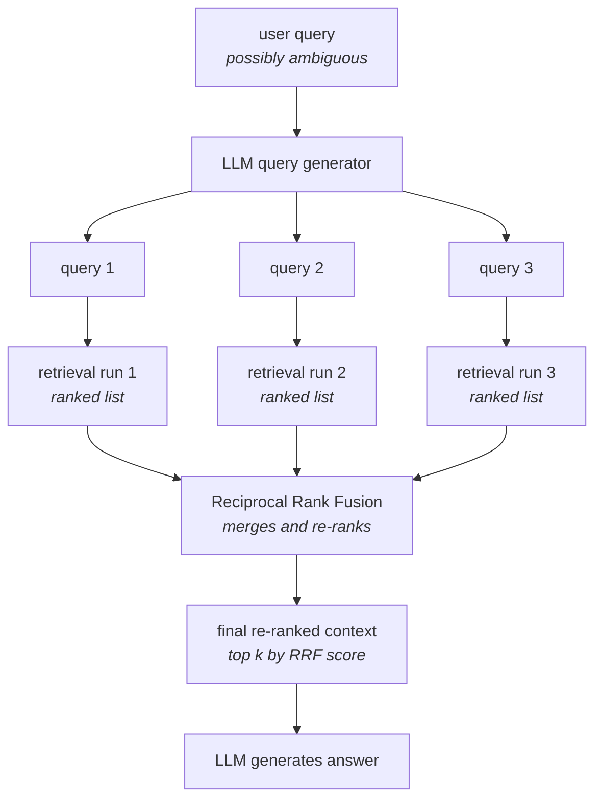

With the rephrasing step from multi-query and the fusion step from RRF, the whole pipeline fits on one diagram.

![[AI-Engineering/07-RAG/07-Reranking-And-Query-Transforms/Images/18-RAG-Fusion-Pipeline.png]]

Read it top to bottom:

1. **User query arrives** — possibly ambiguous, possibly using vocabulary that appears nowhere in your corpus.
2. **LLM query generator** rewrites it into **N alternative queries**.
3. **N retrieval runs** — each alternative hits the vector store independently and comes back with its own ranked list of `k` documents. The diagram shows `k=4`: run 1 returns `#1 Doc A, #2 Doc B, #3 Doc C, #4 Doc D`, run 2 returns `#1 Doc C, #2 Doc A, #3 Doc D, #4 Doc B`, run 3 a third ordering. **The orderings differ, because the queries differ.**
4. **Reciprocal Rank Fusion** merges and re-ranks all results into a single list.
5. **Final re-ranked context** — the top `k` by RRF score. The diagram's annotation sets this to 3.
6. **LLM generates the answer** from that context.

> [!important] Two distinct `k` values live in this diagram and confusing them is easy. The **retrieval `k`** is how many documents *each run* returns — widen it and RRF has more evidence to fuse. The **final `k`** is how many survive fusion into the context. They are independent knobs: you might retrieve 4 per run across 3 runs (up to 12 distinct documents) and keep only 3.

---

## What it buys you

![[AI-Engineering/07-RAG/07-Reranking-And-Query-Transforms/Images/19-Advantages-And-Disadvantages.png]]

**Simple to apply.** RRF is one line of arithmetic. There is no model to train, no threshold to tune, no embedding to compute — you have the ranks already, and the formula turns them into a score.

**Intuitive and easy to understand.** You can explain to a colleague exactly why document X ended up first, and check the arithmetic by hand. That is not true of a cross-encoder, which gives you a number from a neural network and no account of where it came from.

**Better responses.** Because the context window is now filled with documents that several phrasings agreed on, rather than an arbitrary set produced by deduplication, generation has better material to work with.

---

## What it costs

**① An extra LLM API call.** Every query now requires a generation step *before* retrieval can even start, purely to produce the rephrasings.

**② Latency.** That LLM call sits on the critical path, and behind it come **N retrieval runs instead of one**. The user waits for all of it.

**③ Cost.** The extra call is billed per query, forever. Multiply by your traffic.

> [!warning] Notice that all three costs are paid on **every single query**, including the ones where the user phrased their question perfectly and plain retrieval would have worked fine. RAG Fusion has no cheap path — it cannot detect that a query was already good and skip the rewrite. That is the trade: you buy robustness against bad phrasing by paying the rewriting cost unconditionally.

---

## Where it sits among the things that fix retrieval

Three techniques in this module all end with "better documents in the context", and they are easy to blur together. They intervene at different points and fix different failures:

| Technique | What it fixes | How it decides the final order |
|---|---|---|
| **Multi-query** | one phrasing reaches one region of the vector space | it doesn't — deduplicates, order is arbitrary |
| **RAG Fusion** | same, **plus** the lost rank information | **RRF** — consensus across runs, using ranks only |
| **Cross-encoder reranking** | similarity scores are approximate because embeddings are lossy | a model that reads query and document **together** |

The sharpest distinction is between the last two, because both are called "re-ranking":

- **RRF re-ranks using rank agreement.** It never looks at the documents. It is free, instant, and knows nothing about content — it only counts and positions.
- **A cross-encoder re-ranks using content.** It reads each query-document pair with a transformer and produces a genuine relevance judgement. It costs a model pass per document.

They are not alternatives. RRF fuses *several lists into one*; a cross-encoder scores *one list properly*. Stacking them is coherent — fuse your retrieval runs with RRF, then send the fused shortlist through a cross-encoder — and that is what a serious pipeline tends to look like.

---

> [!tip] Interview framing
> "The pipeline is: user query → LLM rewrites it into N alternatives → N independent retrieval runs, each returning its own ranked list → RRF merges those lists into one ordering → top-k becomes the context → generation. The advantages are that RRF is trivially simple, needs no model or training, and is fully explainable — you can hand-check why a document ranked where it did. The costs are an extra LLM call before retrieval, N retrievals instead of one, and both latency and per-query spend, all paid unconditionally because the pipeline can't tell a well-phrased query from a badly-phrased one. The distinction I'd want to draw is against cross-encoder reranking: RRF re-ranks on rank agreement and never reads the documents, while a cross-encoder re-ranks on content and costs a model pass per document. They compose rather than compete — fuse the runs with RRF, then rerank the fused shortlist with a cross-encoder."
