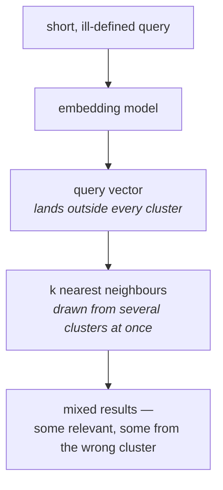

Every retrieval technique so far has tried to fix the query by **rewriting it as another query** — rephrase it, split it, run it several times. HyDE starts from a different observation: the problem is not that the query is worded badly. It is that **a query and a document are not the same kind of object**, and you have been comparing them as if they were.

---

## What the query vector actually contains

When a query goes to the embedding model, what comes back is a numerical representation of the query's **semantic meaning**. That is the whole game — everything downstream is a comparison of semantic meanings expressed as numbers.

So ask the question directly: does a **well-defined, detailed text** have the same semantic meaning as an **ill-defined, sparse one**?

![[AI-Engineering/07-RAG/07-Reranking-And-Query-Transforms/Images/22-Well-Vs-Ill-Defined-Text.png]]

No. And that is the entire problem, because of what sits on each side of the comparison:

| | The query | The documents |
|---|---|---|
| Length | one or two lines | long passages |
| Detail | **not detailed** | detailed |
| Definition | **not well defined**, misses a lot of important keywords | well defined |
| Written by | a user who has never seen your corpus | domain authors |

![[AI-Engineering/07-RAG/07-Reranking-And-Query-Transforms/Images/21-Query-Not-Well-Defined.png]]

You are asking a similarity metric to compare a fragment against an essay and tell you which essays are relevant. The lecture's phrase for it is **apples to oranges**.

> [!important] This is not the same complaint as multi-query's. Multi-query says **the user picked unlucky words, so try other words.** HyDE says **even with perfect words, a two-line question and a two-hundred-word passage have structurally different embeddings.** Rephrasing does not fix an asymmetry of **form**.

---

## Where that breaks, geometrically

Recall how an embedding space is actually organised. Documents are not scattered — they form **clusters**. A group of documents about Python sits in one region; a group about JavaScript sits in another; together they form a larger hyper-cluster about programming languages.

Those clusters exist because of **similarity of semantic meaning**. Documents that mean similar things end up near one another.

Now send in the query vector. Being short and sparse, its semantic meaning does not closely resemble any of the detailed documents — so it does not land inside the relevant cluster. It lands in **a completely different area**, in a region of its own.

> [!note] The lecture's analogy is worth keeping: it is like trying to group **a toddler into a group of teenagers**. The toddler is a person, the teenagers are people, but grouping by size puts the toddler somewhere else entirely. A query is **about** the same subject as the documents, but it does not **look** like them, and the embedding space groups by looking-alike.

### And that is where the retrieval goes wrong

Sitting outside every cluster, the query vector is often roughly equidistant from **several** of them — the relevant cluster is nearby, but so are one or two neighbours.

![[AI-Engineering/07-RAG/07-Reranking-And-Query-Transforms/Images/23-NLU-NLG-Hypothetical-Doc.png]]

So the `k` nearest neighbours get drawn from a **mixture** of clusters. A few from the cluster you wanted, a few from an adjacent one that happens to sit nearby. The result is written plainly on the board: **quality ↓, accuracy ↓**.

What you actually wanted was for retrieval to happen **from inside the relevant cluster only**. Nothing about the query vector's position makes that likely.

---

## What would fix it

State the fix as a requirement before reaching for a technique. You need the thing you embed at query time to be:

1. **Well-defined text** — using the vocabulary and framing the corpus uses
2. **Detailed** — long enough that its semantic meaning has the same shape as a document's

In other words: to find documents, **search with something that looks like a document.**

The user cannot give you that; they do not know what your documents look like. But something else can write one.

---

> [!tip] Interview framing
> **HyDE addresses a different failure from multi-query. Multi-query assumes the user chose unlucky words and tries other words. HyDE points out that a query and a document are structurally different objects — the query is one or two lines and underspecified, the documents are long and detailed — so their embeddings have different shapes regardless of word choice. Geometrically, documents cluster by semantic similarity, and a short query vector doesn't land inside the relevant cluster; it sits outside all of them, roughly equidistant from several, so the top-k gets drawn from a mixture of clusters and accuracy drops. The fix has to make the thing you search with resemble a document rather than a question.**
