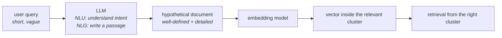

You need to search with something that looks like a document. An LLM can write one.

That is HyDE — **Hypothetical Document Embeddings** — in a sentence: **don't embed the question; have a model write the answer it imagines, and embed that instead.**

---

## Why an LLM is the right tool

Two capabilities, both of which you need and neither of which the embedding model has:

- **Natural Language Understanding (NLU).** The LLM can work out the **intent** behind the query, even when the query is ambiguous, low quality and underspecified. It fills in what the user meant.
- **Natural Language Generation (NLG).** It can then **write** — producing a passage that is well-defined and detailed.

So the LLM takes the user's short query, understands what is being asked, and generates a **hypothetical document**: a passage that would answer it.

That document is exactly what the previous note asked for — **well-defined text, plus detailed**. Embed it with the **same** embedding model you used for the corpus, and its vector lands where documents of that kind live: inside or beside the relevant cluster.

---

## The change, seen in the space

![[AI-Engineering/07-RAG/07-Reranking-And-Query-Transforms/Images/24-Similarity-Vs-HyDE-Embeddings.png]]

On the left — ordinary **similarity search**. The query vector sits outside the clusters, and the selection it pulls straddles two of them.

On the right — **HyDE embeddings**. The query vector is still there, but it is no longer what searches. The **HyDE embedding** sits **inside** Cluster 1, and the neighbours it returns all come from Cluster 1.

> [!important] The decisive change is **what you compare against what**. Before, you compared a **query** to **documents** — the lecture calls this a **weak match**, because the two sides were never really comparable. After, you compare a **document** (hypothetical) to **documents** (real). This is **document-to-document similarity**, and it is the phrase the original paper uses: **the retrieval leverages document-to-document similarity encoded in the inner product.**
>
> Strikingly, the paper notes that with HyDE a **query-document similarity score is no longer explicitly modelled or computed at all**. The retrieval task has been recast into a generation task followed by a document-document comparison.

---

## The objection you should have

Here is the thing that ought to bother you, and the lecture raises it directly:

> **The entire reason we built RAG is that the LLM does not have this knowledge in its parameters.** That is why we attach external knowledge. So how can that same LLM write a correct document about something it does not know?

It cannot. It will write a **fake document**, and it may well contain factual errors.

![[AI-Engineering/07-RAG/07-Reranking-And-Query-Transforms/Images/28-Fake-Document-External-Knowledge.png]]

**And that is fine** — which is the counter-intuitive heart of HyDE.

The hypothetical document is **never shown to the user and never used as an answer**. Its only job is to be a **search probe**. What matters is not whether its claims are true, but whether it is **shaped like** a relevant document: the right vocabulary, the right level of detail, the right topical framing. Those are what determine where its embedding lands, and landing in the right cluster is the entire contribution.

The paper says as much: the generated document is not real and can contain factual errors, but it **resembles** a relevant one — and resemblance is what an embedding measures.

> [!warning] The failure mode this implies is real, though. If the model's hallucination is not merely wrong but **topically wrong** — it misreads the domain and writes confidently about the wrong subject — then the probe lands in the wrong cluster, and HyDE actively steers retrieval away from the answer. The technique is strongest where the model knows the **shape and vocabulary** of the domain even if it doesn't know the specific facts, and weakest on genuinely unfamiliar or highly specialised corpora.

---

## The paper

![[AI-Engineering/07-RAG/07-Reranking-And-Query-Transforms/Images/25-HyDE-Paper-Figure.png]]

HyDE was published in **2022** — an old paper by this field's standards. The figure shows the flow the technique is named after:

1. An **instruction** plus the **query** go to the LLM (the paper used InstructGPT). The instruction varies with what kind of passage you want — **write a passage to answer the question**, **write a scientific paper passage to answer the question**, **write a passage in Korean to answer the question in detail**.
2. The LLM emits a **generated document**.
3. That document goes to a **contrastive encoder** — the paper uses **Contriever** — which turns it into an embedding vector.
4. That vector searches the corpus embeddings, and the most similar **real documents** are retrieved and returned.

Note the instruction column: HyDE is not restricted to one register. Ask for a scientific-paper passage and the probe lands among scientific writing; ask in Korean and it lands among Korean documents.

### Multiple hypothetical documents

![[AI-Engineering/07-RAG/07-Reranking-And-Query-Transforms/Images/27-Multiple-Hypothetical-Documents.png]]

The paper does not generate one hypothetical document — it generates **several versions**, embeds each, and **averages the embeddings** into a single vector, which is then used for retrieval.

The stated reason is historical: **the LLMs of 2022 were not good enough** to reliably produce one strong hypothetical document. Generating several and averaging smooths out the variance — a bad version pulls the average less than it would distort a single probe.

> [!note] This is worth knowing when reading the paper against a modern implementation. Today's models write a good hypothetical document on the first attempt, so most current implementations — including the one in the next note — **generate exactly one** and skip the averaging. That is a deliberate simplification of the paper, not an oversight, and averaging is still the right move if you find your generated documents varying wildly.

---

## What HyDE guarantees, and what it doesn't

**It guarantees** that the vector you search with has the form of a document rather than a question, so the comparison is document-to-document and the probe lands in a plausible neighbourhood.

**It does not guarantee** that neighbourhood is the right one. The probe is only as well-aimed as the model's grasp of the domain.

**It costs** one LLM generation before every retrieval — the same unconditional latency and spend as RAG Fusion, on every query, including the ones that never needed it.

---

> [!tip] Interview framing
> **HyDE has the LLM write a hypothetical document that answers the query, embeds that instead of the query, and retrieves with it. The point is to turn query-document similarity into document-to-document similarity — a short question and a long passage embed differently no matter how well the question is worded, so the query vector sits outside the clusters, while a generated passage lands inside the relevant one. The objection people raise is that the LLM doesn't know the answer, which is why we're doing RAG at all — and the answer is that it doesn't matter. The hypothetical document is a search probe, never shown to the user; it can contain factual errors as long as it has the right vocabulary and shape, because that's what determines where the embedding lands. The real failure mode is when the hallucination is topically wrong rather than just factually wrong, since then you've aimed retrieval at the wrong cluster. The 2022 paper generated several hypothetical documents and averaged their embeddings because models then were unreliable; modern implementations usually generate one.**
