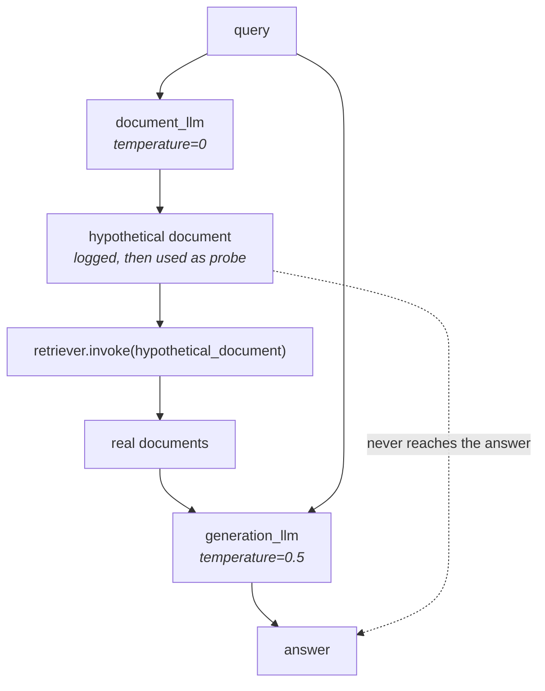

The implementation follows the same shape as the RAG Fusion one: a hand-written class in a Python file, plus a notebook that uses it. The class is smaller than you might expect — about sixty lines, and most of that is the prompt.

![[AI-Engineering/07-RAG/07-Reranking-And-Query-Transforms/Images/26-HyDE-In-The-Pipeline.png]]

The board version of what changes is a single substitution. Ordinary retrieval is:

```
query → vector → vector store → retrieval
```

HyDE **replaces the query with the hypothetical document** at the point of embedding:

```
query → prompt → LLM → hypothetical document → vector → vector store → retrieval
```

Everything after the vector is untouched. That is why HyDE drops into an existing pipeline without disturbing the index, the embedding model or the store.

---

## The prompt is the component

```python
@classmethod
def from_llm(cls, llm: Runnable, retriever: BaseRetriever):
    prompt = ChatPromptTemplate(
        messages=[
            ("system", (
                "You are an expert document writer. Given a user query, your task is to generate a hypothetical document "
                "that would directly and thoroughly answer the query. "
                "The document should be written as if it were a real, authoritative passage retrieved from a knowledge base — "
                "not a response to the user, but a self-contained piece of text that contains the answer. "
                "Write in a factual, informative tone. Do not include phrases like 'Based on your query' or 'Here is a document'. "
                "Output only the hypothetical document text, nothing else."
            )),
            ("human", "query: {query}")
        ],
        input_variables=["query"]
    )
    llm_chain = prompt | llm
    return cls(llm_chain=llm_chain, retriever=retriever)
```

Read what that prompt is actually fighting against. A chat model's default behaviour is to **answer you** — **Great question! Transformers use attention to…**. That output would be shaped like a chat reply, and a chat reply does not resemble a corpus document, which defeats the entire mechanism.

So the prompt insists on the opposite, three times over:

- **as if it were a real, authoritative passage retrieved from a knowledge base** — **the target register**
- **not a response to the user, but a self-contained piece of text** — **not a reply**
- **Do not include phrases like 'Based on your query' or 'Here is a document'** — **no conversational scaffolding**

> [!important] Every one of those clauses exists to make the output **look like the corpus**. This is the one place where prompt wording directly determines retrieval quality — a chatty hypothetical document embeds like a chat message and lands nowhere useful.

---

## The class

```python
class CustomHypotheticalDocumentEmbedder:

    def __init__(self, llm_chain: RunnableSequence, retriever: BaseRetriever):
        self.llm_chain = llm_chain
        self.retriever = retriever

    def _generate_hypothetical_document(self, query: str) -> str:
        hypothetical_document = self.llm_chain.invoke({"query": query})
        logger.info(f"Hypothetical document generated:\n{hypothetical_document.content}")
        return hypothetical_document.content

    def _get_relevant_documents(self, hypothetical_document: str) -> list[Document]:
        return self.retriever.invoke(hypothetical_document)

    def invoke(self, query: str) -> list[Document]:
        hypothetical_document = self._generate_hypothetical_document(query)
        relevant_documents = self._get_relevant_documents(hypothetical_document)
        return relevant_documents
```

`invoke` is three lines and reads as the definition of the technique: generate, then retrieve **with the generated text instead of the query**.

Notice `_get_relevant_documents` takes `hypothetical_document`, not `query`. The original query never reaches the retriever at all.

> [!note] The logging matters more here than usual. The hypothetical document is invisible in normal operation — it is generated, used as a probe, and discarded. When HyDE returns bad documents, the first question is always **what did it actually search with?**, and without the log you cannot answer it. `logger.info` on the generated document is the debugging hook for the whole technique.

---

## Running it

The corpus is 17 documents deliberately spread across four unrelated domains — **AI, Physics, Tech, Medicine** — so that landing in the wrong cluster would be obvious:

```python
embedding_model = OpenAIEmbeddings(model="text-embedding-3-small")

vectorstore = Chroma.from_documents(
    documents=documents,
    embedding=embedding_model,
    collection_name="hyde_demo"
)

retriever = vectorstore.as_retriever(search_kwargs={"k": 3})
```

### Two LLMs, two temperatures

```python
document_llm   = ChatOpenAI(model="gpt-5-mini", temperature=0)
generation_llm = ChatOpenAI(model="gpt-5-mini", temperature=0.5)

hyde_retriever = CustomHypotheticalDocumentEmbedder.from_llm(
    llm=document_llm,
    retriever=retriever
)
```

This split is worth copying. **`temperature=0` for the hypothetical document** — creativity is turned all the way down, because this text is a search probe and you want it stable and conventional; a creative probe is an unpredictable probe, and re-running the same query should retrieve the same documents. **`temperature=0.5` for the final answer**, where some fluency is welcome.

> [!info] Compare with multi-query, which used `temperature=0.3` precisely **because** it wanted its rephrasings to differ from one another. Same knob, opposite reasoning: multi-query wants variety across several probes, HyDE wants one reliable probe. Match the temperature to whether variation is the feature or the bug.

### The query and what it generates

```python
query = "How do transformer models use attention to process sequences?"

retrieved_docs = hyde_retriever.invoke(query)
```

The hypothetical document the LLM produced — recovered from the log — reads in part:

> **…compute attention weights and then form a weighted sum of token representations. This is done in multiple parallel heads, which is called multi-head attention, where each head learns different attention patterns. The heads' outputs are concatenated and linearly projected to produce the final token representation. This parallel attention mechanism enables efficient training on long sequences.**

Now compare that against the corpus it is about to search:

> **Multi-head attention allows the model to jointly attend to information from different representation subspaces… The outputs of all heads are concatenated and linearly projected to produce the final representation.**

The generated passage and the real document are **near-paraphrases of each other** — same vocabulary, same length, same register. That is precisely the resemblance HyDE is engineering, and it is why the probe lands in the AI cluster rather than drifting toward Physics or Tech.

Retrieval returns the AI documents on transformers, attention mechanisms and LLMs — none from the other three domains.

### Then the ordinary ending

```python
context = "\n\n".join(doc.page_content for doc in retrieved_docs)

generation_prompt = ChatPromptTemplate.from_messages([
    ("system", "You are a helpful assistant. Answer the user's question using only the provided context. "
               "Be concise and accurate. If the context does not contain enough information, say so."),
    ("human", "Context:\n{context}\n\nQuestion: {query}")
])

generation_chain = generation_prompt | generation_llm
response = generation_chain.invoke({"context": context, "query": query})
```

Note what is passed to generation: the **original query** and the **real retrieved documents**. The hypothetical document has done its job and is gone — it never reaches the answer.



---

> [!tip] Interview framing
> **The class is about sixty lines and `invoke` is three: generate a hypothetical document from the query, then call the retriever with that document instead of the query — the original query never reaches the retriever. Most of the code is the prompt, and the prompt is the component: it has to stop the model replying conversationally, because a chat-style answer embeds like a chat message rather than like a corpus document. So it explicitly asks for an authoritative knowledge-base passage, self-contained, with no 'here is a document' scaffolding. I'd also point at the two-LLM split — `temperature=0` for the hypothetical document because it's a search probe and you want the same query to retrieve the same things, `temperature=0.5` for the final answer. That's the opposite of multi-query, which deliberately raises temperature so its rephrasings diverge. And logging the generated document isn't optional: it's invisible at runtime, so when retrieval goes wrong the only way to diagnose it is to see what you actually searched with.**
